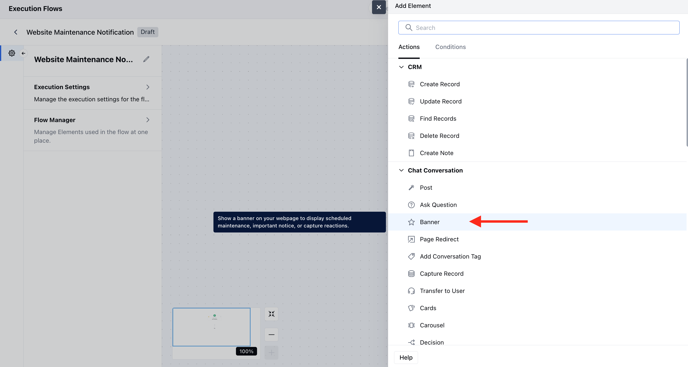
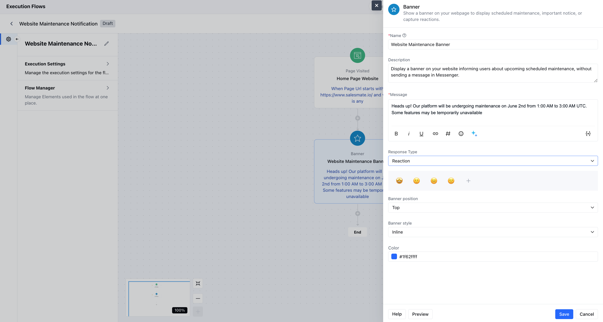
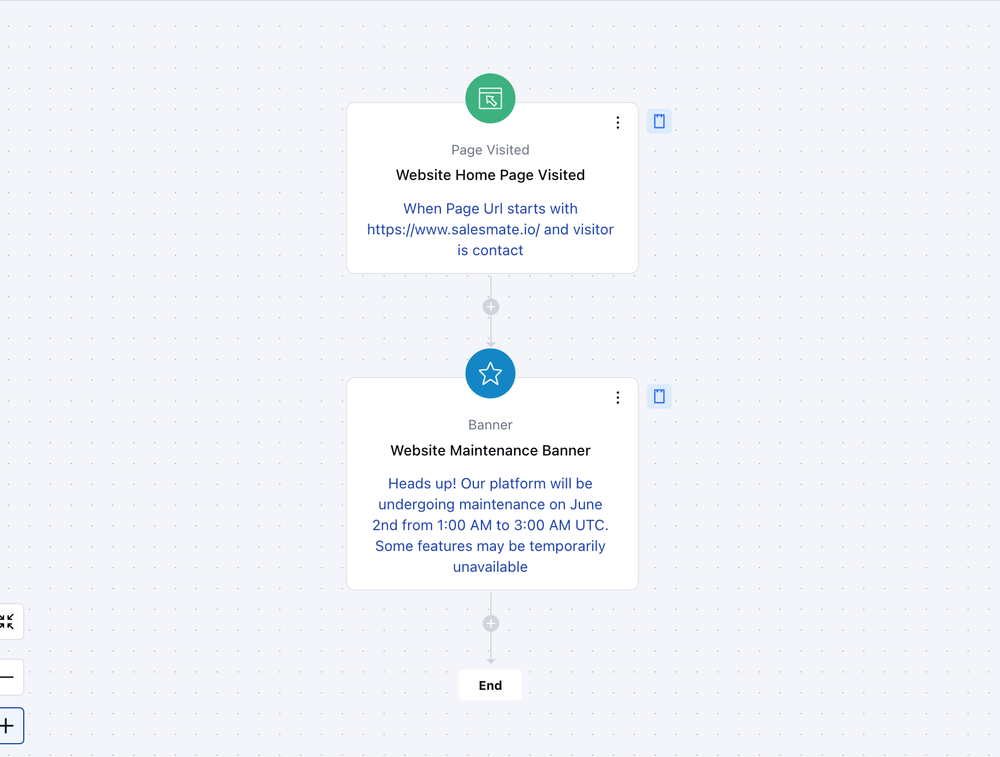

The**Banner - Action**in AI Pilots allows you to display important messages directly on your webpage as a**banner**, rather than inside the in-app Messenger. This feature is ideal for communicating scheduled maintenance, key announcements, or even capturing user reactions.**Topics covered:**[To configure the Banner Action](https://support.salesmate.io/hc/en-us/articles/45880093750937-Banner#h_01JFB84RHPMPZ2NG0171X91QT9)[Practical Example](https://support.salesmate.io/hc/en-us/articles/45880093750937-Banner#h_01JWDRW3HX2HHVDS29P7YVZRDJ)

### How to configure the Banner action

While setting up an Execution Flow, select the**Banner**action.

 Once the Banner action is selected, configure it by providing the following details:**Name:**Assign a clear and descriptive name to the action to identify its purpose in the flow easily.**Description:**Add a description to better understand the action you like to perform.**Message:**Add the message that you like to display as the banner.**Response Type:**You can set it to None or Reaction to get the response on your banner.**Banner position:**You can select the banner position on the screen.**Banner Style:**Apply predefined visual styling to your banner, such as**Inline**or**Floating**.**Color:**Set the background color to match your brand or message tone.

You can also preview the banner and hit**save**.

### Practical Example:

Display a banner on your website informing users about upcoming scheduled maintenance, without sending a message in Messenger. This provides proactive communication about outages or downtime and keeps users informed without interrupting their in-app flow.

