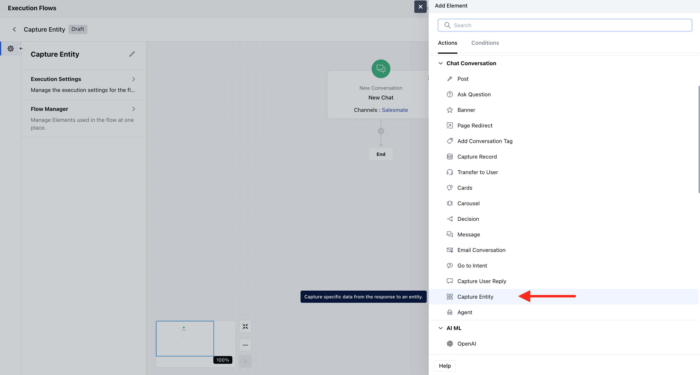

- The **Capture Entity** action allows AI Agents to extract specific data from user responses during a conversation. It’s designed to capture predefined **entities** such as name, email, date, or custom fields and store them as variables for use in your agent flow.

### **Topics covered:**

- [To configure the Capture Entity Action](#how-to-configure-the-capture-entity-action)

- [Practical Example](#practical-example)

### How to configure the Capture Entity action

While setting up an Execution Flow, select the **Capture Entity** action.

Once selected, configure it using the following fields:- **Name:** Assign a clear and descriptive name to the action to identify its purpose in the flow easily.

- **Description:** Add a description to better understand the action you like to perform.

- **Entities:** Select one or more **enabled entities** that you want to capture.
 Only entities previously defined and enabled in the bot are shown.Click **+Add** to include multiple entities.For each entity, you’ll need to configure **re-prompt messages**.

- **Re-prompt Automatically:** If enabled, will handle re-prompting when required entities are missing.

- **Exit Rules:** Define conditions to stop the capture step if the user fails to provide input (e.g., after a number of attempts). Write rules in natural language (e.g., _“Exit if user says ‘I prefer not to share my email’.”_).
 You can set up to **10 rules**. Exit Rules are only available if **Re-prompt Automatically** is enabled.

- **Listen to Other Intents:** Allows the agent to respond to predefined triggers while collecting data.

- **No Match:** Handles unexpected responses that do not match any entity.

- **No Reply:** Enable this option to handle situations when a user does not respond in time.

- **Timeout Duration**(in seconds): Define how long to wait before triggering a re-prompt.

- **Re-prompt Messages**: Provide one or more messages to send during no-reply events.

- **Generate with AI**: Once you enter a re-prompt, you can generate more using AI suggestions.

- **Follow-up Path**: Optionally define a fallback path if all re-prompts fail. This adds a second output port to your step.

Once the configuration is done, hit **Save.**

### Practical Example

Here, I wanted to collect important details from a customer who wants to book a service appointment or needs support. The agent asks for the user's name, contact info, preferred date, and type of service. All the captured info can then be used to confirm the booking and update your CRM automatically.

