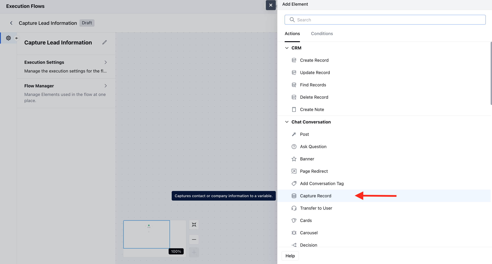
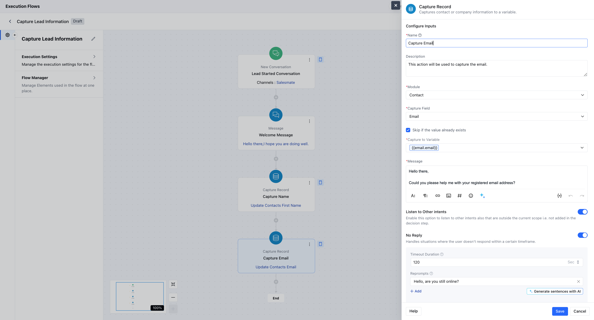
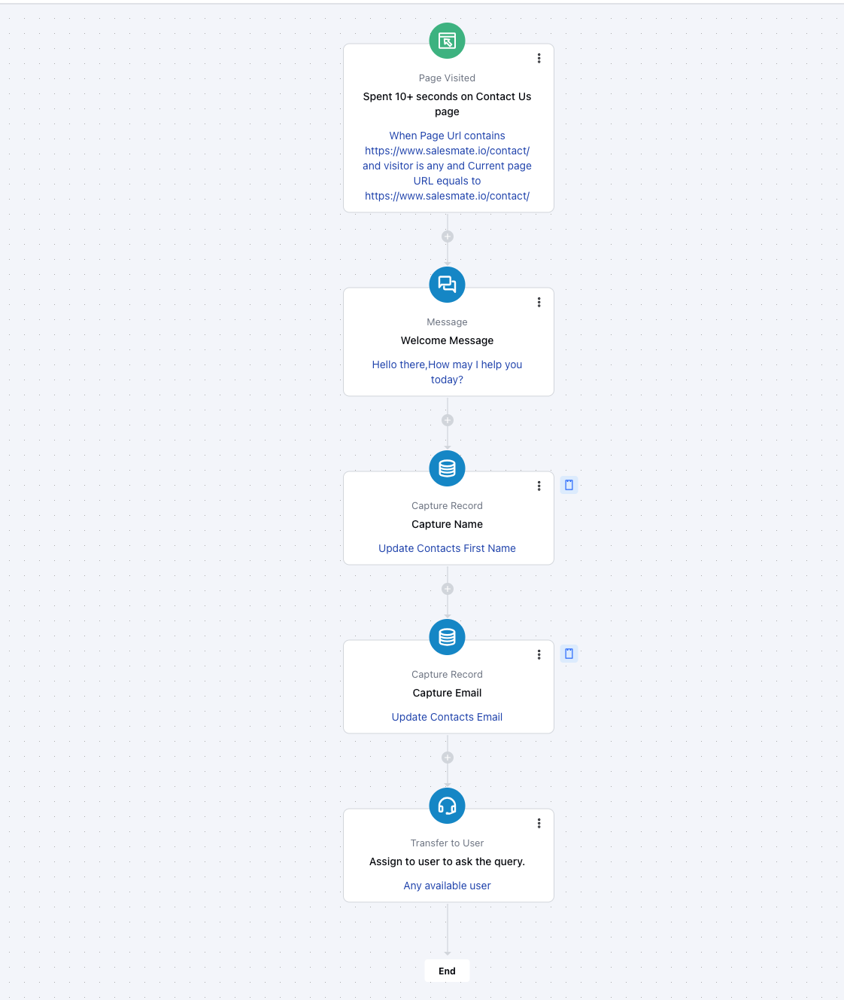

The**Capture Record**action allows AI Agents to collect and store user input directly into either**Contact**or**Company**fields.**Topics covered:**[To configure the Capture Record Action](https://support.salesmate.io/hc/en-us/articles/45880137719833-Capture-Record#h_01JFB84RHPMPZ2NG0171X91QT9)[Practical Example](https://support.salesmate.io/hc/en-us/articles/45880137719833-Capture-Record#h_01JWDSAE284Q7E3FTKTYCC0ER6)

### How to configure the Capture Record action

While setting up an Execution Flow, select the**Capture Record**action.

 Once the Capture Record action is selected, configure it by providing the following details:**Name:**Assign a clear and descriptive name to the action to identify its purpose in the flow easily.**Description:**Add a description to better understand the action you like to perform.**Module:**Choose between**Contact**or**Company**to specify where the data will be stored.**Capture Field:**Select the specific field (e.g., First Name, Email, Company Name) you want to capture.**Skip if the value already exists:**Enable this to prevent overwriting existing values unless they are empty.**Message:**This is the prompt displayed to users, asking them for the data.**Listen to Other Intents:**Allows capturing user response while checking for predefined intents.**No Reply:**Set a timeout and reprompt strategy when the user doesn't respond.**Timeout Duration:**Set a timeout and reprompt strategy when the user doesn't respond.**Reprompts:**Provides a message that gets sent to the user if they do not reply.

Once the configuration is completed, hit**Save**.

### Practical Example

I’d like to capture basic information, such as name and email, from visitors who spend more than 10 seconds on the Contact Us page. Once we have their details, a team member will reach out to address any questions they may have.

