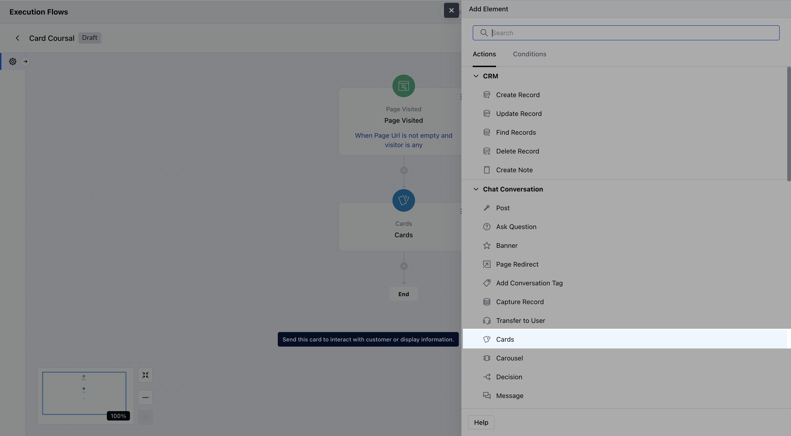
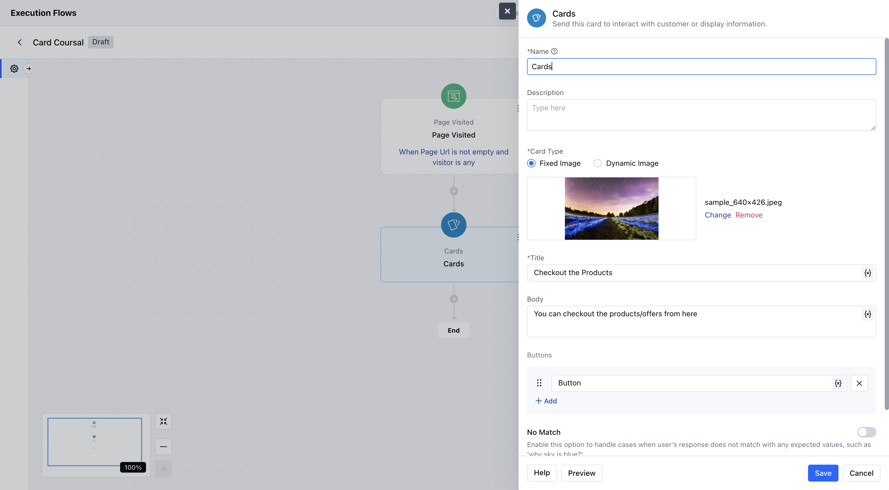
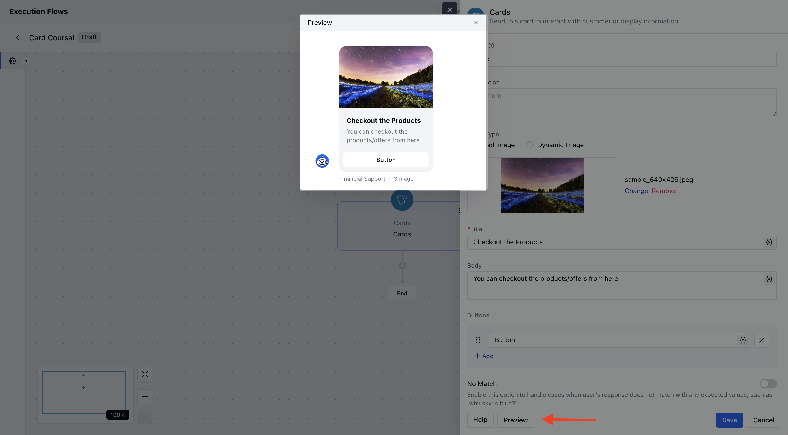
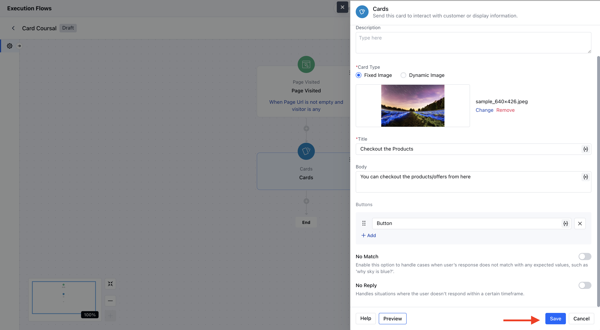
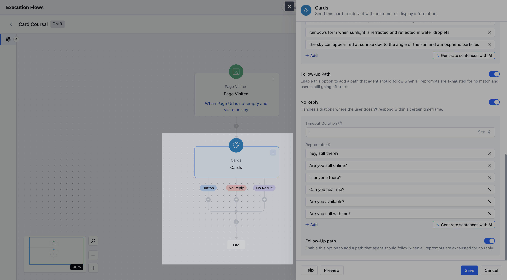
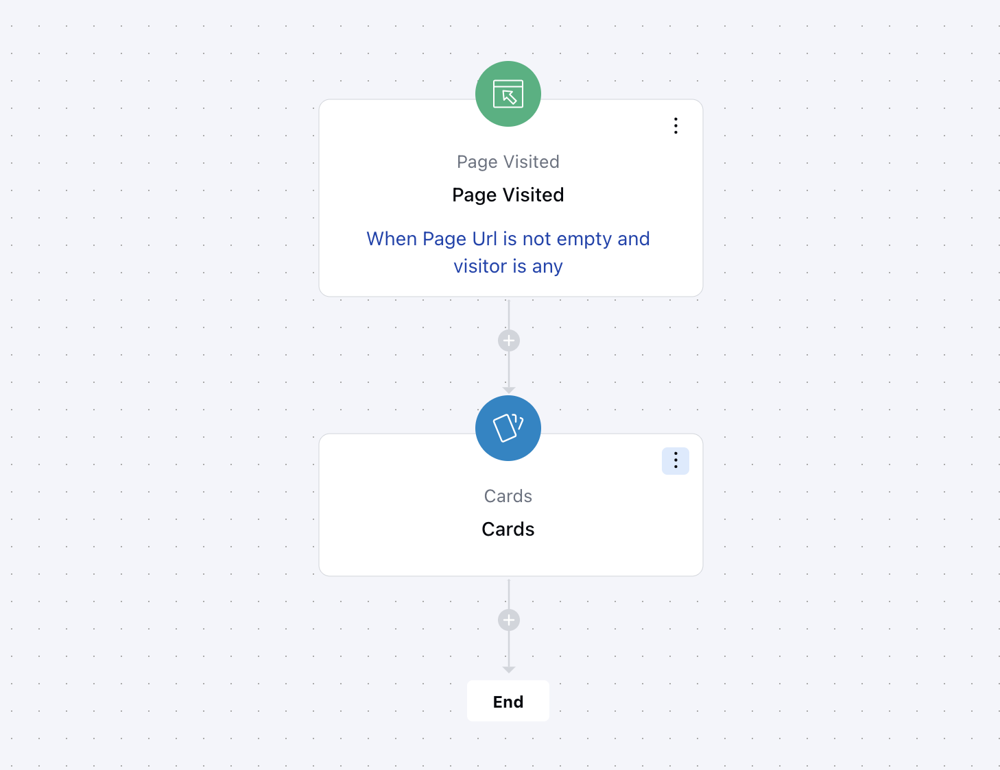

The **Card Component** in Execution Flows allows you to display structured information visually in line with the conversational interface. Cards can be shown individually or as part of a carousel to enrich chat experiences.

### **Topics covered:**

- [How to Configure the Card Component](#how-to-configure-the-card-component)
- [Practical Example](#practical-example)

### How to Configure the Card Component

While setting up a Smart Flow, select the **Card** action from the list of available actions.

Once selected, configure the card with the following settings:- **Name:** Assign a clear name to the card component.

- **Description:** Optionally, enter an internal description to describe the purpose or use of this card in the flow.

- **Image:** You may upload a static image or provide a dynamic image URL (supports variables).Supported formats: jpg, jpeg, png, gif.If no image is provided, a blank thumbnail will be shown.

- **Title:** This is the main heading on the card. This can contain text or variables (for dynamic content).

- **Body:** Descriptive text shown below the title. It can include dynamic variables and supports basic formatting (bold, italic, underline, etc.).

- **Buttons:** You can add up to 10 interactive buttons. Each button must have a label and can use variables.

- **No Match:** You can enable this option to handle unexpected user responses.

- **No Reply:** You can enable this option to handle silence or lack of user interaction.

You can also click on **Preview** to check how your Card Component will look.

After configuration, click **Save** to complete the setup.

Output ports are available for: each button, no match (if enabled), and no reply (if enabled).

### Practical Example:

Let’s say a visitor lands on your website’s **Product/Services** page. You can use the **Cards component** to display a **contextual pop-up message - ** promoting an offer, showcasing a featured product, or guiding them to a demo or contact form

This helps engage visitors in real-time, boosts conversion, and drives them toward the next step in your funnel.
