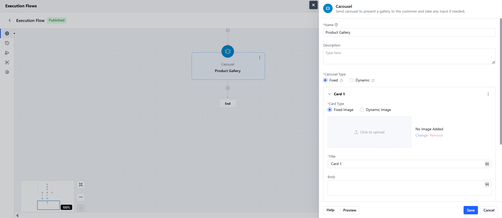
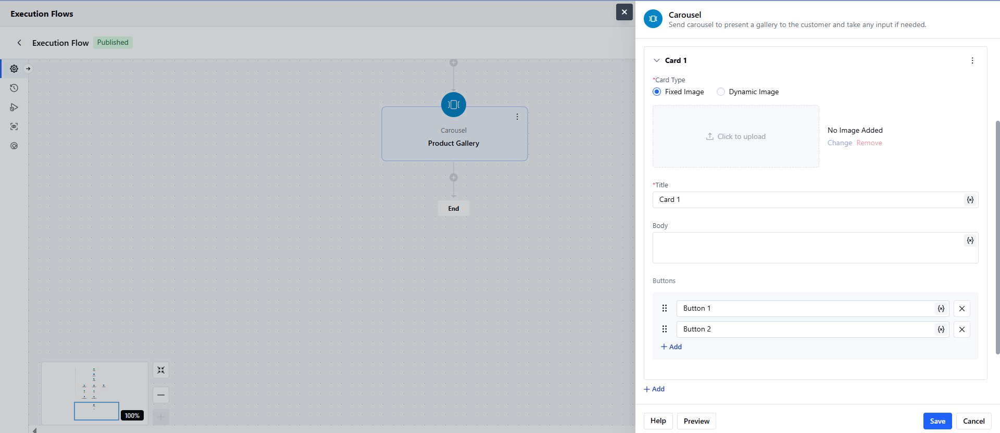
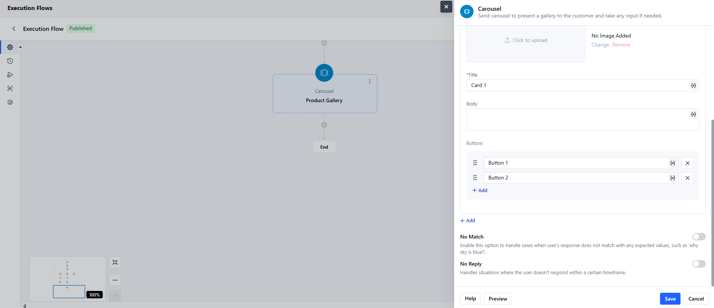
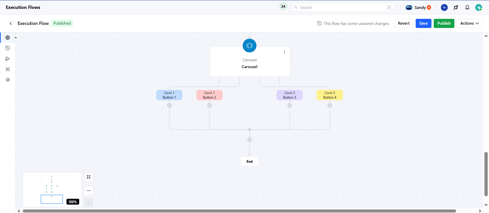
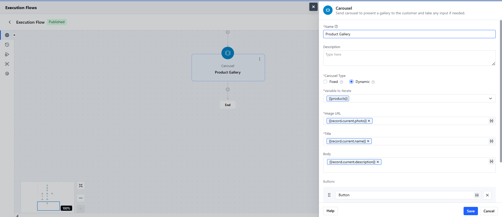
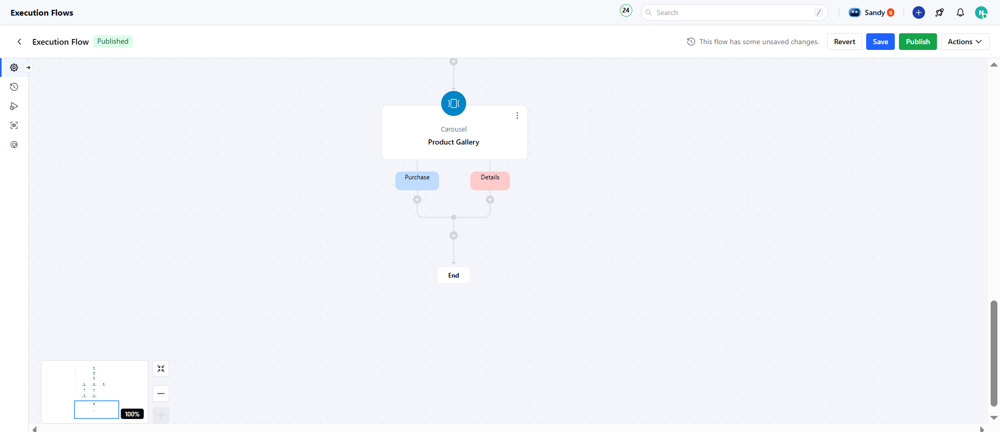
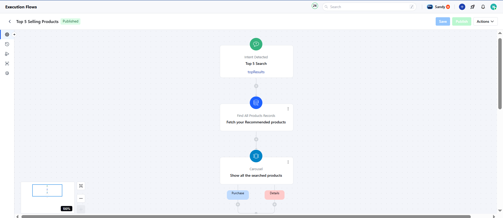

The **Carousel** component in your **Chat/Bot flow** allows you to display a swipeable gallery of cards to customers, each card containing images, text, and interactive buttons. It is ideal for showcasing products, options, or content previews and allows customers to make selections or take actions.It is a visual component that presents multiple cards to the user, either as fixed content or populated dynamically using variables.

### **Topics covered:**

- [Components of Carousel](#components-of-carousel-name-it-is-the-identifier-of-the-step)
- [Types of Carousel](#types-of-carousel)
- [Practical Use Case](#practical-use-case)

### Components of Carousel- 

- **Name:** It is the identifier of the step.
- **Description:** It is optional to display internal notes for context.
- **Carousel Type:** You can choose between Fixed or Dynamic.
- **Cards:** You can add one or more cards with an image, title, description, and buttons.

### Types of Carousel

- [Fixed Carousel](#fixed-carousel)
- [Dynamic Carousel](#dynamic-carousel)

### Fixed Carousel

A Fixed Carousel displays a set number of cards with manually defined content.

### Steps to Set Up Fixed Carousel

While setting up an Execution flow, select the Carousel Action.

- **Step Name:** Add a unique name for the carousel.
- **Internal Description:** (Optional) Add notes for internal use.
- **Carousel Type:** Fixed

You will need to add at least one card:

- **Image:** Upload an image or enter a static URL.
- **Title / Description:** Text content (you can use variables here).
- **Buttons:** Add 1–10 buttons per card.Each button can trigger a different action.

- Use the **Add Card button** to duplicate or create new cards.

  **Additional Settings:-**
- **No Match:** This triggers a fallback when the user's input doesn't match the button options. Sends reprompts and ends the flow if exhausted.
- **No Reply:** This triggers an alternative path when no response is received.

Click on **Save**. Configure the Actions for each Button.

**Note:** You must have at least one card.Buttons stay active even after interaction.Output ports = Number of cards × Number of buttons.

### Dynamic Carousel

A Dynamic Carousel renders cards using an array or loop-type variable.

### Steps to Set Up Fixed Carousel

While setting up an Execution flow, select the Carousel Action.

- **Step Name:** Add a unique name for the carousel.
- **Internal Description:** (Optional) Add notes for internal use.
- **Carousel Type:** Dynamic
- **Variable:** You need to provide a loop type of variable or an array type of variable that consists of multiple items or objects to iterate. For example: Record Type of variable with multiple values allowed.
- **Configure the Card Template:** You’ll configure only one card, which is repeated based on the items in the variable.
- **Image**: You can add the image URL attribute.
- **Title**: You can add the title of the card or use attributes for dynamic value.
- **Body**: You can add the body of the card or use attributes for dynamic value.
- **Buttons**: You can add the button names or use attributes for dynamic value.

**Additional Settings:-**

- **No Match:** This triggers a fallback when the user's input doesn't match the button options. Sends reprompts and ends the flow if exhausted.
- **No Reply:** This triggers an alternative path when no response is received.Click on **Save**. Configure the Actions for each Button.

<Note>
  \*\*Note: \*\*Maximum 10 cards and 10 buttons per carousel.All dynamic cards use the same structure and buttons.
</Note>

### Practical Use Case

- The Carousel can be used to display the top 5 products you offer when an intent is detected. You can show the product images, name, and price with buttons like Purchase or Details.The triggers and Actions used in this example:
- **Trigger**: [Intent Detected](https://support.salesmate.io/hc/en-us/articles/45879968714009)
- **Actions:** [Find Records](https://support.salesmate.io/hc/en-us/articles/38138036610201-Find-Records)[ Carousel ](#components-of-carousel-name-it-is-the-identifier-of-the-step)

Here is an example of how your execution flow will look:

