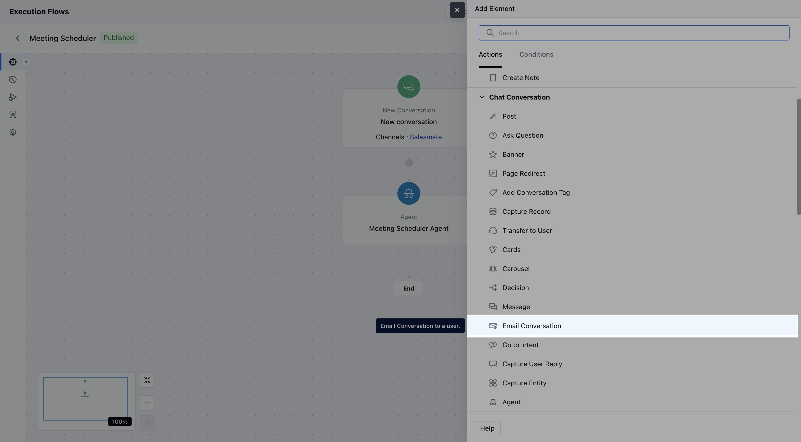
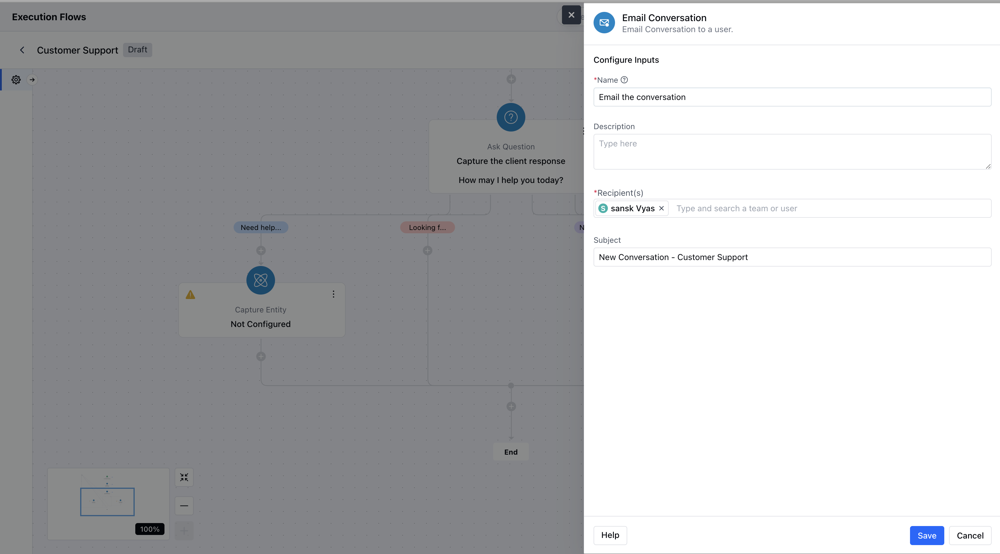
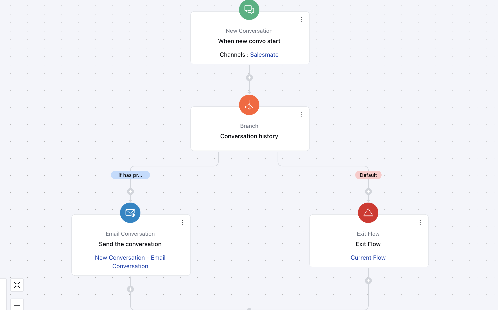

The **Email Conversation** action allows you to automatically send an ongoing conversation to a user or a team via email. This feature helps in notifying internal teams or agents about specific conversations based on workflow logic.

###  **Topics covered:**

- [How to Configure](#how-to-configure)
- [Practical Example:](#practical-example)

###  How to Configure

Drag and drop the Email Conversation Action from the Action list onto your flow canvas.

When configuring the **Email Conversation** action, you will be required to provide the following details:**Name**: Assign a clear and descriptive name for the action to easily identify its purpose **Description**: Offer a brief explanation of the action’s function.

- **Recipients:** Select individual users or teams to whom the email conversation should be sent.

- **Subject:** Define the subject line of the email.

Click the **Save** button after entering all required information to save this configuration.

###  Practical Example:

Let’s say you run a SaaS business, and your support team often gets follow-up queries from existing customers. To ensure continuity and quick resolution, you want any **returning customer’s new chat** to be **immediately forwarded to the relevant team or team member via email**.

