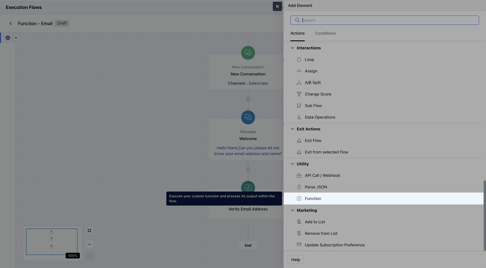
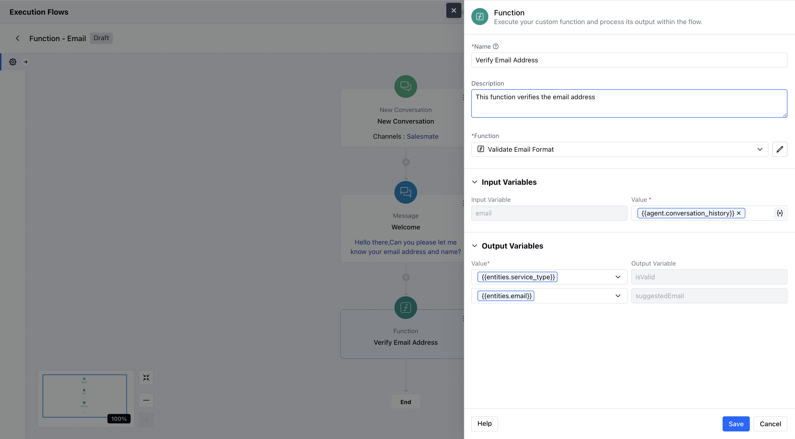
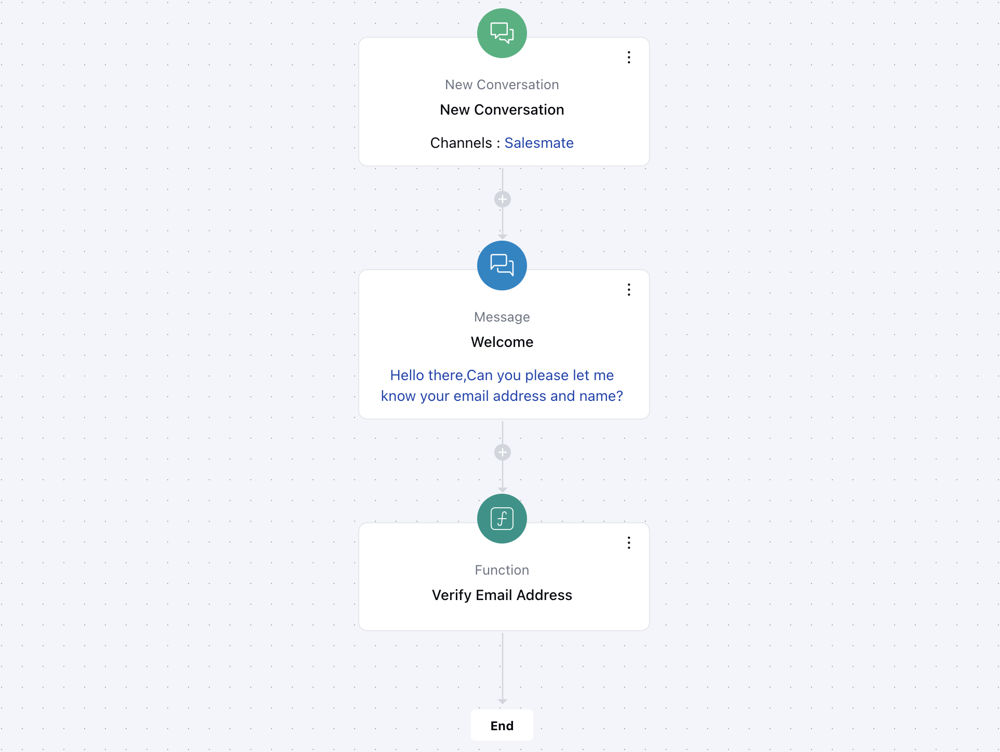

The**Function**action in Salesmate Smart Flows allows you to execute your custom function and use its output within the ongoing flow.**Topics Covered:**[How to Configure Function Action](https://support.salesmate.io/hc/en-us/articles/46626649011353-Functions#h_01JWW55RWBF0D9AG00GCW9CRJ6)[Practical Example](https://support.salesmate.io/hc/en-us/articles/46626649011353-Functions#h_01JWW56965DN8PWSP6AA5DZTCK)

### How to Configure Function Action

While setting up an [**Execution Flow**](https://support.salesmate.io/hc/en-us/articles/45878729348121-Execution-Flows), select the**Function**action. Once selected, configure it by providing the following details:

**Name:**Assign a clear and descriptive name to the action so you can easily recognize its purpose in the flow.**Description:**Optionally, provide a brief explanation of what this function does.**Function:**Select the custom function you want to execute from the available list. Only functions that are configured and available in your account will appear here

Once configured, hit**Save**to include this action in your flow.

### Practical Example:

Let’s take a scenario from your website: sometimes users might enter an incorrect email address or make a typo while filling out a form. To handle this, you can use the**Function Action**in your Smart Flow to**verify the email address first**. Once verified, you can then**store the correct email**in your system. This ensures you're capturing only valid and usable email addresses, helping improve your data quality and communication accuracy.

