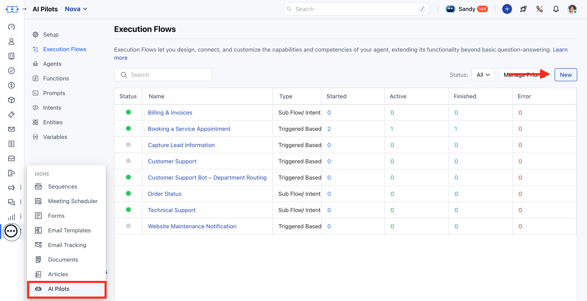
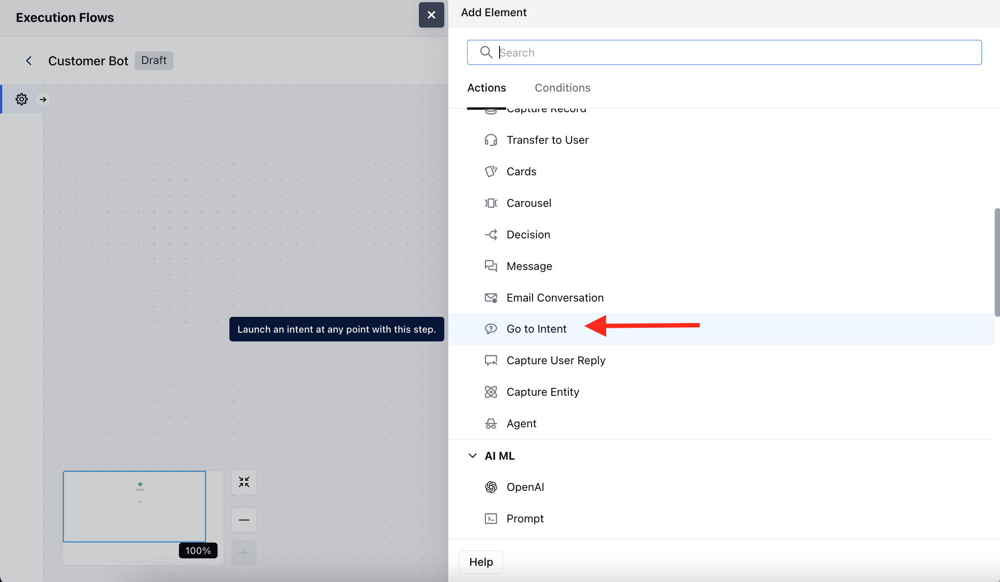
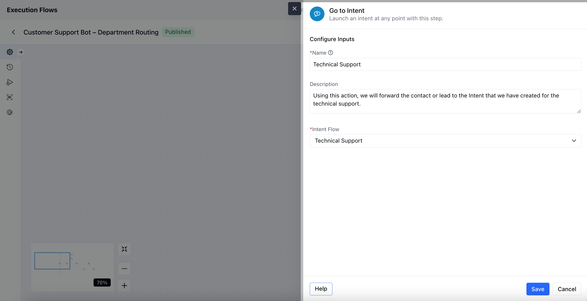
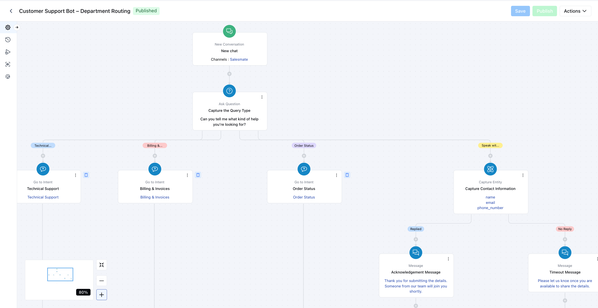

The **Go to Intent** action allows your AI Agent to instantly jump to a specific intent-based flow at any point during the conversation. This is especially helpful when you want to re-route a user based on their input or choices without re-detecting the intent.

### **Topics covered:**

- [How to Configure **Go to Intent** Action](#how-to-configure-the-go-to-intent-action)

- [Practical Example](#practical-example)

### How to configure the Go to Intent action

Navigate to the More option from the left menu barClick on the **AI Pilots**>> Select the AI pilot from the top Drop-DownMove to the **Execution Flows** Click on **New**

Once you have selected the Trigger, click , select the **Go to Intent** as an action.

Once selected, configure the following details:

- **Name:** Assign a meaningful name to this action for easy identification within your flow.

- **Description:** Optionally, describe the purpose of this action.

- **Intent Flow:** Select a predefined intent flow that should be executed further.

Click **Save** once your configuration is complete.

### Practical Example

Once a chat is initiated on our website, I want to identify the type of support the visitor needs. Based on their response, the lead or contact will be routed to a relevant subflow, such as Technical Support, Billing & Invoice Support, or Order Status, for a more personalized and efficient experience.

