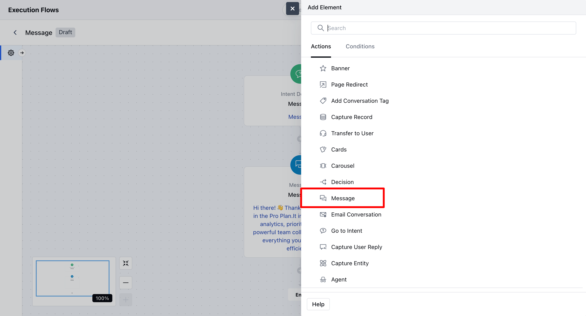
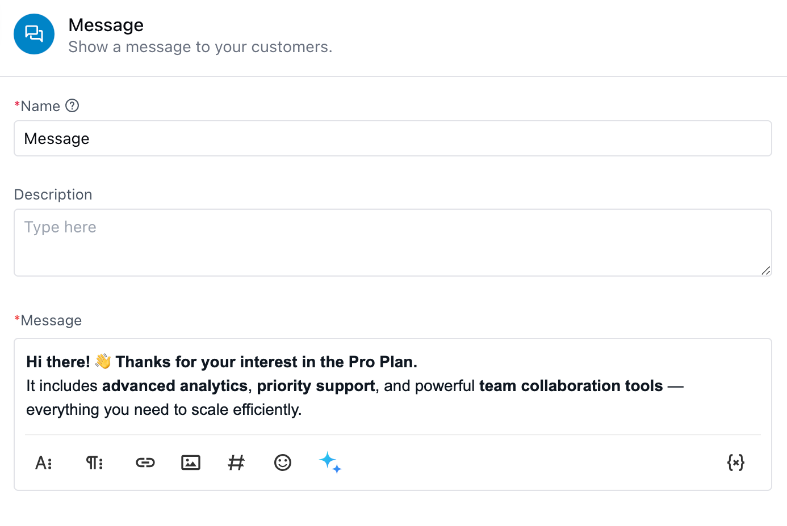
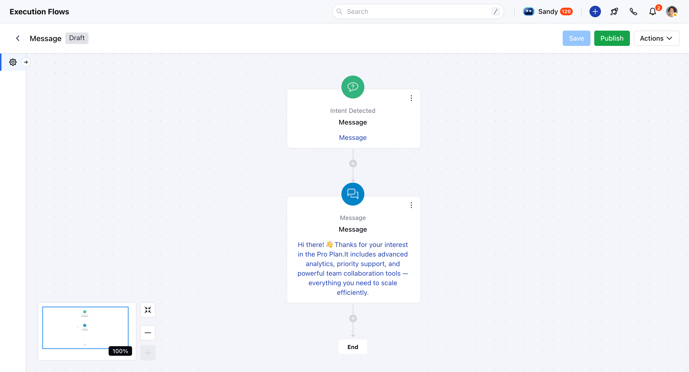

- The **"Message" action** allows agents to display a **custom message directly to customers during their interaction**. This can be useful for sharing important updates, guiding users through a process, or simply providing a friendly note or reminder. It gives you the flexibility to communicate clearly and contextually at any point in the workflow.

###  **Topics covered:**

- [Steps to Configure the Message Action](#steps-to-configure-the-message-actionadd-the-action-select-the-message-action-agentfrom-the-list-of-available-actions)
- [Practical Use Case](#practical-use-case)

###  Steps to Configure the Message Action:**Add the Action** Select the **Message – Action (Agent)**from the list of available actions.

- **Enter a Name:**Give your action a meaningful name to help identify it later.

- **Add a Description (Optional):**You can provide a short description for internal reference.

- **Write the Message:** Type the message that you want to display to your customers. You can personalize it using variables or dynamic content.

- **Preview Your Message:** Use the **Preview** button in the configuration popup to see how your message will appear.

- **Save :**Click **Save** to finalize and apply the configuration.

Once configured, the message will display based on your setup and will appear in the flow with the step name and message content visible.

###  Practical Use Case

Imagine a user is browsing your pricing page and opens the chat to ask:**“What’s included in the Pro Plan?”** Instead of waiting for an agent, your Execution Flow detects this query and triggers a **Message Action**:**“Great question! The Pro Plan includes advanced analytics, priority support, and team collaboration tools.”** This delivers immediate value and keeps the user engaged without agent intervention.

