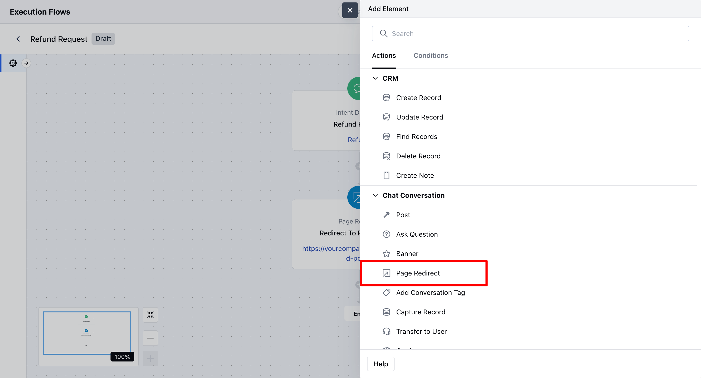
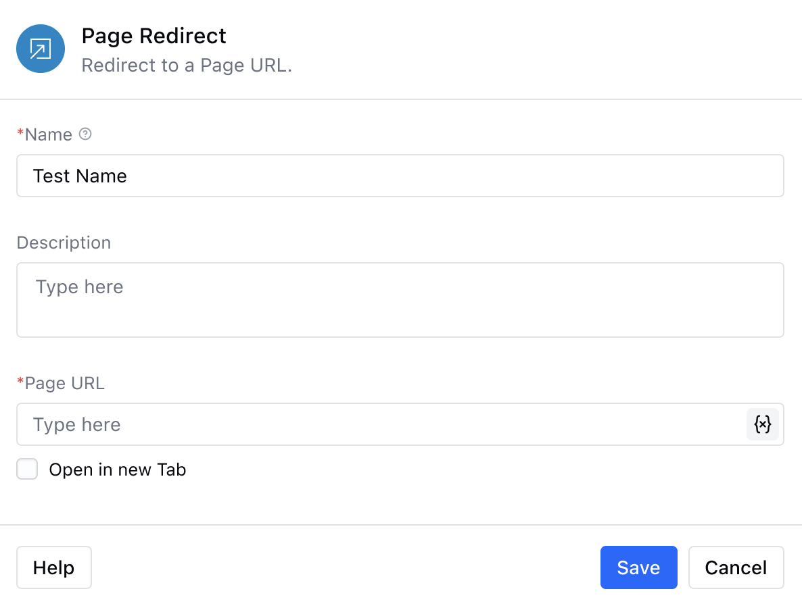
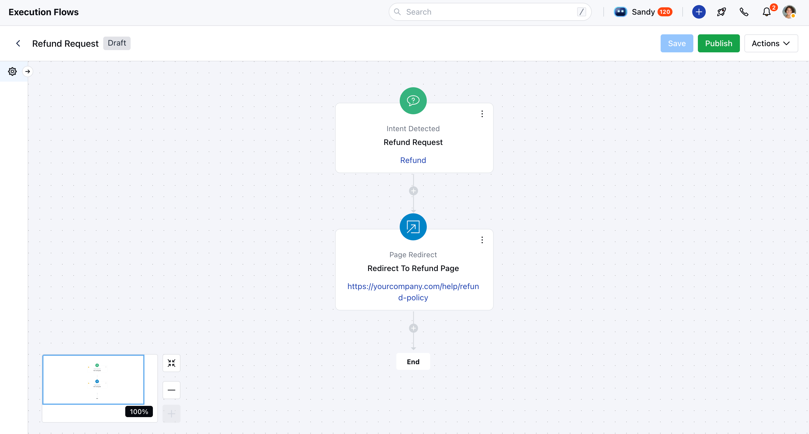

- The **"Page Redirect"** action allows AI Pilot to seamlessly redirect customers to a specific URL during an interaction. This can be used to guide users to a help article, form, product page, or any other external or internal resource.

###  **Topics covered:**

- [How to Configure the Redirect Action](#steps-to-configure-the-page-redirect-action)
- [Practical Use Case](#practical-use-case)

###  Steps to Configure the Page Redirect Action:

Navigate to the **AI Pilots** section and select your desired **Execution Flow.

- ** In the flow canvas, click **+** to add a new stepSelect **Page Redirect – Action (Agent)** from the list

- **Enter a Name:** Provide a name for the action to identify it easily within your flow.

- **Add a Description (Optional):** Include a short internal note or description if needed.

- **Enter the Page URL:** Input the destination URL where you want to redirect the customer. You can also use variables or entities to make the link dynamic.

- **Save the Configuration:** Click **Save** to apply the changes.

###  Practical Use Case

Let’s imagine a scenario where the intent "Refund Request" is detected during a chat. You’ve already defined this intent in system. Now, when a user types something like “How can I get a refund?”, the system identifies the intent and automatically triggers a **Page Redirect** action. The user is seamlessly redirected to your refund policy page `https://yourcompany.com/help/refund-policy`. This redirect event is then logged in the conversation timeline for future reference or follow-up.

