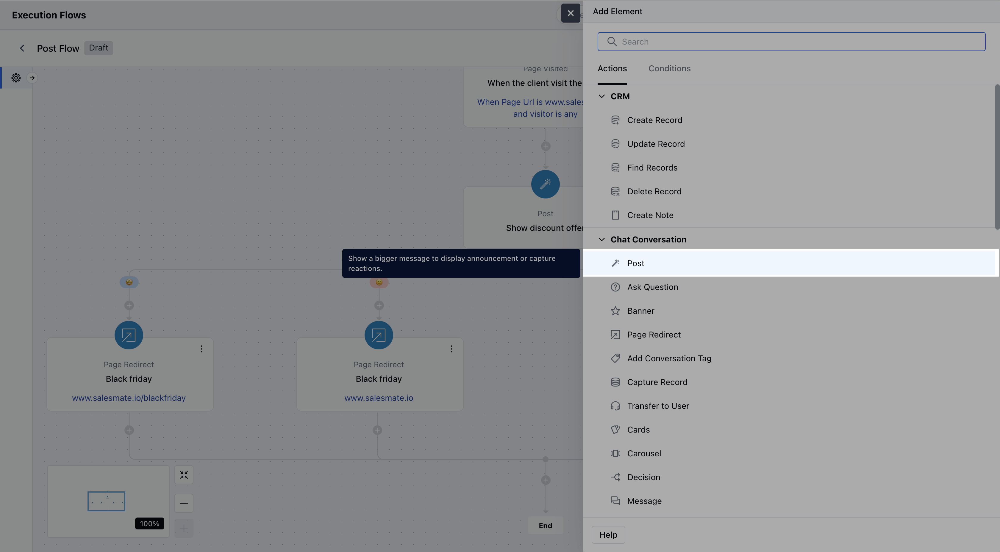
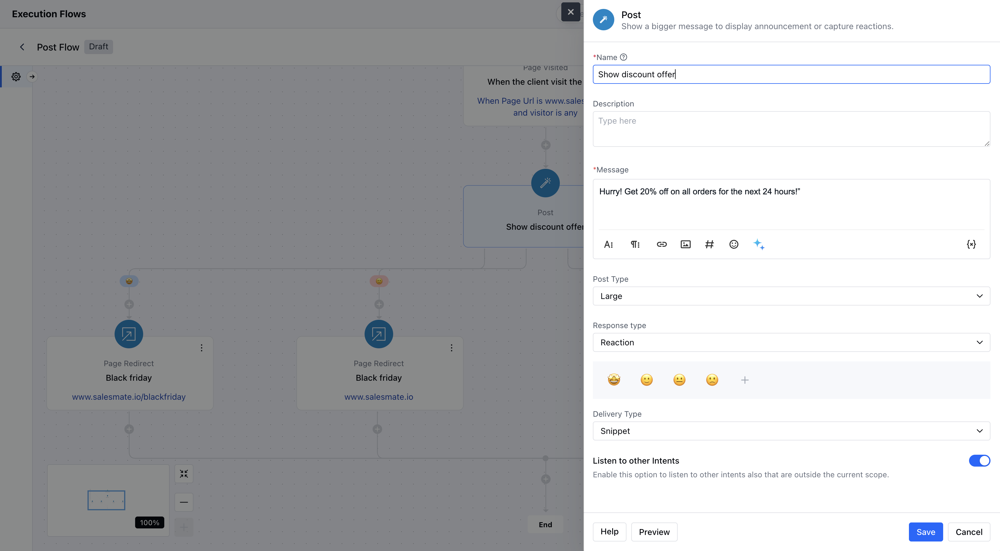
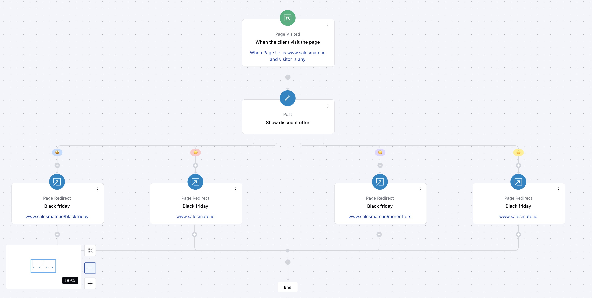

In this article, we will learn about how to configure the Post action. This action displays a popup message to visitors or contacts during a conversation and is particularly useful for gathering quick reactions or text-based feedback—such as asking users if they’re enjoying a specific feature.

###  **Topics covered:**

- [How to Configure the Post Action](#how-to-configure-the-post-action)
- [Practical Use Case](#practical-use-case)

###  How to Configure the Post Action

- **Name:** Assign a clear and descriptive name for the action to easily identify its purpose.

- **Message:** Enter the content of the message to be displayed.
 Variables or entities can be inserted into the message for dynamic personalization.

- **Post Type:** Select the display size of the post message—choose between **Small** or **Large**.

- **Response Type:** Decide how the user should interact with the post:
- **Reactions:** Allows you to specify reaction options (e.g., thumbs-up, thumbs-down).

- **Text Input:** Enables free-text responses from the user.

- **Delivery Type:** Choose how the post will be presented—either as a **Snippet**(compact display) or **Full**(expanded display).

- **Listen to Other Intents:**Enable this option if you want the agent to detect and trigger other intents based on the user’s input.
- [What is Intent and how to configure](https://support.salesmate.io/hc/en-us/articles/What%20is%20Intent%20and%20how%20to%20configure%20%20Intent)

###  Practical Use Case:

Display a **popup message** like “Hurry! Get 20% off on all orders for the next 24 hours!”Include a **CTA (Call to Action)**button (e.g., “Shop Now” or “Claim Discount”) as part of the **reaction options**. If the customer selects the action, the flow continues with the discount code or directs them to the sales page.If the user doesn’t respond or shows no interest, the flow can provide other shopping recommendations or offer assistance.

