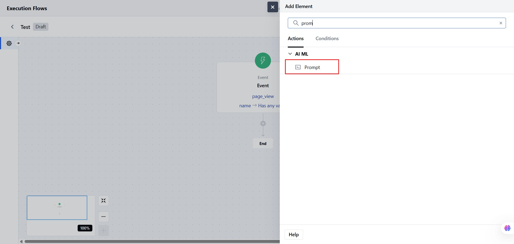
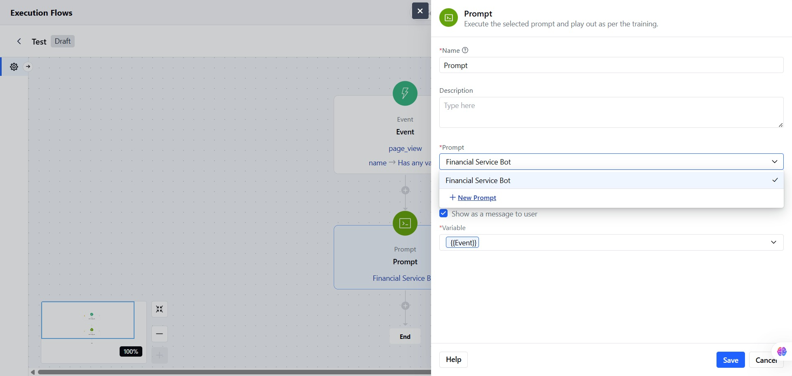
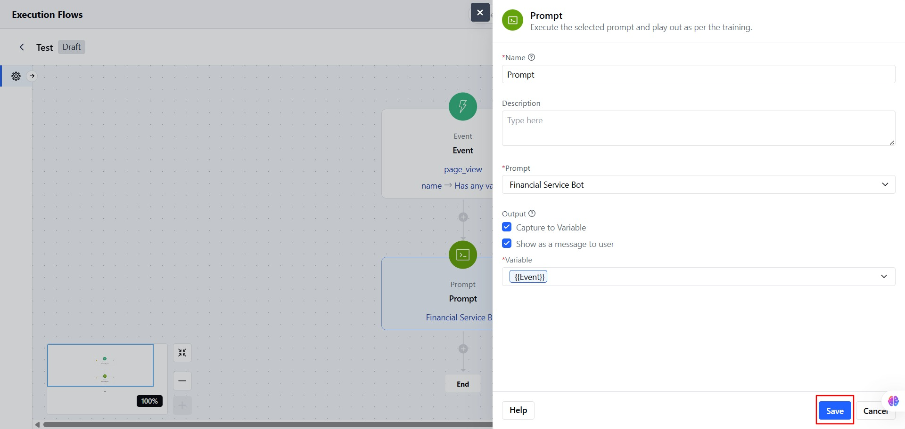

You can use this action to run a trained AI prompt in your flow. The prompt can include system instructions, sample conversations, and variables to guide the response. [Lean more](https://support.salesmate.io/hc/en-us/articles/45878724921369)

### How to Configure

Click on the **Prompt Action** block in your flow.

Add a **Name** based on your flowAdd a **Description,** it can help explain what this step does.

- **Select a Prompt:** Choose an existing prompt enabled for the bot. Or, you can **create a new prompt** from this screen.

- **Only one prompt** can be selected.You can choose two Output 
- **Options: RCapture to Variable** Save the response to a variable for use later in the flow.
- Show as a Message to User Display the response directly to the user in the chat.

Click **Save** to confirm the flow.

