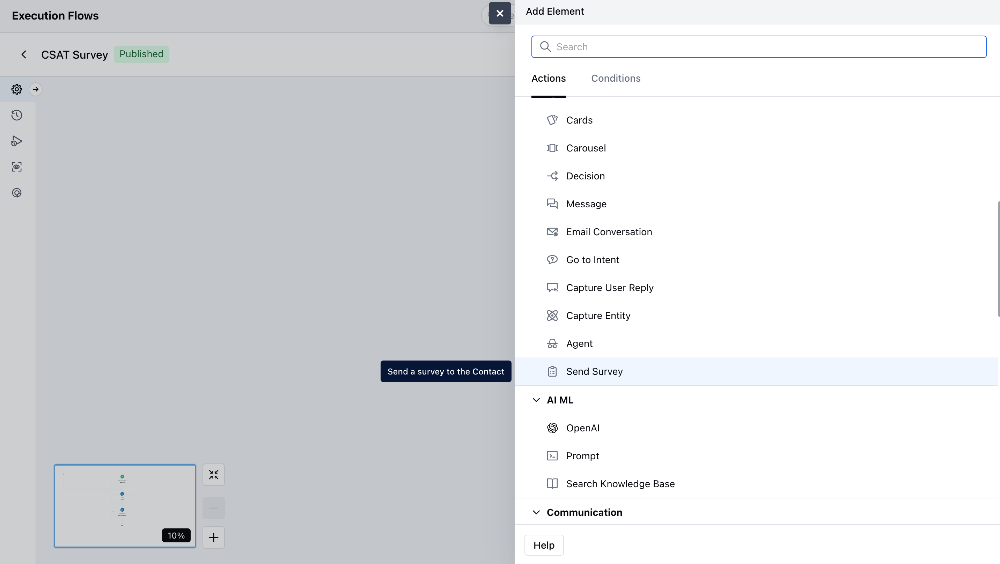
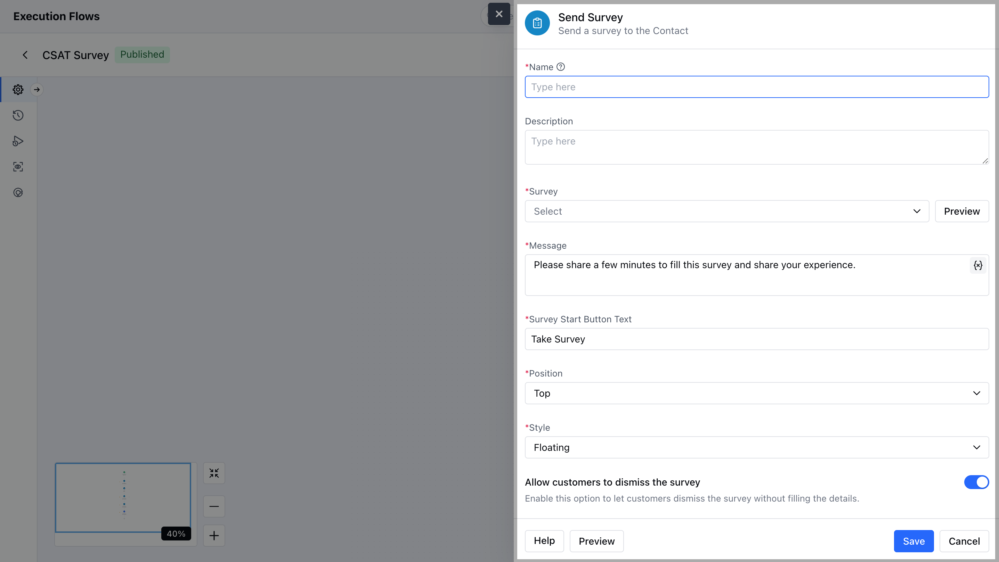
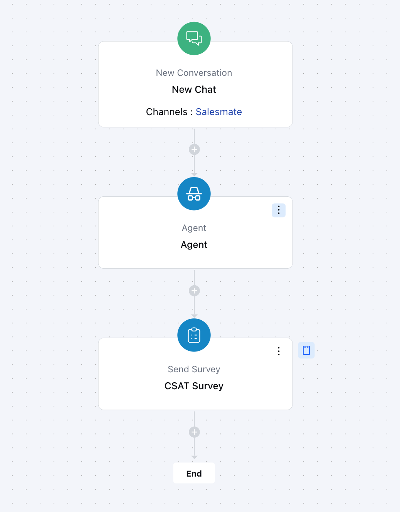

You can automatically send Survey (CSAT, CES, or NPS) to your contacts based on specific events using the **Send Survey** action. The Send Survey in chat action enables you to collect valuable feedback from your customers by sending surveys automatically when certain triggers occur.

- [How to Configure the Send Survey Action in Chat](#how-to-configure-the-send-survey-action-in-chat)
- [Practical Use case](#practical-use-case)

### How to Configure the Send Survey Action in Chat

While setting up an [**Execution Flow**](https://support.salesmate.io/hc/en-us/articles/45878729348121-Execution-Flows), select the **Send Survey** action.

- \*Once the action is selected, configure it by providing the following details:
- **Name** : It is the identifier of the step.
-  **Description** : It is optional to display internal notes for context.
- **Select Survey**  : Choose which survey (CSAT, NPS, CES, or custom) from the surveys created that you want to send to the customer in the chat.
-  **Message _: Enter the greeting or message that appears above the survey invite in the chat. For example: "We’d love your feedback!"_** Survey Start Button Text **: Customize the text on the button that starts the survey. For example: "Start Survey" or "Share Feedback"** 
- **Position** : Decide where the survey message appears in the chat window — top, bottom, or after a specific message.
- Style : Choose the visual style of the survey block to match your brand (like color theme or button style).
-  Allow customers to dismiss the survey **: Turn this on to let customers close or skip the survey if they don’t want to answer.You can preview the Survey using the** Preview\*\* button.

Click on **Save** to save the action.

### Practical Use case

After successfully helping a customer with a support query in chat, automatically send a quick CSAT survey asking how satisfied they were with the assistance they received. This helps measure real‑time customer satisfaction and identify areas to improve the support experience.

