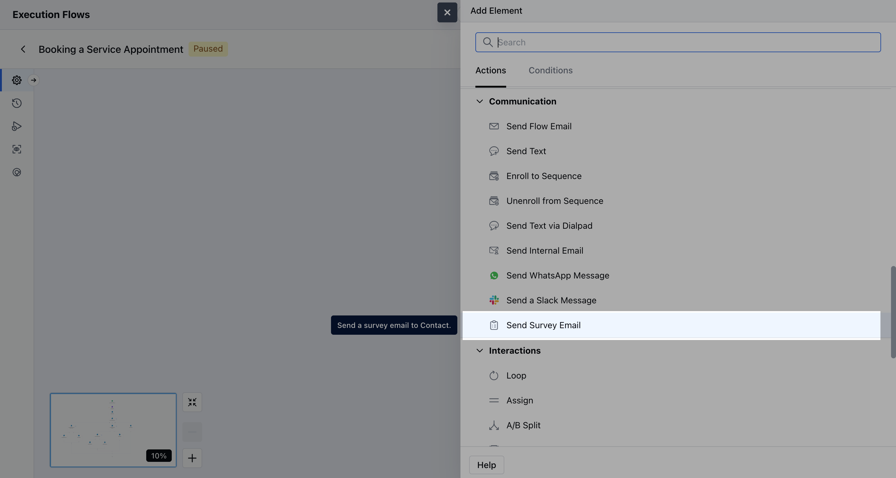
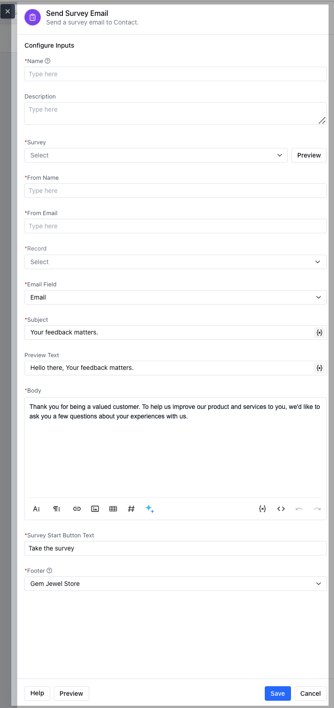
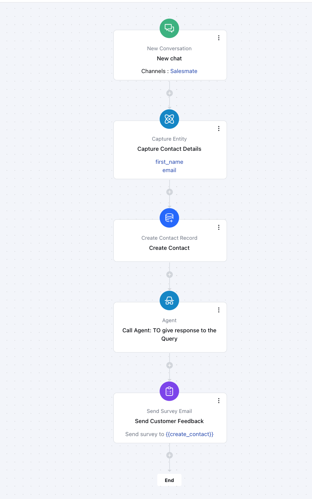

- **Send Survey Email** is an action block available in
- [Smart Flows](https://support.salesmate.io/hc/en-us/categories/36619982436121-Smart-Flows)
and Agent
[Execution Flows](https://support.salesmate.io/hc/en-us/articles/45878729348121-Execution-Flows)
that lets you automatically send a survey (CSAT, CES, or NPS) to a contact based on specific events or triggers.This is useful for collecting feedback after customer interactions such as closing a deal, completing an activity, resolving a ticket, or engaging with a contact.

###  **Topics covered:**

- [How to Configure the Send Survey Email Action](#how-to-configure-the-send-survey-email-action)
- [Practical Example](#practical-example)

###  How to Configure the Send Survey Email Action

While setting up an [**Execution Flow**](https://support.salesmate.io/hc/en-us/articles/45878729348121-Execution-Flows), select the **Send Survey Email** action.

To configure the **Send Flow Email Action**, you'll need to provide the following details:**Name**: Assign a clear and descriptive name for the action to easily identify its purpose.

- **Description**: Offer a brief explanation of the action’s function.

- **Survey:** Choose from any published surveys (CSAT, CES, or NPS).

- **From Name:** This is the **name of the sender** shown in the recipient’s inbox.

- **From Email:** Email address from which the survey email is sent.

- **Record:** Specify the recipient of the email. In this, you need to specify the contact or set of contacts for the email delivery.

- **Email Field:** Choose the email field where the survey will be sent.

- **Subject:** Subject line of the survey email.

- **Preview Text:** Short preview text shown in the email inbox.

- **Body:** Here you can store the Email message body.

- **Survey Start Button:** Label for the survey button.

- **Footer:** Email footer content.

Once the configuration is completed, hit **Save**.

**Note:**If the selected email isn’t found or their email domain isn’t verified, the survey will not be sent, and the process will not move forward.

###  Practical Example:

Once a user initiates a chat with us, we can automatically capture their basic details such as **name** and **email**, and create a contact record in the system. From there, we can route the conversation to our **AI Agent** to handle their query in real time. After the interaction is complete, we can trigger a **survey** to collect feedback on their experience.

