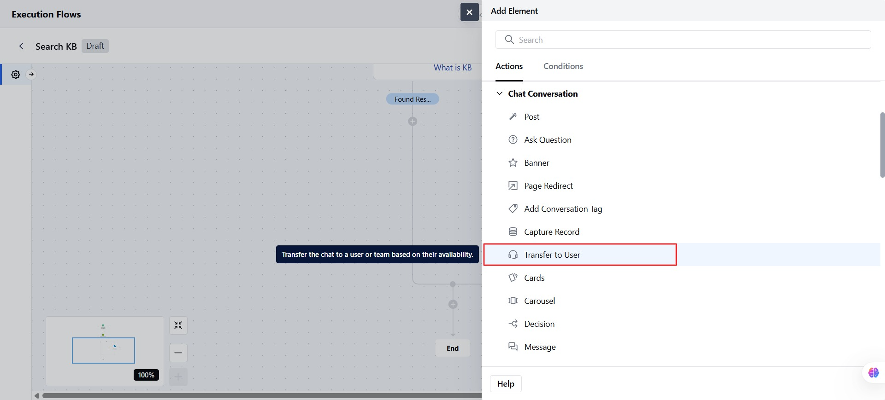
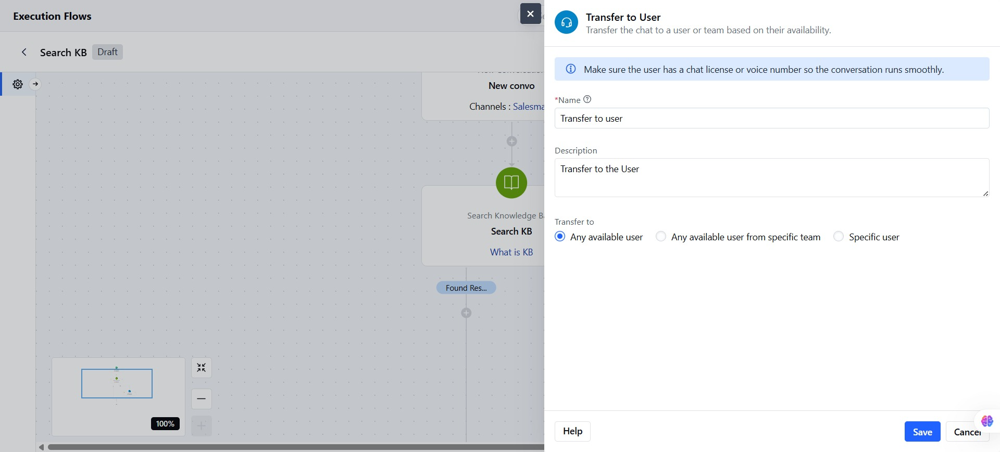
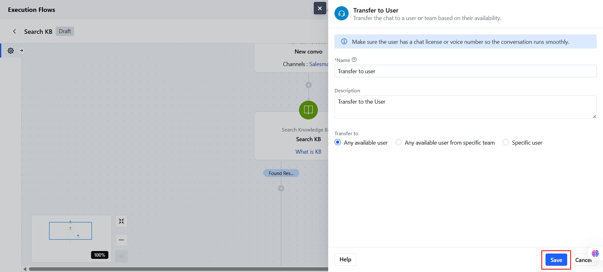
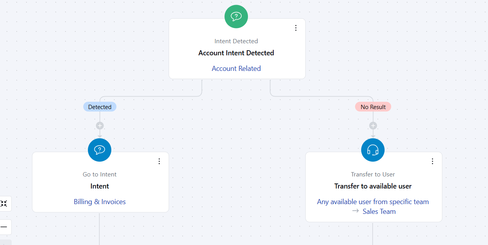

The **Transfer to User** Action in Salesmate AI Pilot allows you to seamlessly transfer a chat to a specific user or team based on real-time availability.

###  **Topics covered:**

- [How to Configure Transfer to User Action](#how-to-configure-transfer-to-user-action)
- [Practical Use Case](#practical-use-case)

###  How to Configure Transfer to User Action

While setting up a Execution Flow, select the **Transfer to User** action.

Once selected, configure the action with the following details:

- **Name:** Give the action a clear and recognizable name. This field is required and follows standard validations.

- **Description:** Optionally, describe what this action will do or who it will transfer the chat to.

- **Transfer To:** Choose how you want to transfer the chat from the following 3 options.

- **Any available user:** The system will check the availability of all users and randomly assign the chat to the first available user.

- **Any available user from a specific team:** Select one active team from the dropdown

- **Specific user:** Select one active user to whom to transfer the chat.

After finalizing the setup, click **Save** to apply the configuration.

When the flow reaches this step:
If the selected user is available, the chat is transferred, and the flow ends.If not, the system continues based on your flow’s fallback logic.

###  Practical Use Case

Let’s imagine a scenario where the intent "Account Related Support" is detected during a chat. You’ve already defined this intent within your AI or bot system. Now, if the user's query requires human involvement, such as checking with account owners or sales reps, you can automate the process further by passing this information into a Execution Flow. From there, the system can automatically check for available users from the Sales or Account Management team and assign the conversation or task to an available team member.

