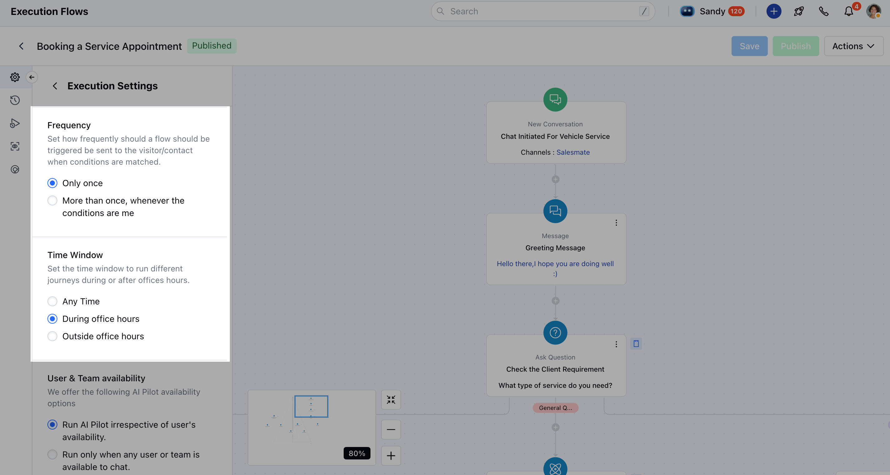

Execution Settings are used to define how an execution flow behaves once triggered by an event, such as a new conversation, intent match, or page visit. They replace the enrollment conditions used in smart flows and offer more focused control over chat journey behavior.

Execution Flows only run if execution settings are properly configured.

###  **Topics covered:**

- [How to Access Execution Settings](#how-to-access-execution-settings)
- [Execution Settings](#execution-settings)
- [Best Practices](#best-practices)

###  How to Access Execution Settings

Navigate to **AI Pilots** from the main menuSelect your **AI Pilot**

Click on **Execution Flows** Choose or create a flow

Open the **Execution Settings** panel in the canvas.

###  Execution Settings

Execution settings help define when and how often an **Execution Flow** should be triggered for visitors or contacts, based on specific conditions and timing preferences.

- **Start Time:** Set the start time of the Flow

- **Immediately:** With this option, the execution flow is executed immediately.

- **Custom:** This option allows you to set a specific start date from which you’d like the flow to begin execution.

- **Stop Time:** Define when the current flow should stop running after it goes live.

- **Never:** The flow will continue running indefinitely.

- **Custom:** Select a specific date and time to stop the flow.

- **Frequency:** Determine how frequently the flow should run when the trigger conditions are met:**Only once** The flow will run just a single time for a visitor/contact when conditions are matched.

- **More than once** The flow will run every time the conditions are met.

- **Time Window:** Control when the journey should be triggered based on the time of day:
- **Any Time:** Flow can run at any time, regardless of office hours.

- **During Office Hours:** Flow will only trigger during the hours defined as office hours.

- **Outside Office Hours:** Flow will only trigger beyond your specified office hours.

- *User & Team Availability:**Choose how AI Pilot interacts with users or teams based on their availability:**Run AI Pilot irrespective of user's availability: The** Flow will always run, even if users are offline.

- **Run only when any user or team is available to chat:** Flow will only trigger when at least one user or team member is available.

- **Run only when a specific user or team is available to chat:** Choose specific users or teams, the flow runs only when they are online.

- **Run only when everyone is unavailable to chat** Flow runs only when no team members are available.

- **Run only when specific user or team is unavailable to chat:**Target specific users or teams—flow triggers only if they are not available.

###  Best Practices

Use **simple language** for flow names and descriptions.Keep triggers and conditions aligned with your business goals.Regularly review execution logs for optimization.Always test your flow before publishing.
