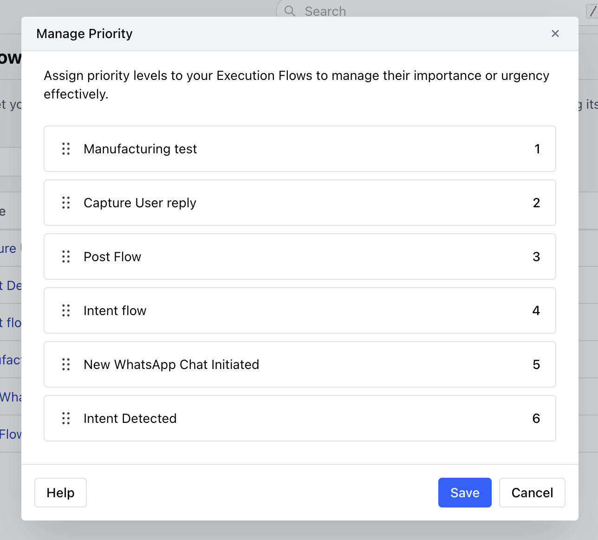

Assign priority levels to your Execution Flows to manage their importance or urgency effectively.To Set Priority to your Execution Flows:

Navigate to the **AI Pilots** from the left bar.

Head Over to Execution Flows sectionNow, click on Manage Priority optionA pop will appear where you can simply drag and drop the flows from the list to reorder them based on the Priority.Once done click on **Save** the changes.

