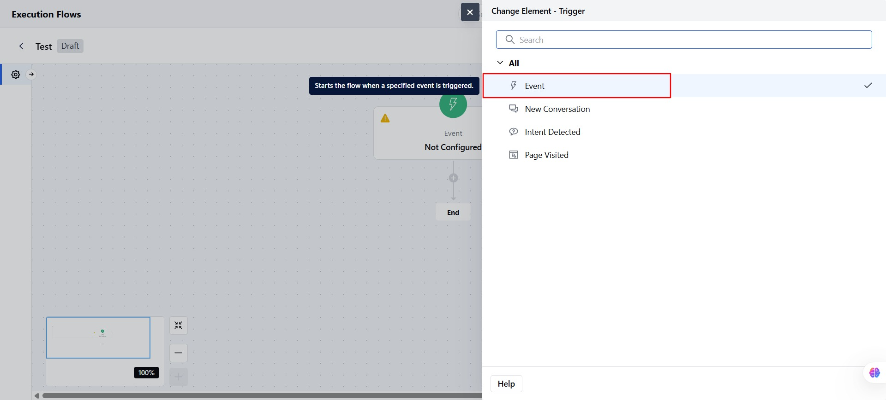
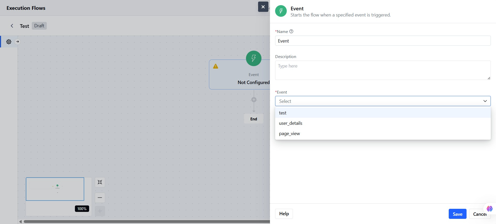
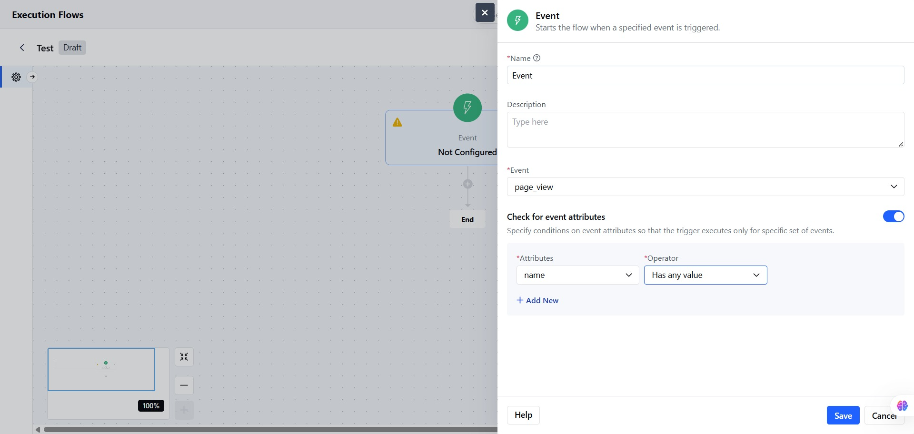
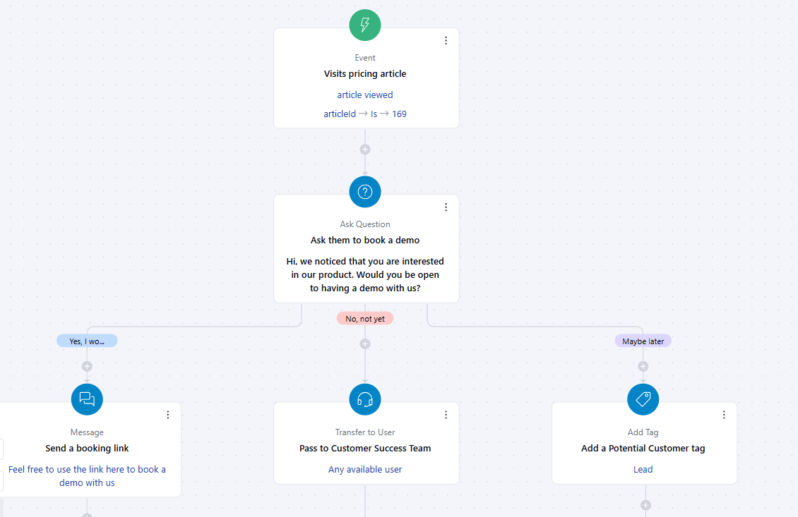

An event is an action a visitor or contact performs on your website, like signing up, clicking a link, or submitting a form. This trigger starts an Execution Flow when a specific event happens.**Topics Covered:**[How to Configure Event Trigger](https://support.salesmate.io/hc/en-us/articles/45879982812185-Event#h_01JW68BDQPYMYM7W35N13F4647)[Practical Example](https://support.salesmate.io/hc/en-us/articles/45879982812185-Event#h_01JWT1N5CH04MH3N2A932DSBEY)

### How to Configure Event Trigger

Select the**Event Trigger**from the Execution Flow Triggers.

Add the**Name**for the Event Trigger.You can also add a**Description**describing the Event trigger.Select the**Event from the list.**

You can add**Attribute Conditions:**Add one or more conditions based on event attributes.**Attribute Name****Operator**: Choose based on the type of data
IsIs notIs unknownHas any valueMore thanLess than**Value**You can also add more attributes for better or specific results.

Click on**Save**to store the configuration.

**Note:**The Flow will only start if**all attribute conditions**match.

### Practical Example

When a visitor views the Pricing & Plans article in your knowledge base, you want to initiate a conversation asking if they’d like to book a demo. Based on their response, the flow should:

Send a booking link if the answer is**Yes**Redirect to a live agent if the answer is**No**Add a "Potential Customer" tag if the answer is**Maybe**

