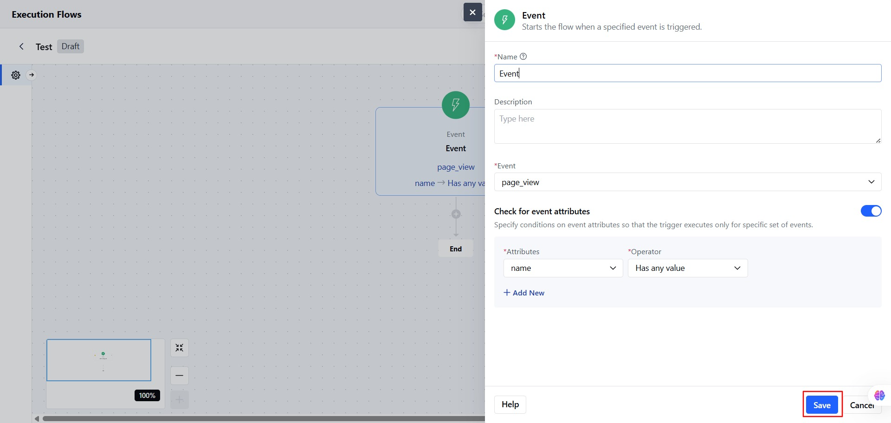

An event is an action a visitor or contact performs on your website, like signing up, clicking a link, or submitting a form. This trigger starts an Execution Flow when a specific event happens.

### **Topics covered:**

- [How to Configure Event Trigger](#how-to-configure-event-trigger)
- [Practical Example](#practical-example)

### How to Configure Event Trigger

Select the **Event Trigger** from the Execution Flow Triggers.

- Add the **Name** for the Event Trigger.
- You can also add a **Description** describing the Event trigger.
- Select the **Event from the list.**

- You can add**Attribute Conditions: **   Add one or more conditions based on event attributes.
- **Attribute Name**
- **Operator**: Choose based on the type of data
  - **Is**
  - **Is not**
  - **Is unknown**
  - **Has any value**
  - **More than**
  - **Less than **
  - **Value**
- You can also add more attributes for better or specific results.

- Click on **Save** to store the configuration.

<Note>
  **Note: **The Flow will only start if **all attribute conditions** match.
</Note>

### Practical Example

When a visitor views the Pricing & Plans article in your knowledge base, you want to initiate a conversation asking if they’d like to book a demo. Based on their response, the flow should:

- Send a booking link if the answer is **Yes**
- Redirect to a live agent if the answer is **No**
- Add a "**Potential Customer**" tag if the answer is **Maybe**

