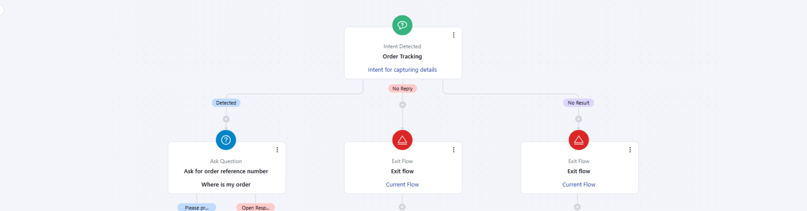

In this article, we will learn about how to configure the**Intent Detected: Agent**trigger. This trigger automatically starts a flow when a specific intent is detected by the bot based on the customer’s input. It ensures the assistant can react appropriately and guide the conversation toward targeted solutions or actions.

### Topics Covered

[Configuring the Trigger](https://support.salesmate.io/hc/en-us/articles/45879968714009-Intent-Detected#h_01JWEFJXECHJDS9V3K0JDBMGK4)[Practical Use Case](https://support.salesmate.io/hc/en-us/articles/45879968714009-Intent-Detected#h_01JWEFJXEDF43WRF2XX75B532M)

### Configuring the Trigger

While setting up a Execution Flow, select the Intent Detected Trigger

**Name:**Assign a clear and descriptive name for the trigger to easily identify its purpose.**Description (Optional):**Provide a brief explanation of the trigger’s function for reference.**Intent:**Select the intent that will trigger this flow upon detection. Only**enabled intents**will appear in the dropdown list.**No Match Handling:**This option manages situations when the user's input doesn’t match the expected prompt or contains irrelevant content.
You can add optional**re-prompts**to guide the user back on track.**Generate More with AI:**Available after adding at least one re-prompt; generates five, ten, or fifteen new training phrases.Re-prompts loop until all provided prompts are used, after which the conversation proceeds along the default path.

**Follow-up Path:**Define an alternative route if the user remains off track after all re-prompts are used.
Enabling this adds an extra output port to specify the follow-up path.**No Reply Handling:**This option manages cases and send automated responses when the user does not respond.**Timeout Duration:**Set duration after which re-prompt message should be sent**Re-Prompt configuration**: Provide one response to send when No reply is detected and you can use the**Generate Sentences with AI"**button to get additional responses.

 Once configuration is complete, click**Save**.

### Practical Use Case:

Imagine a customer messaging the chatbot with the phrase “Where’s my order?”. Instead of routing the query to a human agent or waiting for a manual reply, the**Intent Detected: Agent**trigger can:

Automatically detect the**Order Tracking**intent.Start a pre-configured flow that fetches order details from the integrated system (e.g., Shopify, internal database). Provide the customer with real-time order status, estimated delivery date, and a tracking link. If the customer’s input doesn’t match or is incomplete (e.g., missing order number), the re-prompts guide them to provide the required information.

This approach not only speeds up the resolution but also enhances the customer experience with accurate, instant updates.

**Note**:

When used in an execution flow, the flow type is set as**Sub Flow of synchronous type**. Execution settings are displayed; however, you can only access flow manager within Execution settings when this trigger is selected.
