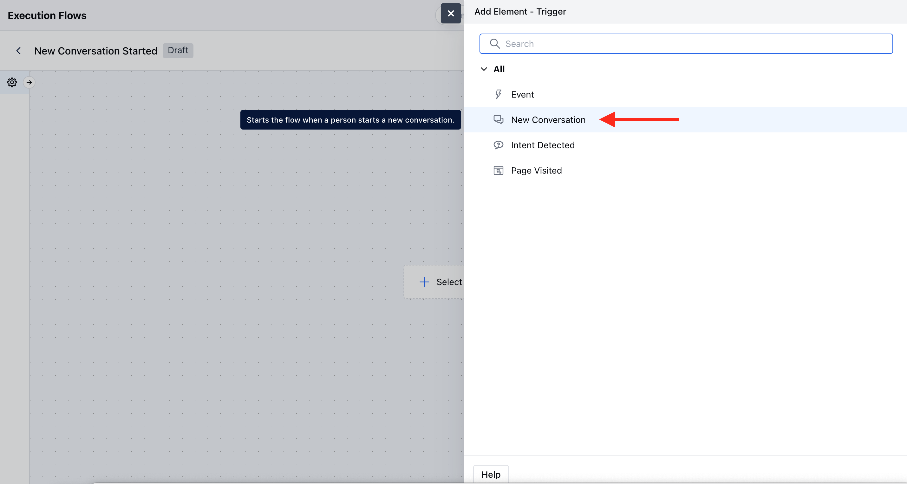
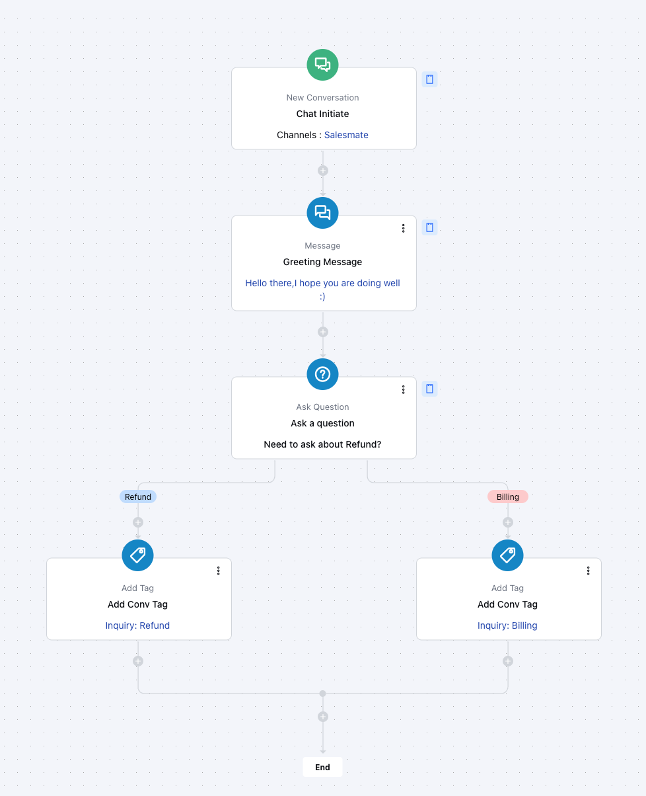

The trigger **New Conversation** helps you start a flow whenever a new conversation begins on selected channels. It supports Web, WhatsApp, Facebook, and voice channels.

### **Topics covered:**

- [How To Configure New Conversation - Trigger (Agent)](https://support.salesmate.io/hc/en-us/articles/45879946769177-New-Conversation#h_01JVWDK06ZJRGCXVG43FF1HJ0R)
- [Practical Example](#practical-example)

### Steps to Configure

- Navigate to the **More Icon** from the left menu bar
- Click on the **AI Pilots** 
- Select the **AI Pilot** from the drop-down.
- Go to **Execution Flows.**
- Click **Create New Flow.**
- Choose **Trigger - New Conversation.**

Fill in the configuration:- 

- **Name:** Add a name for the trigger.
- **Description:** Add details to explain what the trigger does.
- **Channels:** Select at least one channel.
- **Web:** Triggers when a new chat starts from the Salesmate widget.
- [**Facebook:**](https://support.salesmate.io/hc/en-us/articles/25699791176857) Triggers when a new chat starts from Facebook.
- **WhatsApp:** Triggers when a new chat starts from WhatsApp.

### Practical Example

When a customer initiates a new chat via the **Salesmate Web Widget**, the **New Conversation** trigger activates an AI Pilot flow that:

- Greets the customer automatically.
- Collects basic information (like name, email, or issue type).
- Routes the conversation to the right team, such as **Sales** for pricing inquiries or **Support** for technical issues, based on user responses.

This ensures quicker response times, reduces manual triage, and delivers a personalized experience across channels like **Web**, **WhatsApp**, **Facebook**, or **Voice**.

<Note>
  **Note:**

  - If a selected channel is not installed, you will see this message: \
    "You need to install the app first to configure its triggers, conditions, or actions."
  - If Unified Inbox is not active, this warning will appear: "You need to activate the Unified Conversation Inbox and connect this channel to configure the trigger."
  - If no voice number is assigned to the AI Pilot, you’ll see: "You need to add at least one number to the Voice Channel associated with this AI Pilot to receive and handle the incoming calls."
</Note>