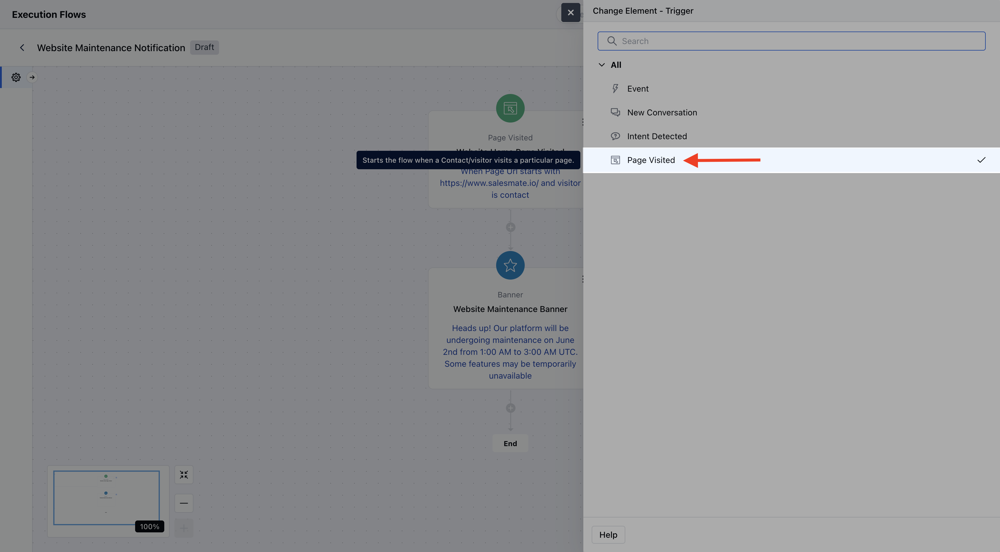
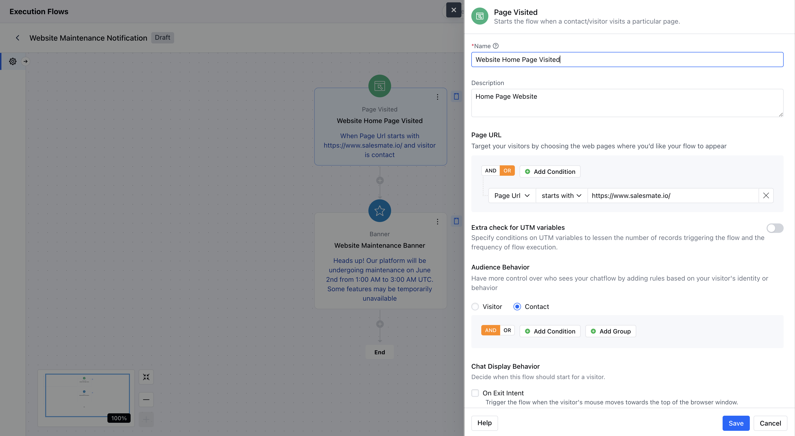
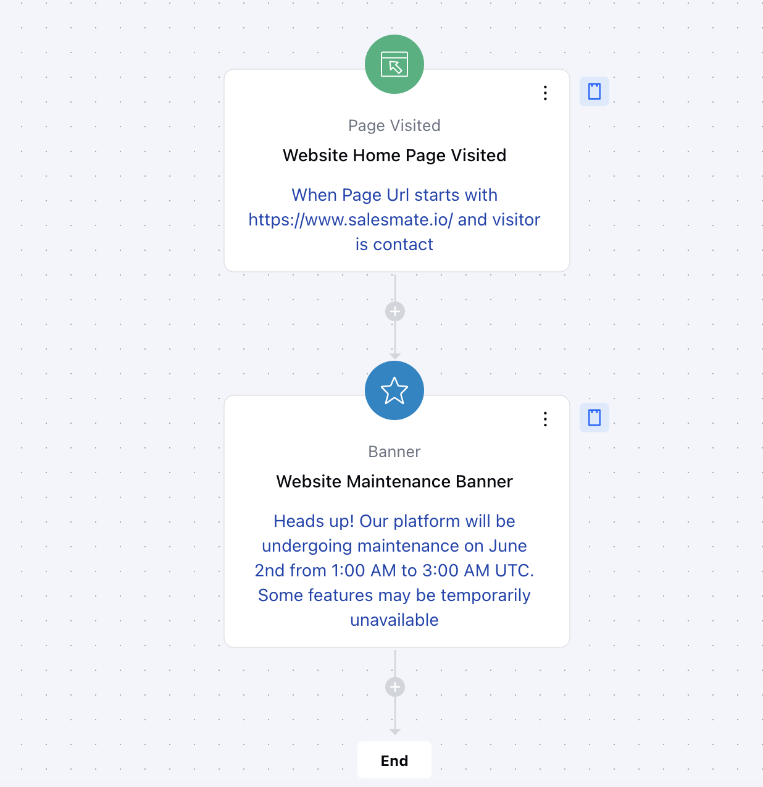

The **Page Visited** trigger is used to initiate a chat flow when a contact or visitor lands on a specific web page. This trigger helps you engage users contextually based on the page they’re visiting and their behavior on your website.

###  **Topics covered:**

- [Add the Trigger](#add-the-trigger)
- [Configure the Page Visited Trigger](#configure-the-page-visited-trigger)
- [Practical Example](#practical-example)

Follow the steps below to configure the Page Visited trigger in your chat execution flow:

###  Add the Trigger

Drag and drop the **Page Visited** trigger from the trigger list onto your flow canvas.Click on the trigger block to open its configuration settings.

###  Configure the Page Visited Trigger

The configuration panel is divided into three sections:**Page URL:** Set the conditions that define when this trigger should activate based on the web page being visited.

Add multiple conditions using **AND**/**OR** operators.Choose from the following operators:**is not empty**(default – no value input required)** is **starts with **ends with **contains **does not contain **wildcard **UTM Variable Matching:** Enable this option to refine the trigger using UTM parameters.

Available UTM parameters:
`utm_source``utm_medium``utm_term``utm_content``utm_campaign`**Audience (Visitor or Contact):** Define who can see the flow based on user type and behavior.Choose either:**Visitor**(default) – applies to any anonymous visitor.

- **Contact**– targets only identified users (logged-in or recognized).

- **Chat Display Behavior:**Configure when the chat flow should appear to the visitor once the conditions are met.

###  Practical Example

Let’s say you want to **notify your customers or website visitors** when they land on a specific page of your website — such as a new feature announcement, a discount offer, or a personalized message.You can use the **"Page Visited"** trigger to do exactly that.

