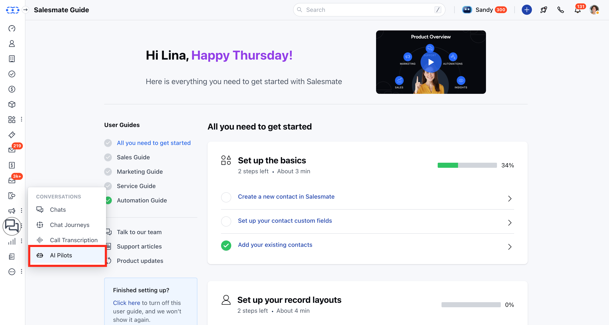
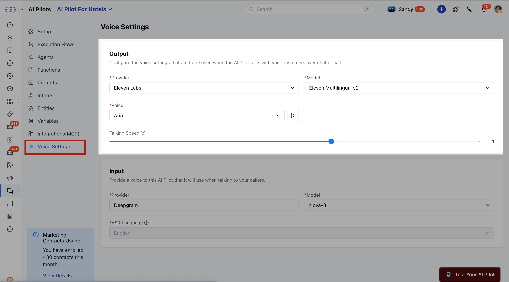
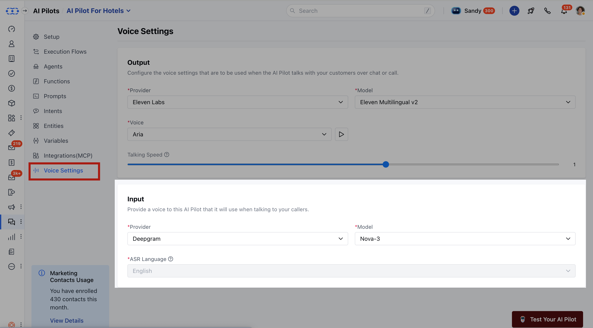

You can customize how AI Pilot responds to customers by configuring voice output and input settings. This includes selecting voice providers, models, tones, and other audio enhancements for an improved customer experience.**Topics Covered**[Configure Voice Output](https://support.salesmate.io/hc/en-us/articles/49115711005209-Customizing-Voice-Chat-Settings-for-Your-AI-Pilot#h_01K2C9ZQY1PK0Y3BAPY60SGMHT)[Configure Voice Input](https://support.salesmate.io/hc/en-us/articles/49115711005209-Customizing-Voice-Chat-Settings-for-Your-AI-Pilot#h_01K2C9ZQY1FTGPQV08YMQKY75P)

### To Configure Voice Output

Navigate to**AI Pilots**from the left sidebar.

If this is your first AI Pilot, you’ll land on a welcome screen. Click [**Build Your AI Pilot Today**.](https://support.salesmate.io/hc/en-us/articles/45878624568857-How-to-Build-an-AI-Pilot)If you already have existing AI Pilots, click the**dropdown**from the header and select**AI Pilot.**Move to**Voice settings.**

**Provider:**Choose a provider such as**Eleven Labs**or**Rime**.
Only one provider can be selected, and based on your selection, the available options for other settings will change.**Model:**Select the model for the chosen provider. Only one model can be selected.**Voice:**Select the tone of voice you want AI Pilot to use. You can play the selected voice before saving.**Talking Speed:**Adjusts the speed of the voice output to match user preference.
Range: 0.7 (slowest) to 1.2 (fastest)Default: 1.0 (normal speed) - Visible only for models that support speed adjustment.**Note:**Availability of Model and Voice will change according to the provider you select (Eleven Labs or Rime).

### To Configure Voice Input

On the same page, you can configure voice input.

**Provider:**Choose a provider**Model:**Select the model for the chosen provider.**Automatic Speech Recognition (ASR) Language:**Select the language for customer/caller input.**Note:**The Voice Settings option will be visible only if Salesmate Voice is enabled in chat or a voice channel has been configured.
