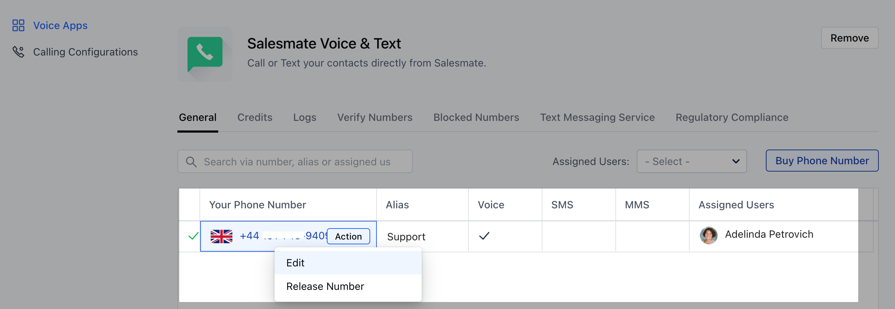
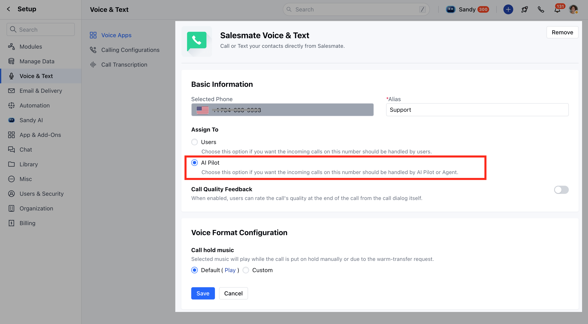
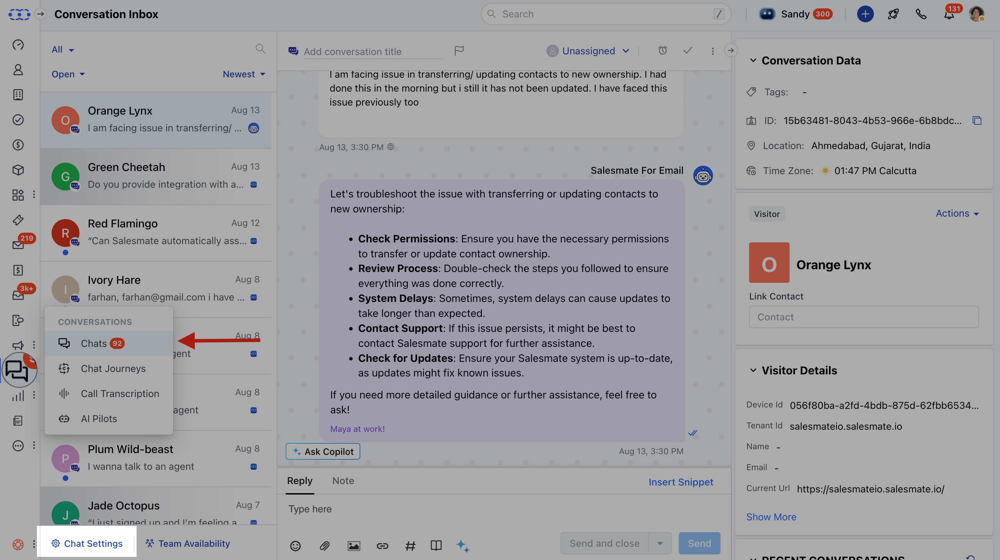
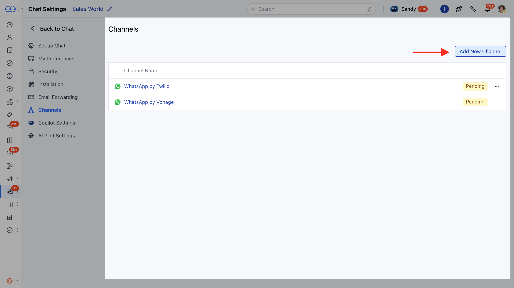
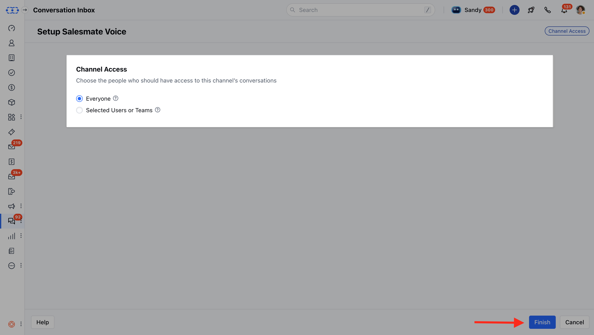
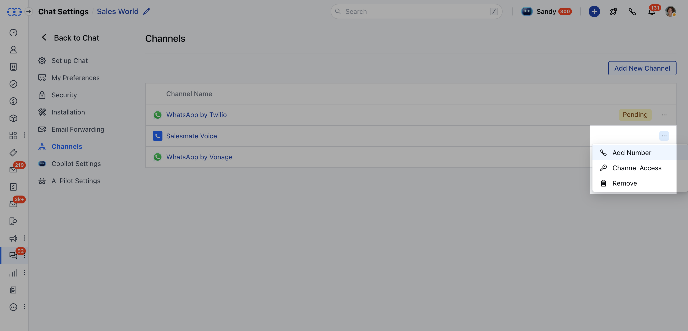
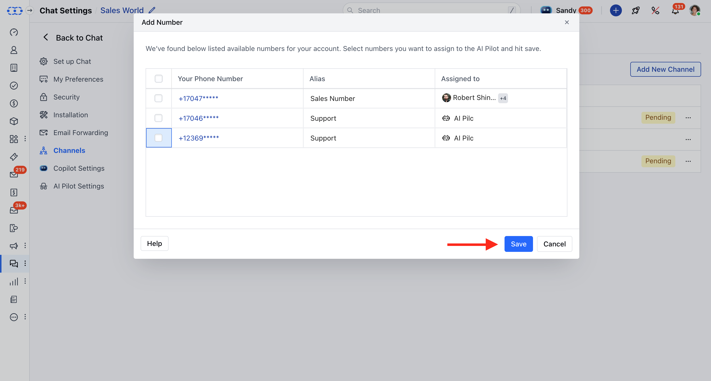
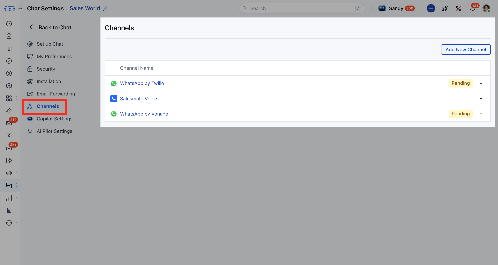
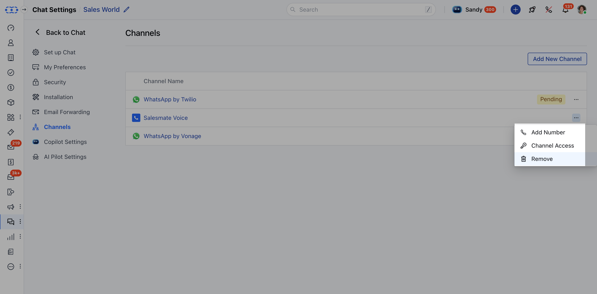
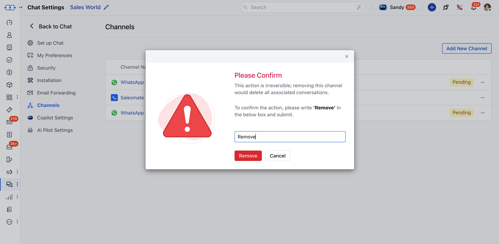

Voice AI Pilot is a feature in Salesmate that lets you create intelligent agents to answer customer calls automatically. Instead of a human agent, the AI can handle conversations, follow preset flows, and reduce the workload for your team. By linking your purchased phone numbers to an AI Pilot, you can automate customer interactions over voice channels and ensure no call goes unanswered.**Note:**Before adding a phone number to AI Pilot, make sure you have purchased a phone number with Salesmate Voice & Text functionality.

#### Topics Covered

[How to Add a Phone Number to AI Pilot](https://support.salesmate.io/hc/en-us/articles/49115652339609-How-to-Activate-Voice-Channel-Access-for-AI-Pilots#h_01K2CDV66WYQ0WV6G4J50TK3ZT)[How to Enable the**Voice Channel**](https://support.salesmate.io/hc/en-us/articles/49115652339609-How-to-Activate-Voice-Channel-Access-for-AI-Pilots#h_01K2KRY3EW6F14D3ENG9TGBWDN)[How Incoming Calls Work](https://support.salesmate.io/hc/en-us/articles/49115652339609-How-to-Activate-Voice-Channel-Access-for-AI-Pilots#h_01K2CDVEEW41WQ55PCWGP5JMFK)[How to remove the voice channel](https://support.salesmate.io/hc/en-us/articles/49115652339609-How-to-Activate-Voice-Channel-Access-for-AI-Pilots#h_01K2CDVM4JTY5RZ4MHF7ZH2GMG)

### How to Add a Phone Number to AI Pilot

Navigate to the**Profile Icon**on the top right cornerClick on**Setup**Head over to the**Voice & Text**categoryClick on**Voice Apps****

**From the list of phone numbers purchased, select the number you’d like to customize.Click on**Actions >>****Edit**.

Under Assign to, select AI Pilot.

Click**Save**.**Note:**If the voice channel is not enabled, a message will appear: "Voice Channel is not enabled in your chat workspace. Please enable it first to use this number with AI Pilot."

### To enable the Voice Channel

Navigate to the**Conversations Icon**on the left menu barClick on**Chats**Head to**Chat Settings**on the bottom left**.**

Head to the**Channels**OptionYou will see the list of channels here that are installedClick on**Add New Channel****

**Select the**Salesmate Voice >>**Hit**Install**

Choose the people who should have access to this channel’s conversations.

Click**Finish**to save.Once it gets added, you can add numbers to AI Pilot.Click the three dots next to**Salesmate Voice.**Hit**Add Number**to attach one or more numbers.

Numbers added here will automatically link to the AI Pilot.

Once done, hit**Save.**### How Incoming Calls Work

When someone calls, AI Pilot answers and follows your setup.Every call is recorded in your Chat Inbox (view only, no replies).Only users with**Salesmate Voice**channel access can see these logs.

### To remove the voice channel

When you remove the voice channel, all voice call records will be deleted, and the AI Pilot will no longer handle calls for those numbers. If you still intend to remove it, please follow the steps mentioned below:

Navigate to the**Conversations Icon**on the left menu barClick on**Chats**Head to**Chat Settings**on the bottom left**.**

Navigate to the**Channels**

You will see the list of channels here that are installedClick the three dots next to**Salesmate Voice.**

Please confirm and Hit**Remove.**
