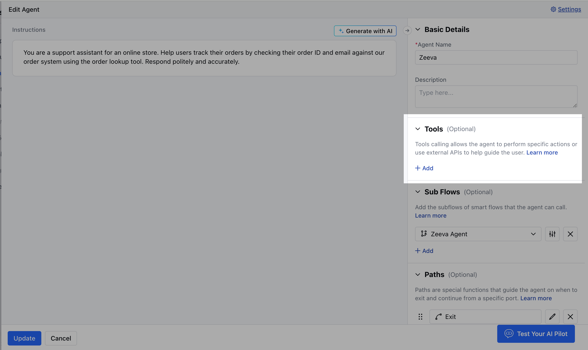

Skara allows you to connect with third-party **MCP (Model Context Protocol)** servers to extend tool capabilities within your AI Pilots dynamically. These integrations enable secure, real-time, and server-based tool execution, either through predefined providers or custom connections.

An **MCP Integration** lets your AI Pilots call external tools hosted on remote servers via a standard protocol. Once connected, the MCP server makes available one or more tools (via metadata or capabilities endpoints) that you can use in your AI workflows without needing to define every input/output manually.

### **Topics covered:**

- [Adding a New MCP Integration](#adding-a-new-mcp-integration)
- [Using Tools from an MCP Integration](#using-tools-from-an-mcp-integration)
- [Removing an MCP Integration](#removing-an-mcp-integration)

### Adding a New MCP Integration

Follow the steps below to connect your custom MCP server:

- Navigate to **AI Pilots** from the left sidebar.

- Select Integrations, then click on **\+ New Integration.**

- A pop-up will appear asking for **New Integration**:
- [Custom MCP](#custom-mcp)
- [Shopify](#shopify)
- [Stripe](#stripe)

### Custom MCP

- **Thumbnail:** Upload an image representing the brand you're integrating with. The image validations are similar to function or pilot avatars.
- **Name:** Add a label to identify this integration.
- **Description:** Enter a short description for your reference.
- **Transport Type:** Choose the type of transport protocol:
  - SSE (\_default \_)
  - Streamable HTTP
- **MCP Endpoint:** Enter a valid URL (e.g., https://mcp.example.com/api/mcp).
- **Authentication:** Select how you want to authenticate with the MCP server:
  - **None:** No authentication is required.
  - **Access Key:** Enter a bearer token for the authorization header.
  - **Custom Headers:** Define key-value pairs to be passed in the request header (at least one pair required).

- Once done, click **Save**.

### Shopify:

Shopify will help you to integrate your online store with Skara AI Pilot. You need to provide the Store URL to connect your Shopify account in AI Pilots.

Once it gets connected, you can get the following capabilities:

- **Product Discovery:** Enable natural language search to help users find products and receive personalized recommendations.
- **Cart Management:** Allow users to create shopping carts, add or remove items, and seamlessly proceed to checkout.
- **Store Support:** Provide instant answers to common queries around store policies, shipping, returns, and FAQs.
- **Order Management:** Let customers track their order status and initiate return or refund requests with ease.

### Stripe:

Use natural language commands to manage payments, customers, and refunds seamlessly via the Stripe MCP server. You need to provide the **API Key (Secret key)** from the Stripe to connect in Skara.

Once it gets connected, you can get the following capabilities:

- **Create Customer**: Creates a new customer record in Stripe.
- **List Customers**: Retrieves a list of all customers from Stripe.
- **Create Product**: Adds a new product in Stripe.
- **List Products**: Fetches all available products from Stripe.
- **Create Price**: Sets a price for a product in Stripe.
- **List Prices**: Retrieves the list of all defined prices in Stripe.
- **Create Payment Link**: Generates a secure payment link for a product or service via Stripe.
- **Create Invoice**: Creates a new invoice for a customer in Stripe.
- **Create Invoice Item**: Adds line items to an invoice before finalization.
- **Finalize Invoice**: Finalizes the invoice and makes it ready for payment collection.
- **Retrieve Balance**: Retrieves the current available balance in your Stripe account.
- **Create Refund**: Initiates a refund for a payment intent in Stripe.
- **List Payment Intents**: Displays all payment attempts made by customers.
- **List Subscriptions**: Fetches all active or past subscriptions in Stripe.
- **Cancel Subscription**: Cancels a customer’s active subscription.
- **Update Subscription**: Updates an existing subscription's plan or billing details.
- **Search Documentation**: Takes a user's question and searches Stripe documentation for relevant information.
- **Create Coupon**: Creates a discount coupon in Stripe.
- **List Coupons**: Retrieves a list of all created coupons in Stripe.

### Using Tools from an MCP Integration

Once connected:

- Navigate to the agent, 
- Move to **Tools**, hit **\+Add**

- You will see the list of available tools exposed, such as Functions, Integrations, and by Skara.

- By clicking on the Integrations, you will be able to see the MCP servers that were created.
- Click to add any tool. After that, you can modify the **LLM description, Input variables, and Output variables**

- Once done, hit**Save .**

### Removing an MCP Integration

To remove an MCP server:

- Go to **AI Pilots \> Integrations (MCP)**.
- Use the search bar to find your MCP integration.
- Available actions:
  - **Edit**: Modify any field.
  - **Remove**: Remove the MCP

<Note>
  \*\*Note: \*\*If any agent is using a tool from this integration, deletion will be blocked: “You cannot remove the integration [MCP Server Name]. Its tools are being used in the following places. Please remove the dependencies to proceed with the removal.”
</Note>