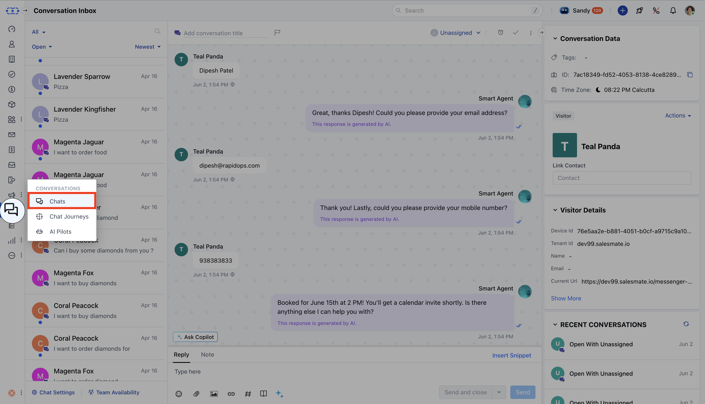
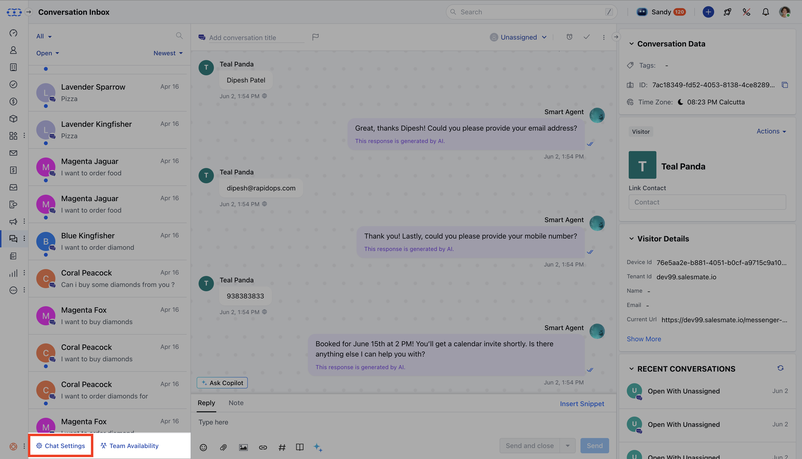
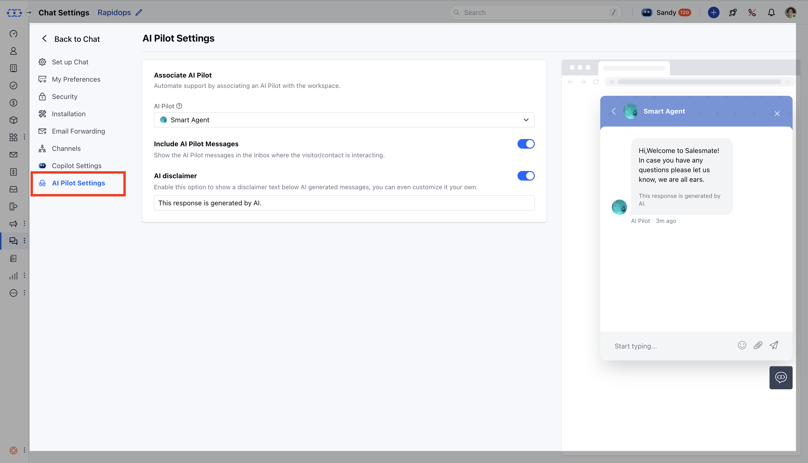

Skara makes it easy to set up AI Pilots in your chat workspace, letting you automate conversations and provide instant support to customers.

<Note>
  **Note: **You’ll need permission to manage the Unified Inbox to configure AI Pilot settings.Topics Covered:
</Note>

- [Steps to Configure AI Pilot Settings](#steps-to-configure-ai-pilot-settings)
- [Configure AI Pilot Settings](#configure-ai-pilot-settings)

### Steps to Configure AI Pilot Settings

- Navigate to the **Chats** from the left sidebar.

- Click **Chat Settings**, then select **AI Pilot Settings**.

- Choose the workspace from the header where you want to add your AI Pilot.
- If no AI Pilots exist, click **Build Your AI Pilot Today** to open the quick creation form.

### Configure AI Pilot Settings

Here’s what you can set up for your AI Pilot:

- **AI Pilot**: Select an AI Pilot to handle customer chats. Only **one AI Pilot** can be active per workspace 
- **Include AI Pilot Messages**: Turn on to show AI Pilot messages in the inbox. By default, it is turned off.
- **AI Pilot Narrator**: You can turn on to have the system read AI Pilot or Agent messages aloud to recipients.
- **AI Disclaimer**: 
  - Turn on to add a disclaimer to AI-generated responses. By default, it will show the text: “This response is generated by AI."
  - You can customize the disclaimer (max 50 characters).

- **Save**: Click **Save** to store your settings without activating them. All required fields must be valid.
- **Apply**: Click **Apply** to activate the settings for the selected workspace. If the AI Pilot has no published flows, it won’t work.
- **Auto-Save**: Changes auto-save every 60 seconds. You’ll see “Auto-saving content changes.”

Make the most of AI in your chat workflows with AI Pilots, automate conversations, deliver instant answers, and elevate your customer experience with ease.