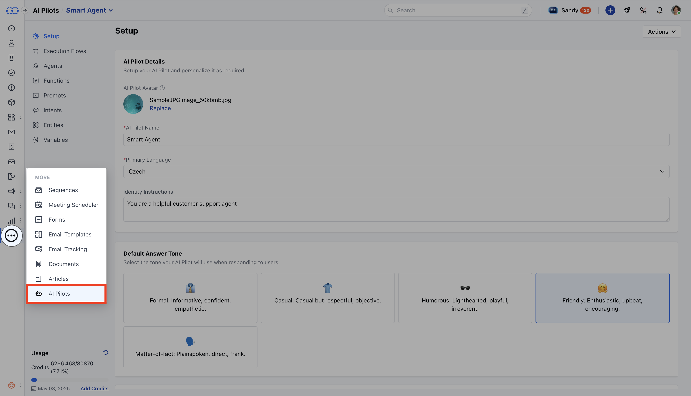
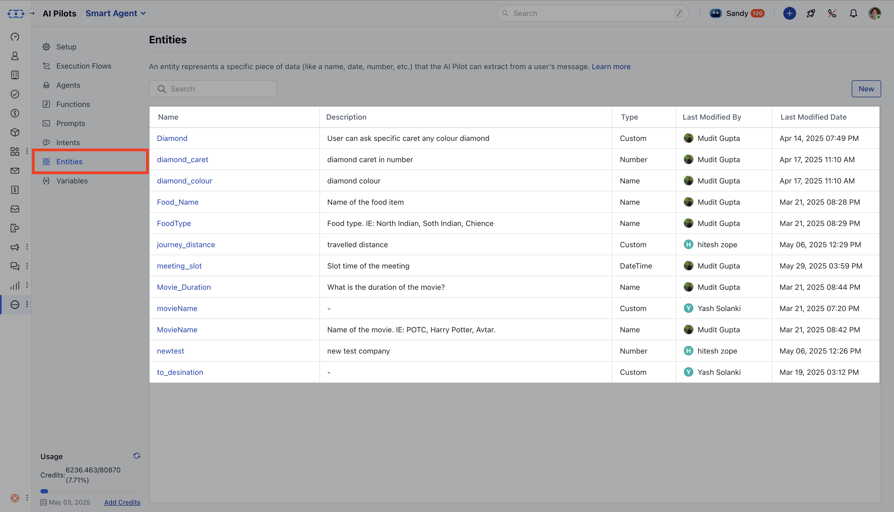
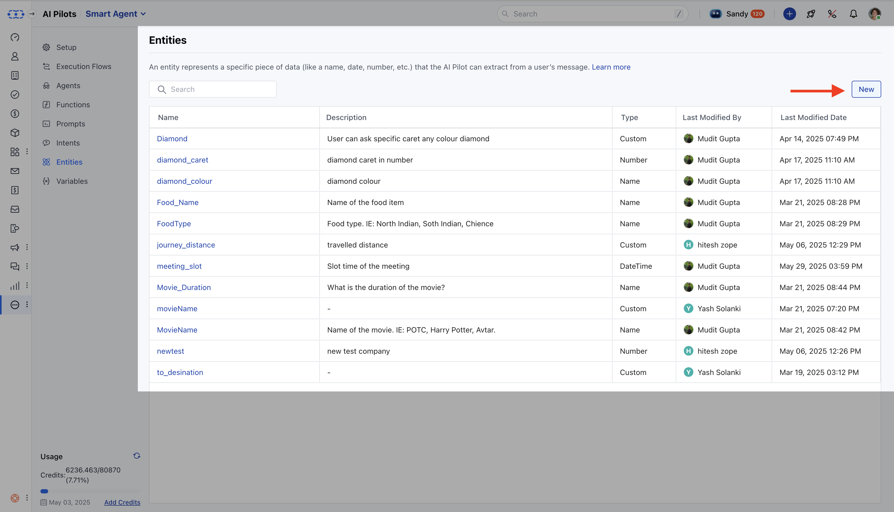
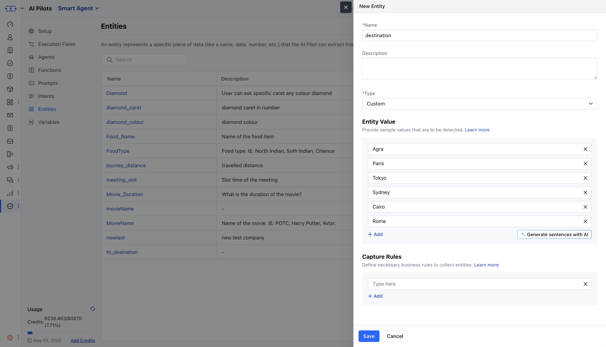
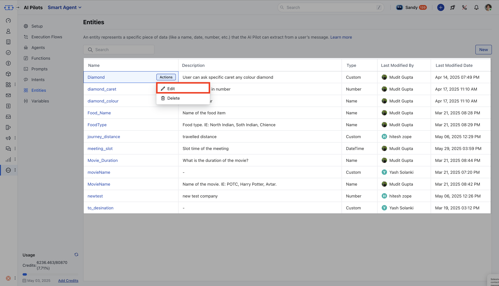
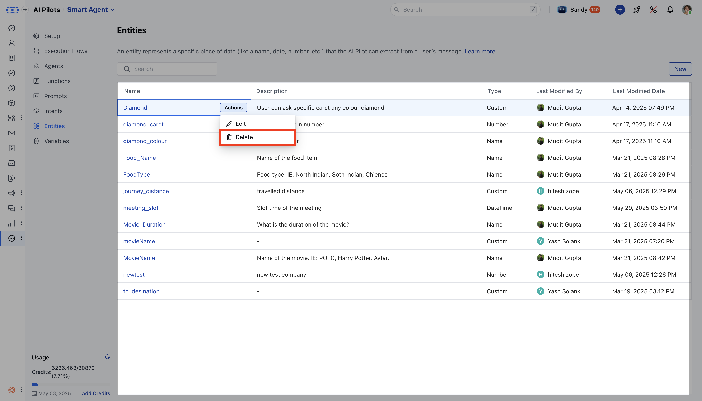
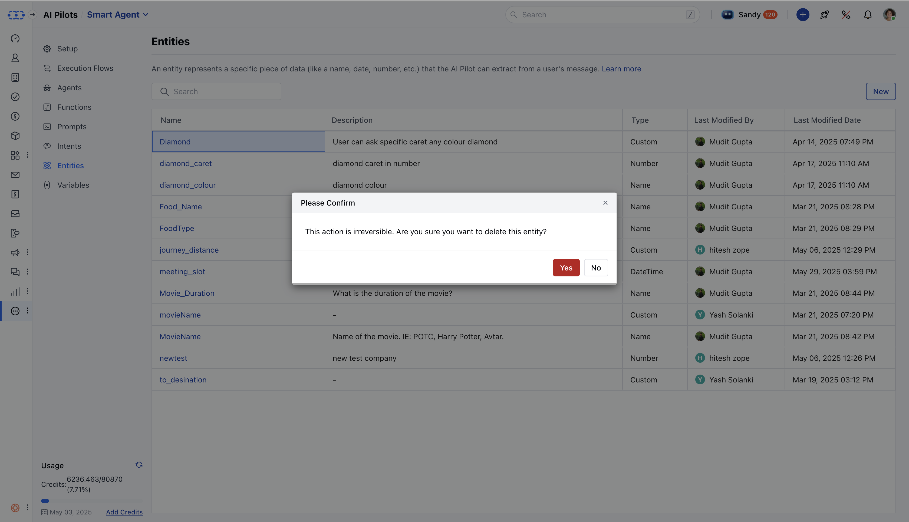

- **Entities** in Salesmate AI Pilots capture key information from user interactions, such as names, dates, numbers, or custom values, and work alongside intents to provide context for fulfilling requests. By extracting structured data from unstructured input, entities enable AI Pilots to perform actions and respond accurately.

###  **Topics covered:**

- [Entity Listing Screen](#entity-listing-screen)
- [How to Create an Entity](#how-to-create-an-entity)
- [How to Edit an Entity](#how-to-edit-an-entity)
- [How to Delete an Entity](#how-to-delete-an-entity)
- [Tips for Entity Management](#tips-for-entity-management)

###  Entity Listing Screen

Navigate to **AI Pilots** from the left menu bar.

Select the **AI Pilot** from the drop-down.Move to **Entities**. You will be able to check the following columns: Name, Description, Type, Last Modified By, Last Modified Date.You can search entities by name.You can sort by Name, Type, or Last Modified Date.In the List View, upon hovering over the Entity Name, you will get options to Edit or Delete an entity.

###  How to Create an Entity

Click on the **AI Pilots** from the left menu bar.Select the **AI Pilot** from the drop-down.Move to **Entities**. Click **New Entity** in the Entities screen of your AI Pilot

Enter a unique **Name.

- **Select an **Entity Type.

- **You can also add a **Description** based on the Entity.For List or Custom types, add at least one **Entity Value**(with optional synonyms) and define **Capture Rules.

- **Click **Save** to create the entity.

Entities are then available in intents, flows, and prompts within the AI Pilot

###  How to Edit an Entity

Click on the **AI Pilots** from the left menu bar.Select the **AI Pilot** from the drop-down.Move to **Entities**. Select **Edit** from the Actions menu next to an entity.

You can modify Description, Values, or Synonyms as per your requirements.Click **Save** to update.

###  How to Delete an Entity

Click on the **AI Pilots** from the left menu bar.Select the **AI Pilot** from the drop-down.Move to **Entities**. Select **Delete** from the Actions menu next to an entity.

You will have to click on the Confirmation Box in order to delete the Entity.

###  Tips for Entity Management

- **Understand your domain:** Identify key pieces of information your AI needs.

Example: For a hotel booking assistant, use entities like check_in_date, room_type, location.

- **Define a clear purpose for each entity:** Each entity should capture only one specific type of data.
 Example: Use flight_date to capture the travel date instead of a vague travel_info entity.

- **Keep entities granular:** Break down data into smaller, useful parts for more accurate recognition.
 Example: Use departure_city and arrival_city instead of a general city entity.

- **Include synonyms and variations:** Add different ways users may refer to the same item.
 Example: For drinks, include values like soda, pop, soft drink, and beverage.

- **Expand entities over time using real user input:** Monitor actual user phrases and update entity values accordingly.
 Example: If users type “non-veg” often, add it as a value for food preferences.

- **Avoid overlapping or redundant entities:** Make sure each entity has a distinct and non-conflicting role.
 Example: Use only arrival_city instead of multiple similar entities like end_city or final_city.

- **Keep values relevant to your AI’s purpose:**Only include values that your AI supports or can respond to properly.
 Example: For payment options, include credit card, debit card if those are the only accepted methods.

**Note:**Entity **Name** and **Type** cannot be changed once in useIf the entity exists in intents, flows or prompts, an error message will prevent deletion and lists where it’s used.
