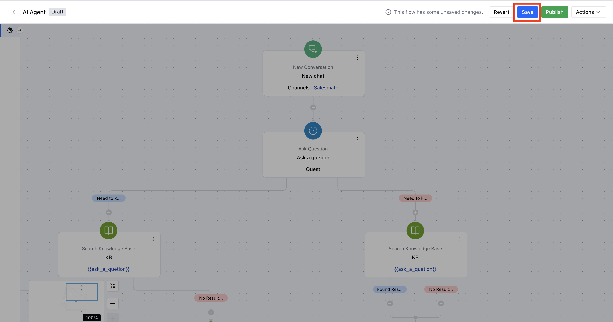
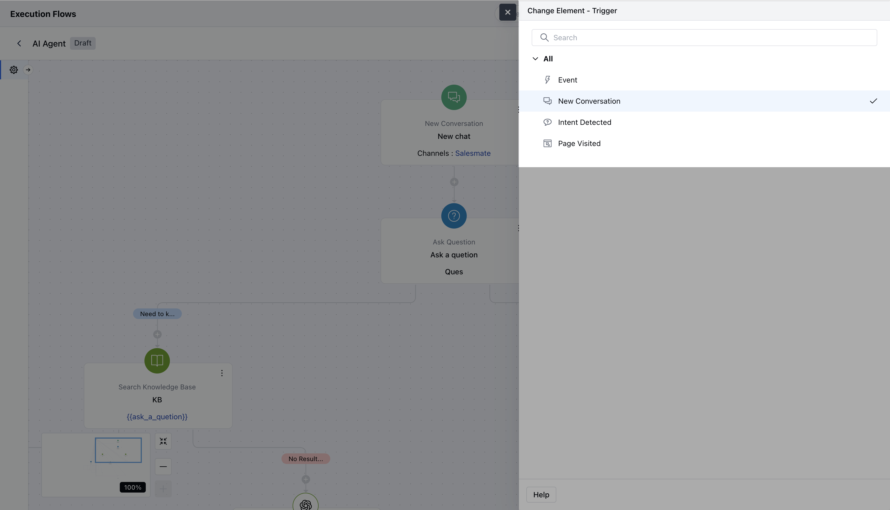
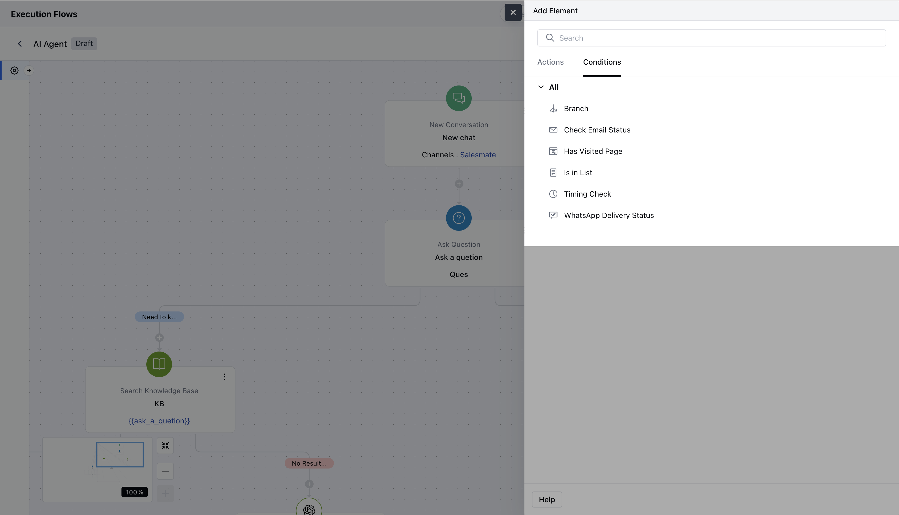
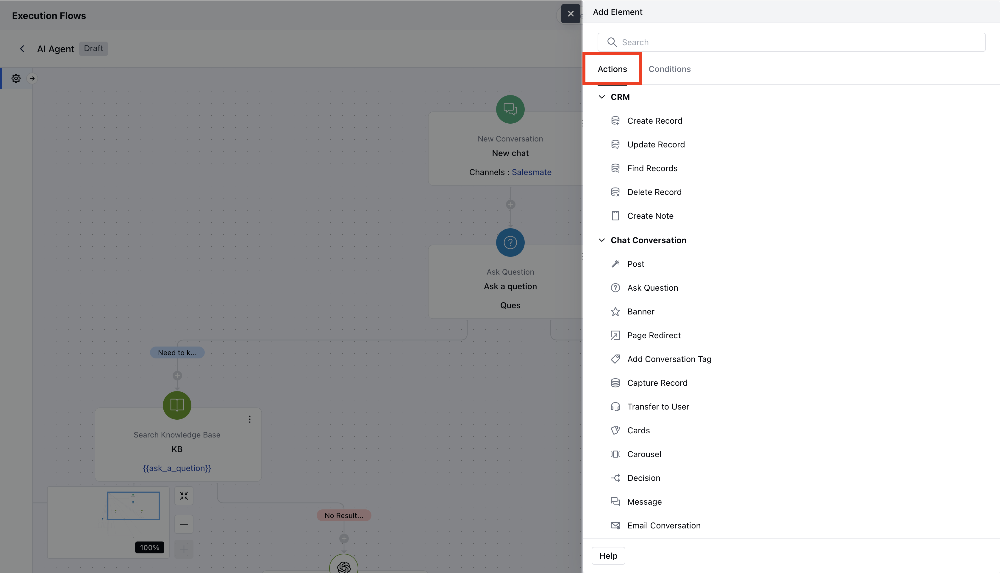

Execution Flows are essential for running AI Pilots. Without an execution flow, your AI Pilot cannot take action. These flows define how conversations are triggered, managed, and executed in real time.

<Note>
  Execution Flows are similar to Smart Flows but tailored specifically for AI Pilots, with minor differences in functionality and setup.
</Note>

### **Topics covered:**

- [What is an Execution Flow](#what-is-an-execution-flow)
- [How to Create an Execution Flow](#how-to-create-an-execution-flow)
- [Best Practices](#best-practices)

### What is an Execution Flow?

An **Execution Flow** defines the journey an AI Pilot follows once triggered by a user event like a message or action on the website.

### How to Create an Execution Flow

Follow these steps to create an execution flow:

- Navigate to the **Execution Flows** from the left panel 
- Click on **Execution Flows** 
- Click on **New**

- Add a **Name**, **AI Pilot** and **Description**, then click **Create** 

- Design your flow on the canvas
- Use **Save** to preserve changes or **Publish** to activate the flow

### Key Components

- **Triggers**
  - Event
  - New Conversation
  - Intent Detected
  - Page Visited

- **Conditions**
  - All Smart Flow conditions are available.

- Actions
  - All Smart Flow actions except time-based delays like **"Wait"**.

- **Flow Manager **
  - Manage local variables similar to Smart Flows.
- **Execution Settings**
  - Replaces enrollment conditions to control how and when flows run.
- **Version History**
  - Track flow changes over time.
- **Enrollment Logs**
  - Monitor when and how flows were triggered.
- **Live View & Insights**
  - View ongoing conversations and flow stats.endencies of the flow to proceed with deletion.

<Note>
  ### Best Practices

  - Use clear names and descriptions for each flow
  - Organize triggers and actions in a logical layout
  - Test flows with various scenarios
  - Use execution settings to manage timing and availability
  - Monitor flows with **Live View** and **Insights**
</Note>