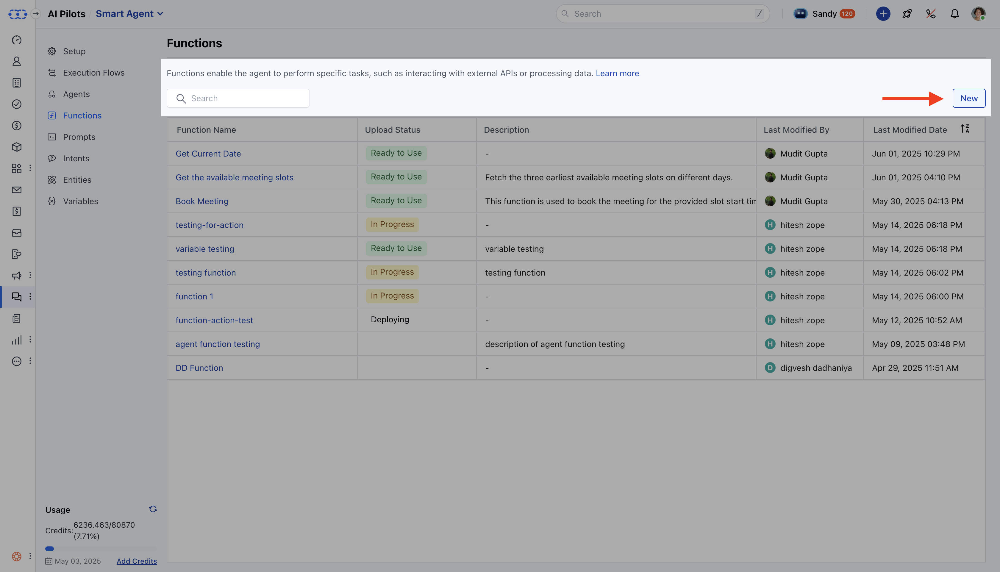

- *Functions** in AI Pilots allow developers to build reusable, custom logic that extends an agent’s capabilities. From simple data transformations to complex third-party API integrations, functions enable smarter, more dynamic agent behavior.

- [How to manage your Functions](https://support.salesmate.io/hc/en-us/articles/46626581723545-Functions#h_01JW8WD30Y2EA71CM853Y74WST)
- [To configure a new Function](https://support.salesmate.io/hc/en-us/articles/46626581723545-Functions#h_01JW8YF5MYF74Z436VXMH3CHRR)
- [To edit an existing Function](https://support.salesmate.io/hc/en-us/articles/46626581723545-Functions#h_01JW90002QYBYNJ0C0CTZYYX71)
- [Steps to Delete a Function](https://support.salesmate.io/hc/en-us/articles/46626581723545-Functions#h_01JW9023WV07P2EAFET82FZB1F)

####**How to manage your Functions:** Navigate to the **More Icon** from the left menu barClick on the **AI Pilots**

Select the **AI Pilot** from the drop-down.Move to the ** Functions.***

- *You’ll see a list of functions (if any exist) with the following columns:**Function Name **: Name of the function for the identification** Deployment Status **: Indicates if the function is** Ready to Use **,** Failed, or In Progress.

- **Hover over the error icon to view error details if the status is Failed.** Description **: A summary of the function’s purpose.

- ** Last Modified By **: The user who last updated the function.

- ** Last Modified Date **: When the function was last modified.

####**How to configure a new Function** Click the **New** button.

- The **Function Editor** opens, divided into:**Left Panel**: Code editor **Right Panel**: Configuration panel.

####** Configuration Panel Details **Function Details:**Function Name **: Name of the function for identification.

- ** Description **: A summary of what the function does.

- ** Thumbnail Image **:
Supports .png, .jpeg, .jpg under 1 MB.Appears in selection lists where this function is referenced.

####** Input Variables:**Variable Name**: Used within the function code.

- **Description**: Details about the expected input.Click **\+ Add ** to add multiple inputs.

####**Output Variables:**Variable Name:** Identifier variable for the output.

- **Description**: Details about the expected output.Click **\+ Add** to define more outputs.

- **Note:** These variables are limited to that function only. The data type for these variables will be defined in the code snippet on the left side.

####**Paths:**Path Name**: Logical route (e.g., _Success_, _Failure_).

- **Canvas Label**: Label displayed in the flow builder.Click **\+ Add ** to define additional paths.

####**Writing Function Logic:** Use the **left-side code editor** to write your function using the supported language.Choose from:
Primary runtime (first launch):**Node.js 22** Supported by Monaco Editor (for syntax): JavaScript, Python, Go, PHP, HTML, CSS, Java, C++, etc.

####

####**To edit an existing Function** Go to **AI Pilots**> Choose your Pilot >**Functions**. Click the function name or hover and select **Hit Action**.

Click on **Edit,**make your changes, then click **Update**.

####**Steps to Delete a Function** Go to **AI Pilots**> Choose your Pilot >**Functions**. Find the function you wish to delete.

Hover and select **Delete** from the action menu.
