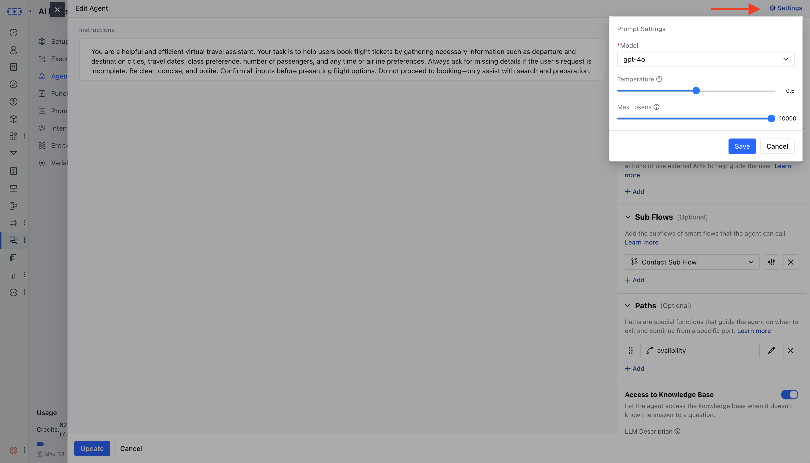

In this article, we’ll discuss how**agents**function as dedicated modules that integrate effortlessly into a conversation flow. Agents are equipped to handle**specific user requests**that go beyond the standard capabilities of the assistant.By delegating these complex tasks to agents, your main assistant remains focused on its core interactions, keeping it efficient and responsive. This setup also allows your system to be modular and adaptable, supporting advanced functionalities without adding unnecessary complexity.Once an agent is built, it can be easily**incorporated into an execution flow**using the**Agent action**, expanding your assistant’s range of abilities in just a few steps.

### Topics Covered

[Steps to Create a New Agent](https://support.salesmate.io/hc/en-us/articles/46626362237721-How-to-Build-an-Agent#h_01JWEGQ37P557DAFDQGKAVNHTC)[How to Configure an Agent](https://support.salesmate.io/hc/en-us/articles/46626362237721-How-to-Build-an-Agent#h_01JWTPD7VVAJQCK48KPC6G6SX5)[Editing an Agent](https://support.salesmate.io/hc/en-us/articles/46626362237721-How-to-Build-an-Agent#h_01JWEGQ37R6NXY221WZW99GPHJ)

### Steps to Create a New Agent

Navigate to**AI Pilots**from the left side bar.Choose existing pilot or create New

Move to "Agents"**Click:**“New” buttonConfigure**New Agent**in the Popup

### How to Configure an Agent

You will be need to provide below asked details in order configure your new agent.**Agent Details****Name:**Provide the agent’s name.**Description (Optional):**Add a brief description of the agent’s purpose or role.**[Functions](https://support.salesmate.io/hc/en-us/articles/46626581723545):**Functions allow the agent to perform tasks such as interacting with APIs or processing data.**Configuration Details:****Add Functions:**Select functions from the library or create new ones.**LLM Description (Optional):**Provide a description for each function to specify when and how it should be used.**Input Variables:**Define LLM descriptions and default values for input variables.**[Sub-flows](https://support.salesmate.io/hc/en-us/articles/38138439700761):**Sub-flows enable the agent to incorporate other flows (optional)**Add Sub-flows:**Include synchronous sub-flows from Smart Flows.**LLM Descriptions:**Provide descriptions for each sub-flow.**Configure Variables:**Set variables as needed for the sub-flow.**[Paths](https://support.salesmate.io/hc/en-us/articles/46626606669593):**Paths define the conversational routes the agent follows based on different outputs or decisions.**Add Output Ports (Optional):**Define output ports for return values.**Define Paths:**Assign names, conditions, and variables (with LLM descriptions) for each path.**Avoid Duplicate Path Names:**Ensure each path has a unique name.**[Knowledge Base](https://support.salesmate.io/hc/en-us/articles/44390956989977) Access**The Knowledge Base (KB) provides additional data the agent can use to provide informed responses.**Enable Access (Optional):**Allow the agent to access the KB if needed.**LLM Description:**Describe when and how to use the KB.

**[Prompt](https://support.salesmate.io/hc/en-us/articles/45878724921369) Settings****Access Prompt Settings:**Click the**“Settings”**button on the**“Create New Agent”**page to access prompt settings.**AI Model:**Select the desired AI model for generating responses (e.g.**gpt-4.0**or**gpt-4.1**).**Temperature:**Use this to adjust the creativity level of AI-generated responses.
Use the slider to set the value between**0**(least creative) and**1**(most creative).**Max Tokens:**This determines the length of each AI-generated response.
Use the slider to adjust the value from**0 to 2000 characters**.

### Editing an Agent

Navigate to**AI Pilots**.**Choose Your Pilot:**Select the relevant Pilot containing the agent you want to edit.**Move to Agents:**Access the**Agents**section under your selected Pilot.**Edit an Agent:**Hover over the agent you want to edit and then click actions.**Make Changes:**Edit the the agent and then hit "Update"

