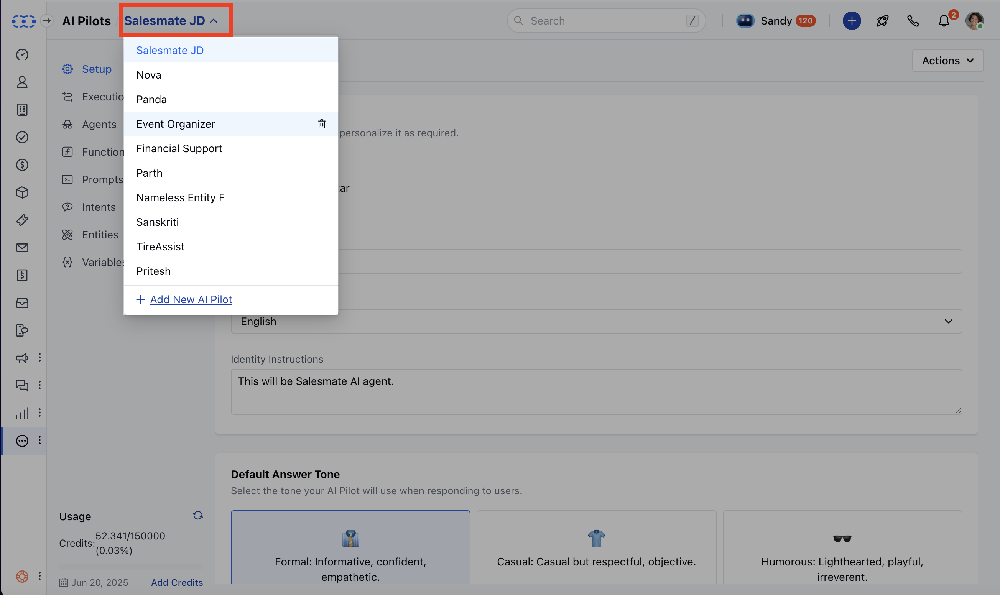
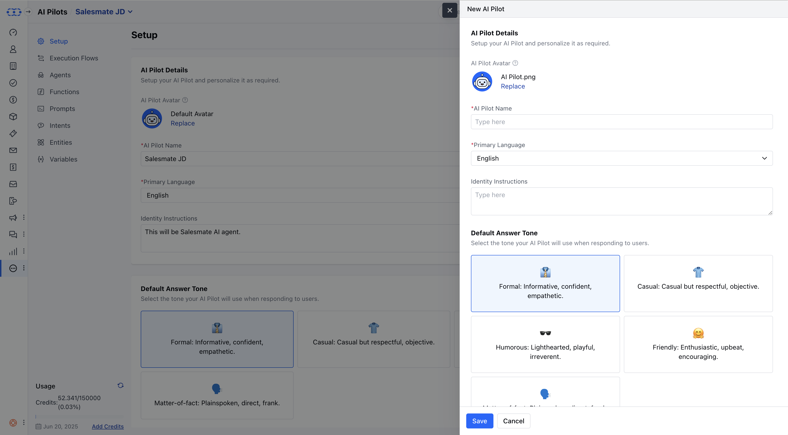
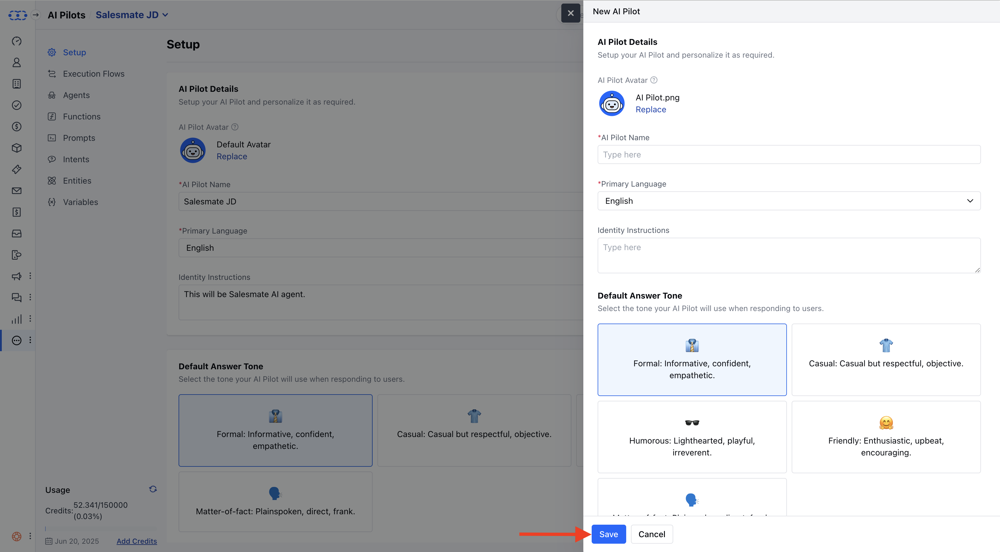

AI Pilots are intelligent bots with unique personas that interact with users using various methods such as intents, entities, and execution flows. These bots are designed to deliver contextual and conversational responses across supported channels.

**Note:** The number of AI Pilots you can create depends on your subscription plan. Limits are managed from the Subscription Manager.

### 

- **Topics covered:** -
- [To create an AI Pilot, follow the steps below:](#to-create-an-ai-pilot-follow-the-steps-below)

- [Fill in the Basic Details](#fill-in-the-basic-details)

- [Save the AI Pilot](#save-the-ai-pilot)

###  To create an AI Pilot, follow the steps below:

Navigate to **AI Pilots** from the left side bar.

If this is your first AI Pilot, you’ll land on a welcome screen. Click **Build Your AI Pilot Today**. If you already have existing AI Pilots, click the **dropdown** from the header and select **\+ Add New AI Pilot**.

###  Fill in the Basic Details

A side panel (Quickview) will appear, asking for the following information:**Avatar** Choose an image to represent your AI Pilot.Click **Replace** to upload a custom image.Uploaded images can only be removed or replaced.If you remove your uploaded image, the **system default avatar** will be restored.Avatar validations (similar to those in Chat Journeys) will apply.

- **AI Pilot Name** Enter a unique, identifiable name for your AI Pilot (e.g., _SalesPilot_).Allowed characters:**Alphanumeric only** Maximum length:** 50 characters **Primary Language** Select the language your AI Pilot will use to communicate.Default:**English** You can choose from a list of supported languages.

- **Identity Instructions** Describe your AI Pilot’s persona and purpose.

- **Knowledge Base** Select the knowledge base your AI Pilot will use to fetch answers.You may skip this if not required during creation.

- **Default Answer Tone** Choose the tone your AI Pilot will use when responding to users:**Formal**– Informative, confident, and professional _(Default)_ **Casual**– Relaxed and respectful **Humorous**– Lighthearted and playful **Friendly**– Upbeat and encouraging ** Matter-of-fact **– Direct and clear-cut

###  Save the AI Pilot

Click **Save** to create your AI Pilot.If you want to cancel the process, click **Cancel**.

Once saved, you will be redirected to the **AI Pilot Detail Screen**, where you can view all the information you just entered.
