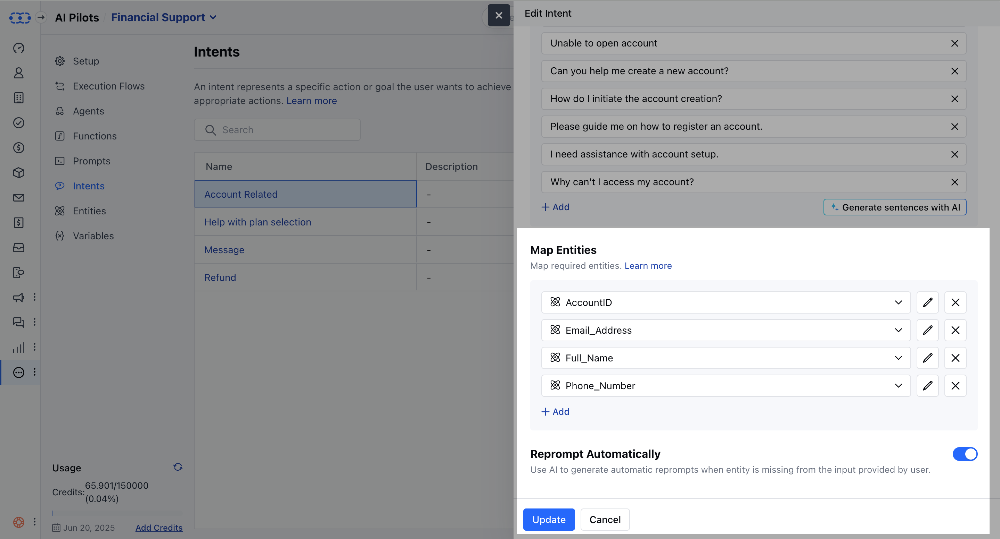
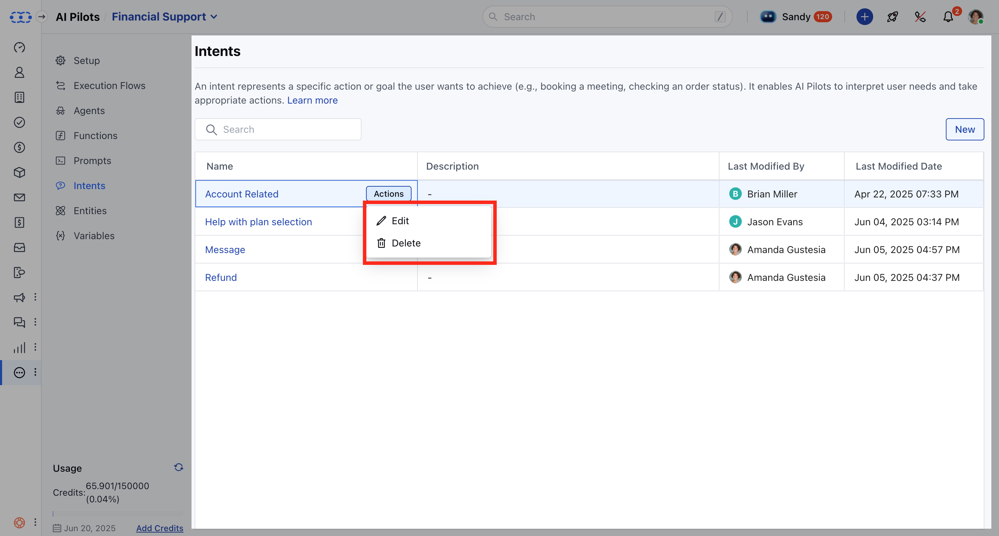

Salesmate's AI Pilots utilize **intents** to interpret and classify user requests effectively. An intent represents a specific action or goal the user aims to achieve, such as booking a meeting or checking an order status. These intents work in tandem with **entities** to facilitate structured and contextual conversations. While an intent identifies what the user wants, entities extract specific details from the request.

### **Topics covered:**

- [What is an Intent?](#what-is-an-intent)
- [Creating an Intent](#creating-an-intent)
- [Managing Intents](#managing-intents)
- [Best Practices for Intent Management](#best-practices-for-intent-management-be-clear-and-concise-name-intents-based-on-purpose-eg-ordertracking-not-task1)
- [Handling Partial Matches and Multi-Intent Phrases](#handling-partial-matches-and-multi-intent-phrases)

### What is an Intent?

An **intent** is a predefined action the AI Pilot recognizes and responds to based on user input. For instance, if a user says, "Schedule a call with Alex tomorrow at 5 PM," the AI Pilot identifies the intent as Schedule Meeting and extracts Alex as a Name entity and tomorrow at 5 PM as a Date/Time entity.

### Creating an Intent

To create a new intent in Salesmate AI Pilots:

Click on the **Conversations** option from the SidebarNavigate to **AI Pilots.

- ** Select your **AI Pilot** from the drop-downClick on **Intents**.

- **Click on 'New Intent'**: Initiate the creation of a new intent.

- **Provide Intent Details**:**Name**: Enter a unique name using alphanumeric characters and underscores. It must not start with a number.

- **Description**: Optionally, add a description to provide context.

- **Add Training Phrases**:
 Include at least five example phrases that users might say to trigger this intent.You can manually add phrases or use the **Generate** button to create additional ones.

- *Assign Entities (if applicable)**:
Tag relevant words in training phrases as entities.Entities help capture dynamic information in user input.

- **Configure Reprompts**:
If an entity is required but not provided by the user, set up reprompt messages to request the missing information.You can enable **Reprompt Automatically** to let the AI handle this.

- **Save the Intent**:
Click **Save** to finalize the creation.A success message, "Created successfully," will appear.

### Managing Intents

### To view existing intents:

Click on the **Conversations** option from the Sidebar.Navigate to **AI Pilots.

- **Select your **AI Pilot** Click on **Intents**.

The list displays:** Name **Description**: Hover to see the full description.

- **Used By**: Shows the flows where the intent is currently used.

- **Last Modified By **Last Modified Date **Actions Available**:**Edit**: Modify the intent details.

- ** Delete **: Remove the intent (if not in use).

### To edit an existing intent:

Click on the **Conversations** option from the SidebarNavigate to **AI Pilots.

- **Select your **AI Pilot** Click on **Intents**.

Click on the intent you wish to edit.

Make the necessary changes to the name, description, training phrases, or entities.Click **Update** to apply the changes.

### To clone an intent:

Click on the **Conversations** option from the SidebarNavigate to **AI Pilots.

- **Select your **AI Pilot** Click on **Intents**.

Click on the intent you wish to clone.Choose to clone within the current AI Pilot or another one.Provide a new name for the cloned intent.Click **Clone** to create the duplicate.

### To delete an intent:

Click on the **Conversations** option from the SidebarNavigate to **AI Pilots.

- **Select your **AI Pilot** Click on **Intents**.

Click on the intent you wish to delete.

Click **Delete** and confirm the action.

- *Note**: Deletion is prevented if the intent is referenced in workflows, API actions, or another intent’s context. An error message will indicate where the intent is being used.

### Best Practices for Intent Management **Be Clear and Concise**: Name intents based on purpose (e.g., OrderTracking, not Task1).

- **Avoid Overlapping Intents**: Ensure similar phrases do not belong to multiple intents.

- **Use Context Wisely**: Set and clear context appropriately to avoid confusion.

- **Expand and Improve**: Regularly update training phrases to reflect actual user input.

- **Test Frequently**: Test intents in real-world scenarios to improve accuracy.

### Handling Partial Matches and Multi-Intent Phrases

Users may sometimes include multiple requests in one message, such as "I need to reset my password and also, what are your support hours?" Salesmate's AI Pilot will typically identify only one top intent per message.

- **Recommendations**:**Address One Intent at a Time**: Design your AI Pilot flow to handle one request per interaction.

- **Use Fallback Responses**: If multiple intents are detected, prompt the user to clarify their request.

- **Note**: By effectively managing intents and entities, you can enhance the conversational capabilities of Salesmate's AI Pilots, leading to more natural and efficient user interactions.
