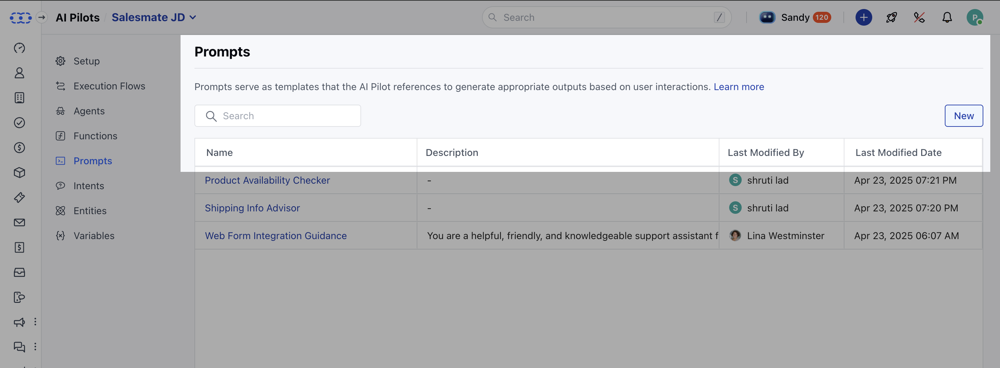

- *Prompts** are structured instructions that guide your conversational **AI Pilot** in generating relevant and context-aware responses.
They act like a playground for training, testing, and fine-tuning AI behavior before using it in live flows.

- **For example:** If a prompt is created for “Flight Booking Inquiry” and a user says, _“I want to book a flight to New York,”_ the AI Pilot identifies the intent and responds:
“Sure! Please provide your preferred travel dates.”

---
###  **Topics covered:**

- [Components of a Prompt](#components-of-a-prompt)

- [Creating a New Prompt](https://support.salesmate.io/hc/en-us/articles/45878724921369-Prompts#h_01JW6AW00F9QJ88DRJMFFCBBZ2)

- [Editing an Existing Prompt](#editing-an-existing-prompt)

- [Deleting a Prompt](#deleting-a-prompt-how-to-delete1-navigate-to-ai-pilots)

- [Prompt Listing & Actions](#prompt-listing-actions)

---
###  Components of a Prompt

When creating prompts for your AI assistant, it's important to structure them with the right components. Here’s how each part works:

- **System Prompt:** Use this to set the tone, style, and behavior of the AI. Whether you want the assistant to be formal, friendly, concise, or informative, define that here.
 _Example:_ “You are a helpful and empathetic support agent who answers questions clearly and politely.”

- **User & AI Pilot Messages:** These are sample conversations that show the AI how it should respond. Use them to guide the AI's behavior by providing real-world scenarios and expected replies.

- - **Conversation History:** Include past messages when you want the AI to understand the full context of an ongoing interaction. This helps the AI respond more accurately and maintain continuity.

- **Variables:** Add variables or entities like `{user_name}` or `{product}` to personalize messages dynamically.
 This makes responses more tailored and human-like.

- **Structured Outputs:** Define how you want the AI to format its response — plain text for emails, JSON for APIs, etc.

---
###  Steps to Create a Prompt

1. Navigate to **AI Pilots**.
2. Select your **AI Pilot**.

3. Click on **Prompts**→**New**.

---
###  Prompt Configuration

- - **Name:** Provide a meaningful name (e.g., “Financial Support”).

- **Description:** Describe the objective of the prompt.

- **System Prompt:** Set the tone and instruction style.

- **User Prompt:** The initial user message to start the prompt.

- **Message Pairs:** Add back-and-forth conversations to enrich training.

- **Variables:** Insert dynamic fields using `{}` for personalization.

- **Conversation History:** Insert the `conversation_history` block once for added context.

- **Templates:** Use predefined templates for quick setup.

- **Reordering:** Rearrange blocks except the System Prompt (fixed at the top).

>

**Note:** The last block must be a **User Prompt**.

---
###  Prompt Settings

Click the **Settings** option to modify prompt-level configurations.

- **Options Available:** -

- **AI Model:** Choose which LLM your AI will use:
 GPT-3.5 Turbo, GPT-4 Turbo, GPT-4o, GPT-4o mini, Claude 2/3/3.5 (Haiku, Sonnet, Opus), Gemini 1.5 Pro, Grok-2-1212 / Grok-2-vision-1212

- **Temperature:** Controls creativity (0.00–1.00).

- **Max Tokens:** Range 10–2000.

>

**Note:** These settings apply only to the current prompt.

---
###  Testing the Prompt

You can run a simulation to test your prompt:

1. Click **Run Test**.
2. Enter values for required variables.
3. The AI will simulate a live user interaction.

The output includes:

- - **Latency:** Time taken for response

- **Tokens:** Total used, with input/output breakdown on hover

---
###  Editing an Existing Prompt

- **How to Edit:** 1. Navigate to **AI Pilots**.

2. Select your **AI Pilot**.

3. Hover over the prompt.
4. Click on **Actions**→**Edit**.

After editing, click **Save** to apply changes.

---
###  Deleting a Prompt **How to Delete:**1. Navigate to **AI Pilots**.

2. Select your **AI Pilot**.

3. Hover over the prompt.
4. Click on **Actions**→**Delete**.

A confirmation dialog box will appear:
_“This action is irreversible. Are you sure you want to delete this prompt?”_

Click **Yes**, and the prompt will be deleted permanently.

> **Note:** You cannot delete the prompt if it is currently in use.

---
###  Prompt Listing & Actions

- **Access the Prompt List:** 1. Navigate to **AI Pilots**.

2. Select your **AI Pilot**.
3. Click on **Prompts**.

The list includes:

- **Name**-**Description**-**Last Modified By**-**Last Modified Date** You can perform actions such as **Edit**, **Clone**, or **Delete**.
 You can also sort prompts by **Name** or **Last Modified Date**, and search by name.

