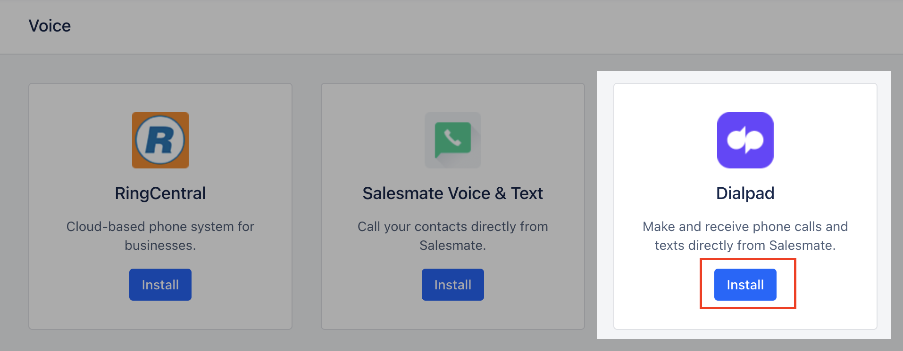
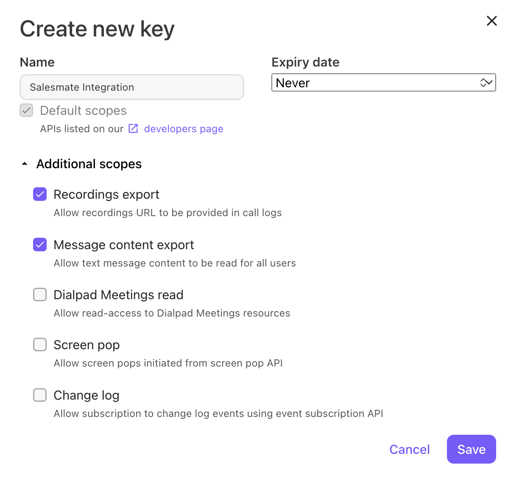
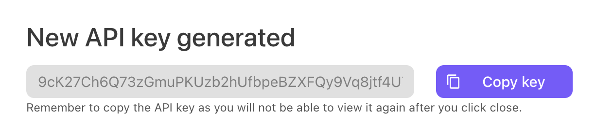
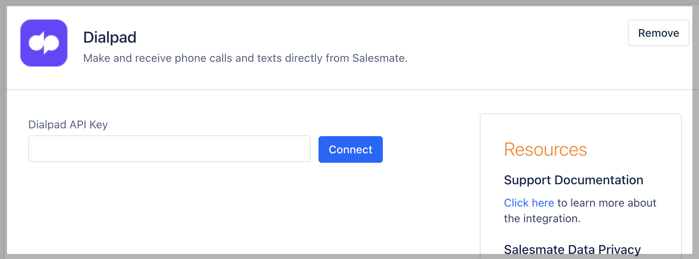
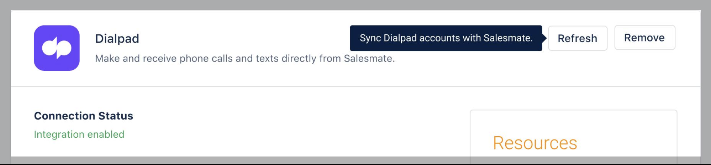
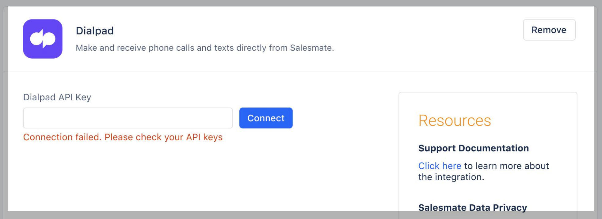
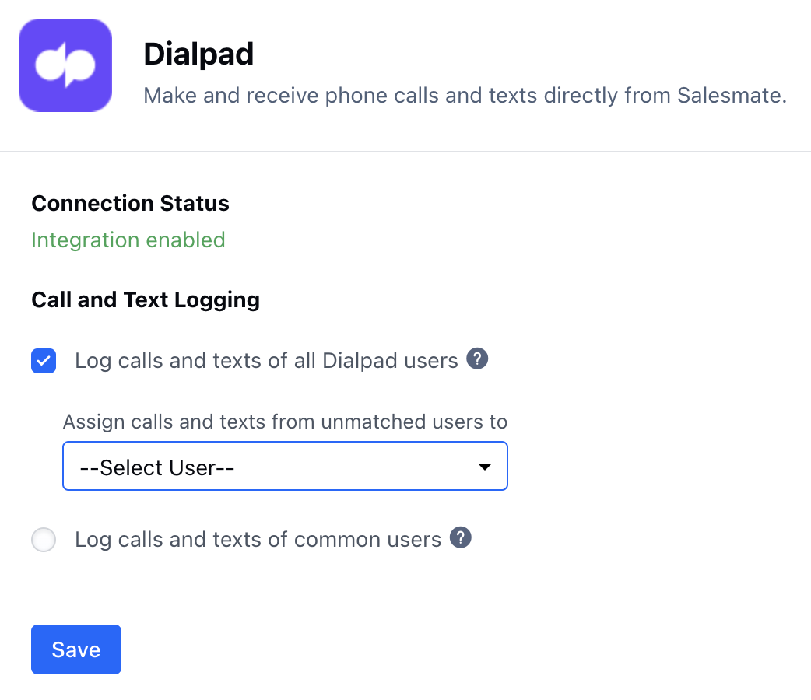
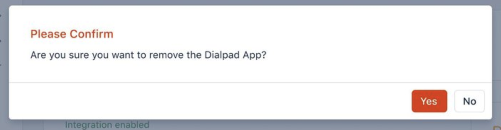

- *Available in the Pro Plan and above.

- ** Note: The user email id on Salesmate and DialPad should be the same then only it will allow you to send or receive a text in Salesmate.[Dialpad](https://www.dialpad.com/) is the most modern business communications platform. Taking into account every form of communication that you rely on and unified it into one app. Calling a client? Meeting with your team? Texting a colleague? It’s all here, on all your devices.Installing / Uninstalling the Dialpad app (Only for Admin)

Navigate to the **Profile Icon** on the top right cornerClick on **Setup** Head over to **Voice & Text** categoryClick on **Voice Apps**

- *Dialpad** Click on “**Install**” to install the **Dialpad**

You will be asked to provide your **Dialpad key** here.

- **Dialpad API** keys can be generated from the native **Dialpad account**.
- [Create Dialpad API Key](https://help.dialpad.com/hc/en-us/articles/360019680532-Create-an-API-Key)

To create an API key, head to your **Admin Settings** from **Dialpad.com.

- **Navigate to **My Company** Select **Authentication** Select **API Keys** Select **Add key** Enter the API key's name and expiration termsSelect desired Additional Scopes
For Call Sync (Recording export should be selected)For SMS Sync (Message content export should be selected)

Recordings exportAllow recordings URL to be provided in call logsMessage content exportAllow text message content to be read for all usersDialpad Meetings readAllow read-access to Dialpad Meetings resourcesScreen popAllow screen pops initiated from screen pop APIChange logAllow subscription to change log events using event subscription API

Select **Save** If desired, copy the code to your clipboard

Your new API Key and will now appear in the list of API keys.

Add the Dialpad API Keys as created

On successful verification, the following message is shown in status: “**Integration enabled**”

On Failure: “**Connection failed. Please check your API keys**”.

Call and Text Logging **\>> Log calls and texts of all the users even without a Salesmate account.

- ** Choose a user to assign calls and texts from unmatched users (**not available in Salesmate**). (Refer to [Calling via Dialpad](https://support.salesmate.io/hc/en-us/articles/9333549016857-Calling-via-Dialpad))

- *Log calls and texts of the users having both Salesmate and Dialpad accounts.

- **The users are auto matches based on their email.Log calls and texts of all Dialpad users (Default: Enabled)Log calls and texts of common usersClick “**Save**”**To uninstall the DialPad app.

- **Navigate to the **Profile Icon** on the top right cornerClick on **Setup** Head over to **Voice & Text** categoryClick on **Voice Apps**

- *Dialpad** Click on “**Remove**” to uninstall the **Dialpad** You will get a confirmation popup.“Are you sure you want to remove the Dialpad App?Confirm to remove the Dialpad app

