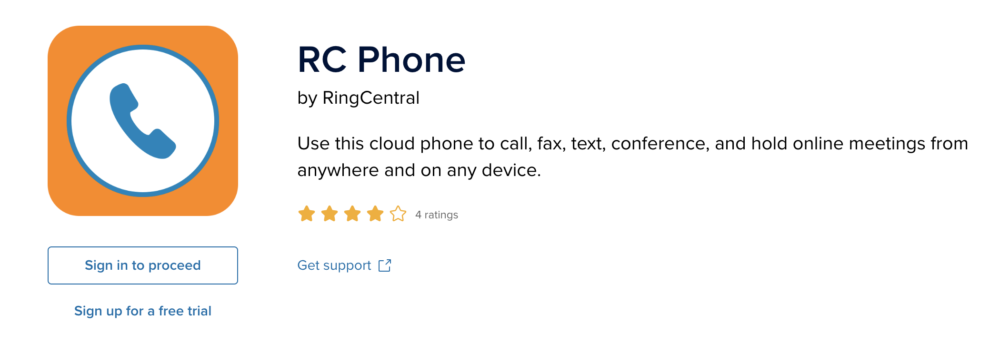
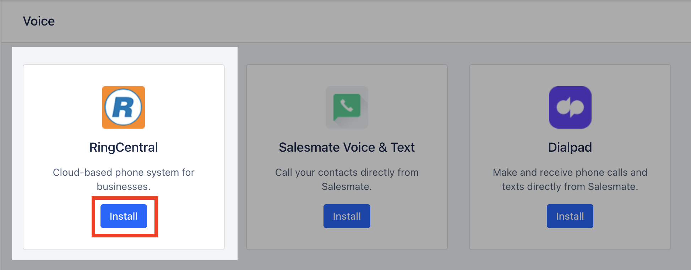
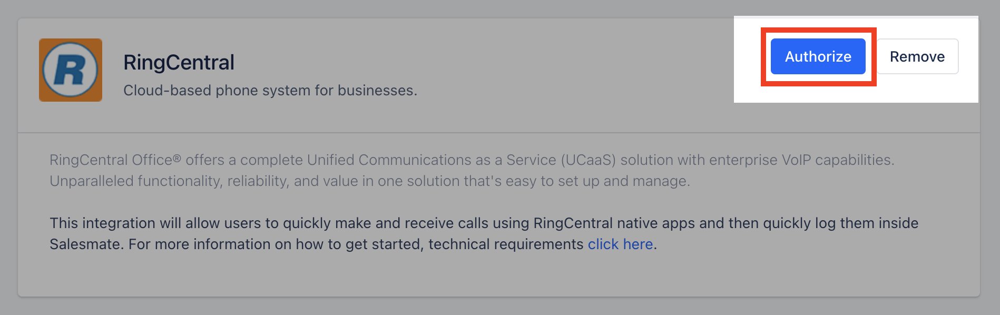

| **Available in the Pro Plan and above.**[RingCentral’s](#installing-the-ringcentral-integration-only-for-admin) cloud phone system brings in VoIP based calling capabilities to Salesmate CRM. With the native RingCentral integration, you can make and receive calls directly from Salesmate with a click of a button. All incoming and outgoing calls can be logged and recorded* effortlessly. Sales teams can save hours per week dialling calls and log the conversations by leveraging this powerful integration. Recorded calls are a great way to monitor and improve sales pitches and client conversations. Salesmate will automatically capture all incoming calls received when you were away and allow you to quickly log them later.

- **Here is how you can set up and use the RingCentral Integration.** | You are required to have an active RingCentral account to use this telephony integration. Works with RingCentral Standard, Premium and Ultimate Plans ( https://www.ringcentral.com/office/plansandpricing.html ) Note: Auto recording of calls is only available on Premium and Ultimate Plans of RingCentral and should be enabled in RingCentral for calls to be auto recorded in Salesmate |
| --- | --- |

### Installation:

### Installing RC Phone desktop app:

| Download and install the app from
[https://www.ringcentral.com/apps/rc-phone](#installing-rc-phone-desktop-app)
or from
[https://support.ringcentral.com/download.html](#installing-the-ringcentral-integration-only-for-admin)
Direct Download links:
[Windows](https://downloads.ringcentral.com/sp/RingCentralForWindows)
|
[Mac](#receiving-a-call-incoming-call)
Now login to your **Ring Central Phone** Desktop App for your Mac or Windows PC **Note**: Salesmate is only compatible with **RC Phone app** from RingCentral. You need to be logged in at all times to the RC Phone app to log calls and use RingCentral with Salesmate. |

### Installing the RingCentral Integration \[ Only for admin \]

Only the Salesmate administrator/account owner with proper permissions to install the apps and add-ons can install RingCentral application. Any user with the Admin Profile can do this.In Salesmate,First, locate the RingCentral app at

Navigate to the **Profile Icon** on the top right cornerClick on **Setup** Head over to **Voice & Text** categoryClick on **Voice Apps**

Ring CentralInstall

Authorize

### Authorize the RingCentral app: \[ Only for admin \]

- The **admin user** will be automatically authorized to use this RingCentral account on the app.

- **Other users** will now be able to see a disconnected telephone icon in their menu bar on the top right.All telephones numbers will now be clickable and show "RingCentral" upon hover.

### Authorize the RingCentral app for all other Salesmate users: \[ All other users \]

Similarly, other users will have to authorize their accounts to connect to their Ring Central accounts from

Navigate to the **Profile Icon** on the top right corner.Click on **Setup** Head over to **Apps & Add-ons** Click on **Voice** RingCentral PreferencesAuthorize

### Calling \[only on PC, mobile app not supported\]:

### Make Outgoing Calls (Dial Out):

To dial out click on any of the phone fields in Salesmate list, detail or quick view screens and hit "RingCentral"This will open the RingCentral Desktop app and fill in the number automatically to dial outA pop-up showing an outgoing call is made will be seen in Salesmate with
Contact Name (if the contact exists in Salesmate) elseShow the number being dialled out and give an option to Add it to ContactClicking on Add Contact will open Contact in its quick view and fill the Mobile field with the number being dialled outThis pop-up also allows you to
add a note during the callselect dispostion (outcome)log it as a new activity or with existing onediscard and delete call log (non-reversible)Thus a completed activity will be created with Title: Outbound Call with {Contact.Name}Call made from deals will automatically associate the deal with the call

### Receiving a Call (Incoming Call):

An incoming call will show the RingCentral Desktop app pop-up from where the call can be received.Upon receiving a call the incoming (ongoing) call pop-up will be shown with the call detailsOnce the incoming call ends it allows you to perform similar operations as that on dial-out
Create ContactAdd a NoteAttach an Activity of type CallDelete & discard the call log (non-reversible)

### Call Reports and Dashboard Widgets:

All call logs can be seen on the Call Logs reports under the Reports >> Activity Insights section. You can also add the Call Logs widget on the Dashboard 2.0 for Call Logs.

### Texting \[via RC Chrome Plugin\]:

We only support RingCentral for calls via our web (browser) using the RingCentral RC Phone Desktop app. Texting is not supported. Alternate, is to install the RingCentral Chrome Extension which enables the texting option for the number.

- **RingCentral Chrome Plugin:**
- [https://chrome.google.com/webstore/detail/ringcentral-for-google/fddhonoimfhgiopglkiokmofecgdiedb?hl=en](#installing-the-ringcentral-integration-only-for-admin)

- **Note:** These texts will not be logged inside Salesmate.
