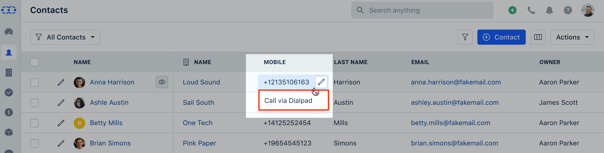
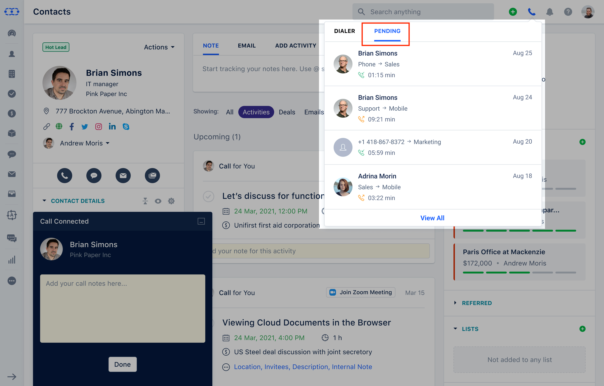
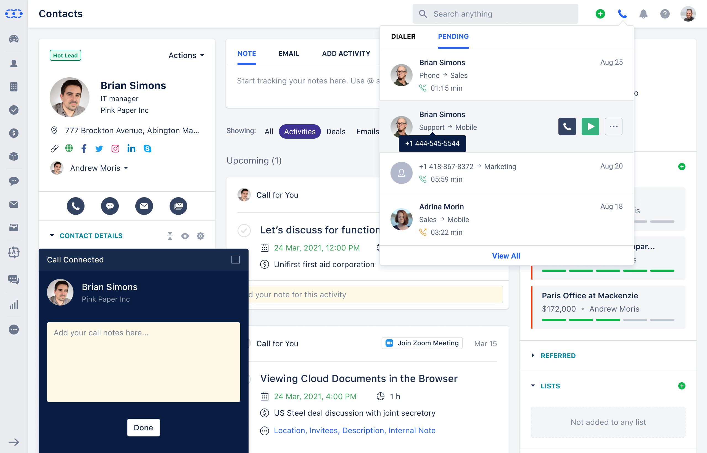
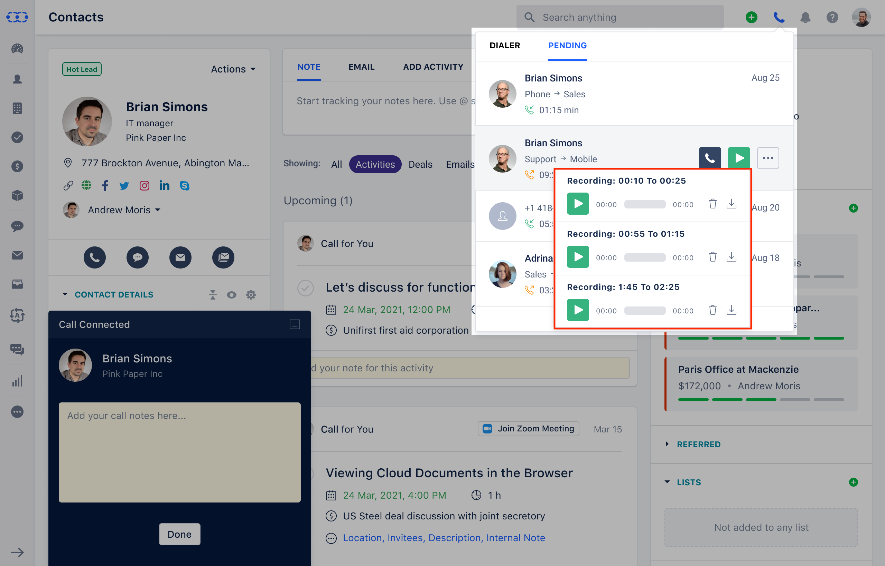
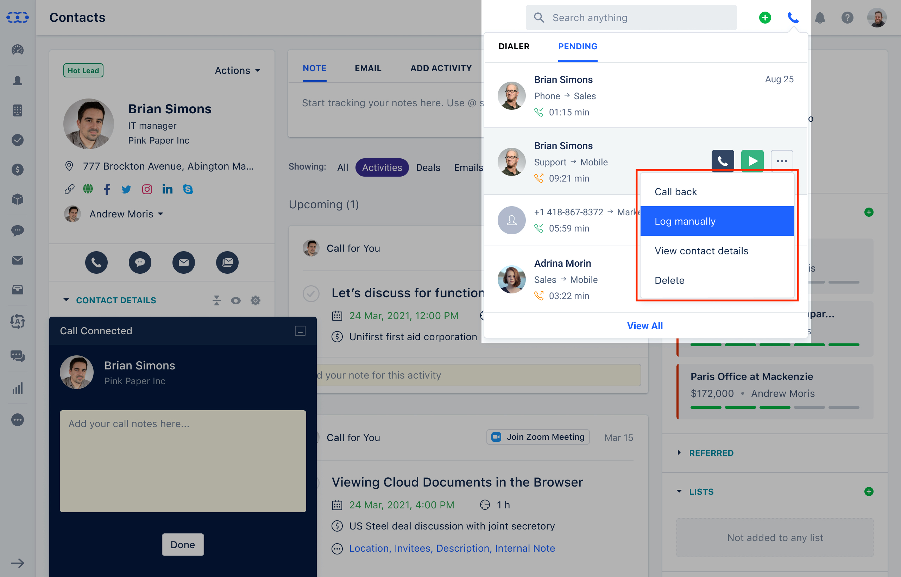
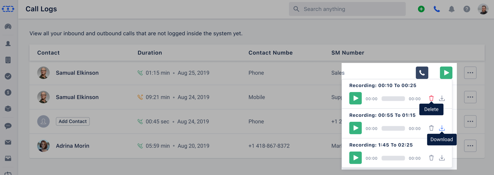

Dialpad is the most advanced platform for business communications. We've combined all the methods of communication you use into a single platform. Calling a client? Meeting with your team? Texting a coworker?

<iframe
  width="560"
  height="315"
  src="https://www.youtube.com/embed/ZMS_lDkEWz8"
  title="YouTube video"
  frameBorder="0"
  allow="accelerometer; autoplay; clipboard-write; encrypted-media; gyroscope; picture-in-picture; web-share"
  allowFullScreen
/>

### Quick Links

- [Connecting Dialpad](https://support.salesmate.io/hc/en-us/articles/6421925275929-Built-in-Calling-Texting-using-Dialpad-Integration)
- [Receiving a Call On An Unmatched User Account](https://support.salesmate.io/hc/en-us/articles/9333549016857-Calling-via-Dialpad#h_01GAQA5EMWD0MWCVJYA27TJG52)
- [Activity Logging From Pending Call Logs](https://support.salesmate.io/hc/en-us/articles/9333549016857-Calling-via-Dialpad#h_01GAQA5Q1MCH3387D4TVZ7NEEF)
- [Available Call Types](https://support.salesmate.io/hc/en-us/articles/9333549016857-Calling-via-Dialpad#h_01GAQA5ZRRBNHGZBJM8H27WDDB)

Upon successfully connecting, users with a **Salesmate + Dialpad** account will be able to call from **Salesmate**.

Hover over any phone number in the contact's list view, and a dropdown menu will appear with the option **Call via Dialpad**.

**Select the Dialpad option** — the call will be initiated and a Salesmate window will appear to record call notes. Once disconnected, the Salesmate calling widget will give the option to create a contact/company for unknown numbers or log calls for known contacts/companies. The user can also log the call manually by clicking the **Done** button.

---

## Receiving a call on an unmatched user account

If there are multiple users on **Dialpad** and **Salesmate** accounts, and the option to log calls for all users is selected, the following events occur when someone makes or receives a call outside Salesmate:

- Users will not see the **log call popup** while the call is in progress.
- **Once the call is completed**, the system checks:
  - **a)** If an associated contact/company exists in Salesmate, the call is logged and marked as closed.  
    
  - **b)** If the contact/company doesn't exist, the call log appears in recent call logs and can be manually logged later.  
    

All these activities or call logs are assigned to the user specified in Dialpad’s call settings.  
If the user is no longer active, the system continues to route calls to that disabled user, and someone must change the **Dialpad settings**.

---

## Activity logging from pending call logs

All calls not logged as an activity in the system appear in the **Pending** tab, where the user can take various actions depending on the call type.

---

## Available call types

### Contact Missed Phone Call
Options:
1. Call back  
2. Manually log  
3. View contact information  
4. Remove  

### Inbound/Outbound Call
Options:
1. Call back  
2. Manually log  
3. View contact information  
4. Recording download  
5. Remove recording  
6. Remove  

### Unidentified Missed Call
Options:
1. Call back  
2. Create contact and log call  
3. Create company and record call  
4. Remove  

### Unidentified Inbound/Outbound Call
Options:
1. Call back  
2. Add contact and log call  
3. Create company and record call  
4. Download recording  
5. Remove recording  
6. Remove  

---

There is also an option to **View All Call Logs**, where users can see all calls.  
The **Delete** option removes a log (only if no activity exists yet).  
**Download Recording** and **Delete Recording** appear only in full-screen mode.  
If multiple recordings exist for a contact, all can be played.

---

> **Note:** Power Dialer feature is supported with Dialpad.
