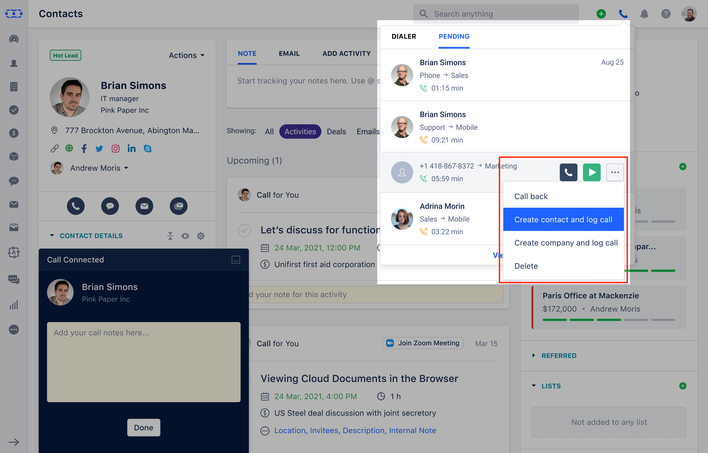

Dialpad, is the most advanced platform for business communications. We've combined all the methods of communication you use into a single platform. Calling a client? Meeting with your team? Texting a coworker?

<iframe
  width="560"
  height="315"
  src="https://www.youtube.com/embed/ZMS_lDkEWz8"
  title="YouTube video"
  frameborder="0"
  allow="accelerometer; autoplay; clipboard-write; encrypted-media; gyroscope; picture-in-picture; web-share"
  allowfullscreen
></iframe>

### Quick Links

[Connecting Dialpad](https://support.salesmate.io/hc/en-us/articles/6421925275929-Built-in-Calling-Texting-using-Dialpad-Integration)[Receiving a Call On An Unmatched User Account:](https://support.salesmate.io/hc/en-us/articles/9333549016857-Calling-via-Dialpad#h_01GAQA5EMWD0MWCVJYA27TJG52)[Activity Logging From Pending Call Logs:](https://support.salesmate.io/hc/en-us/articles/9333549016857-Calling-via-Dialpad#h_01GAQA5Q1MCH3387D4TVZ7NEEF)[Available Call Types](https://support.salesmate.io/hc/en-us/articles/9333549016857-Calling-via-Dialpad#h_01GAQA5ZRRBNHGZBJM8H27WDDB)

Upon successfully connecting users with a**Salesmate + Dialpad**account will be able to call from**Salesmate**.

Hover over any of the phone numbers in the contact's list view, a dropdown menu will appear with the option "**Call via Dialpad.**"Select the**Dialpad**option, the call will be initiated and a Salesmate window will appear to record the call notes.Once disconnected, the Salesmate calling widget will give an option of creating a contact or a company for unknown numbers or logging calls for a contact and a company from known customers.The user can also log the call manually by clicking the "**Done**" button.

##**Receiving a call on an Unmatched user account:**If there are multiple users on**Dialpad**and**Salesmate**accounts, and the option log calls for all users have been selected, the following events will occur when someone makes and receives a call outside of Salesmate.

Users will not see the**log call popup**while the**call is in progress.**Once the call is**completed**, the system will look for two conditions:**a)**If an associated contact or company for the call is present in Salesmate, the call will be logged against that contact and company and marked as closed.

**b)**If the associated contact or company isn't in Salesmate, the call log will be available in recent call logs, and the user will be able to manually log that call after adding its contact or company.

All of these activities or call logs are assigned to the user specified in the Dialpad's call settings.If the user is no longer active, the system will continue to route calls to the disabled user, and someone must go change the**Dialpad settings.**##**Activity logging from pending call logs:**All calls that are not logged as an activity in the system will appear in the**Pending tab**, from which the user can perform various operations depending on the type of call.

##**The following are the call types available:****Contact Missed Phone Call**1. Call back
    2. Manually log
    3. View Contact Information
    4. Remove

**Make an Inbound/Outbound Call**1. Call back
     2. Manually log
     3. View Contact Information
     4. Recording Download
     5. Remove Recording
     6. Remove

**Unidentified Missed Call**1. Call back
    2. Make a contact and log the call
    3. Make a Company and Record a Call
    4. Remove

**Unidentified Inbound/Outbound Call**1. Call back
   2. Add contact and log the call
   3. Make a Company and Record a Call
   4. Recording Download
   5. Remove the Recording
   6. Remove

There would also be an option to**View All Call Logs**, which would take the user to a screen where they could see all of the calls made on the link.The '**Delete**' option will delete the log from our system.
   a). This option appears only in calls for which the activity has not yet been created.The '**Download Recording**' and '**Delete Recording**' options are only visible when viewing call logs in full-screen mode.If there are multiple recordings for a single contact, the user should be able to listen to them all.

**NOTE**- Power Dialer feature is supported with Dialpad.
