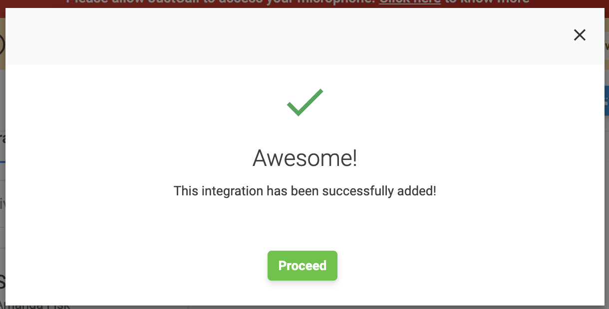

JustCall’s cloud phone system brings in VoIP based calling capabilities to Salesmate CRM. With the Click-To-Call JustCall integration, you can make and receive calls directly from Salesmate with a click of a button. All incoming and outgoing calls can be logged and recorded effortlessly.Connecting Salesmate in JustCall.

Login to your JustCall AccountFrom the menu, select Integrations.Search for “Salesmate” Integration.Click on Integrate.

Now, add your Salesmate Email id, domain name and Session Key.Hit on Save and integration is completed.

On successful integration, you will get below popup

Details of Salesmate:

Click on the**Profile Icon**Followed by**My Account**Head over to Your Personal API Token/Access Key section.From the**Your API Session Token**section copy your Session Key / Session Token.From the URL of your profile copy your domain name.

Once the Salesmate account is integrated in JustCall, all your Contacts of Salesmate will get synced on JustCall account.Multiple user accounts could be created on JustCall and multiple Salesmate users could integrate JustCall in their respective account.**Calling via JustCall desktop application:**Download the desktop apps from [https://justcall.io/app/apps](https://justcall.io/app/apps)

Configure JustCall in Salesmate.

Navigate to the**Profile Icon**on the top right cornerClick on**Setup**Head over to**Voice & Text**categoryClick on**Voice Apps**

You can setup multiple click-to-call options from pageEach click to call option will require following fieldsProvider label = JustCallSyntax = justcall://\[number\]Hit on save to store all those options.

Now, hit on any phone numbers or mobile number in the system then it will give you the option to select your calling choice. Select JustCall and the system will divert to JustCall desktop application.**Calling and Texting via JustCall Chrome Extension:**Download chrome extension from [https://justcall.io/crx](https://justcall.io/crx).Add the JustCall extension to your chrome browser.Right click on the phone number, select JustCall >> Call via just call**or**Text via just call.

**Notes:**Outbound and Inbound calls will be logged in Salesmate automatically as an Activity. Notes added on the call and**call recording**will be added to the activity description as an URL.

Missed calls will also get logged in Salesmate as an Activity and all information will be added in activity description as an URL.

When you dial out the call from Salesmate via Justcall, it doesn’t dial the number directly, you have to hit on Call on the JustCall app.

Once the call is connected via just call then the activity logged in Salesmate would be marked as Completed.

If the call is not answered or not connected then activity in Salesmate would be not marked completed.

All outbound and inbound text will be logged as Notes in Salesmate under the record timeline.

JustCall also provides the feature of extension number which is helpful to directly divert the call to the appropriate team member.
