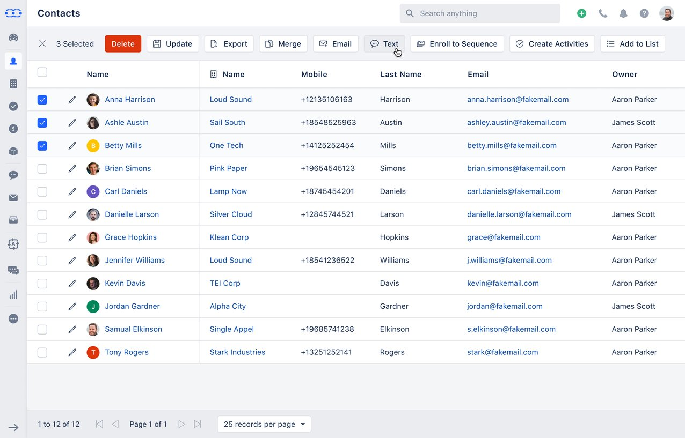

To start with **Sending Text Messages via Dialpad**, a user should have an active **Dialpad account.

- **The logged-in user’s email is checked and if the corresponding Dialpad account is found then they can send the text.NOTE - _Dialpad APIs don’t support attachments right now, so you can’t send MMS._

- [**Sending One-to-one message**](#sending-one-to-one-message)
- [**Sending Bulk message**](#sending-bulk-message)
- [**Scheduling Text Message**](#scheduling-text-message)
- [**Send Text via Dialpad (Automation)**](#send-text-via-dialpad-automation)

###  Sending One-to-one message

Clicking on any phone number will give an option to Text.Choosing Text option will open up the Salesmate Popup
It will display To numberFrom User Name (It will show the logged-in user’s email id here, can’t be edited.)Text Message (**Option to choose template**)Send / ScheduleUpon the template is selected, the system will parse the variables and show the message as below.On Send the text will be sent from the linked user's account.

###  Sending Bulk message

Select multiple contacts or deals to send a bulk text message.Choosing Text option will open up the Salesmate Popup.
It will display To Number (You will need to select any of the contact’s phone or mobile fields. By default **Mobile Field** will be selected)From User NameText Message (**Option to choose template**)Send / ScheduleIf you select any template then it will show the message with variables. The variables are replaced in the backend while sending messages to customers on a one-on-one basis.On Send the text will be sent from the linked user's account.

###  Scheduling Text Message

You can schedule a one-to-one or bulk text message.Scheduling a message will send those texts once the predefined time has arrived.In case the user who has scheduled the message doesn’t have an active account then messages will fail from sending: “**No Dialpad account found**”.

How would the Text appear to your Contact?

###  Send Text via Dialpad (Automation)

There is an Automation Action called **Send Text via Dialpad**

This will follow the base rules as stated here: [Send Text](#send-text-via-dialpad-automation)The action will have a tooltip: “**Send a text to the contacts via Dialpad from specified user.

- **”The differences are stated here with:
The link would redirect the user to the app detail page of DialPad.In case the plan doesn’t support the DialPad, then user will get the upgrade popup on click of Install button.Instead of From Number it will ask From User (List of Salesmate users who have active Dialpad account)The texts will be sent from the Dialpad number associated with that UserFor any reason, if the selected account is no more active then message sending will fail: “No Dialpad account found”If any other error has come from Dialpad while sending the text then it will be visible with text as we do in the current system.In case DialPad account is not connected, or not installed, or not supported. A message is displayed in the popup “You need an active DialPad connection to use this feature. Click here to connect.”

In case DialPad account is not connected, or not installed, or not supported. A message is displayed in the popup “You need an active DialPad connection to use this feature. Click here to connect.”

Click on **Save**.

- *NOTE - Texting via Sequences from Dialpad is not available.**
