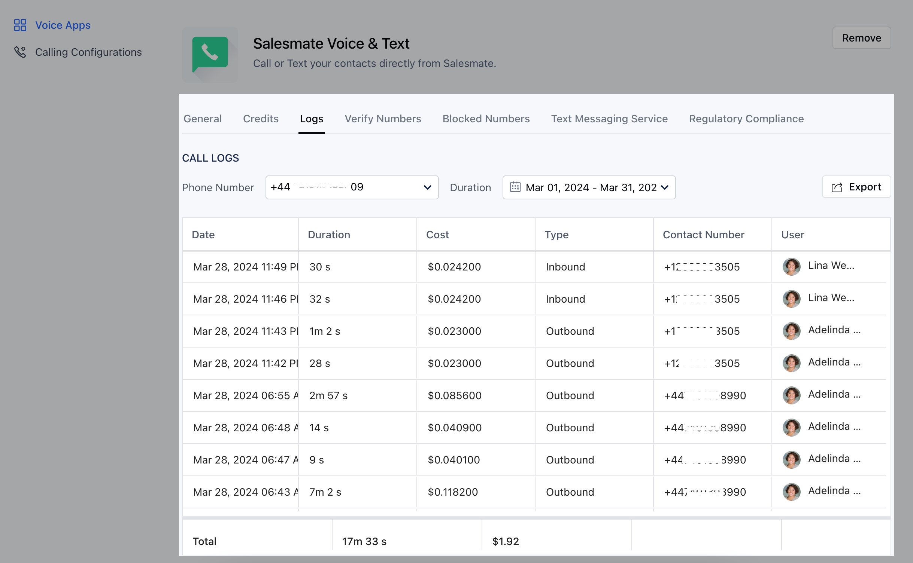

Every call that was made or answered by each sales rep can now be seen with the help of the call logs on each number. To check the call cost :

Navigate to the**Profile Icon**on the top right cornerClick on**Setup**Head over to**Voice & Text**categoryClick on**Voice Apps**

On the Salesmate Voice & Text Page hit the**Logs**TabYou will be able to see each charge on the selected numberYou can select the**number**and**duration**for which you wish to view the logs

