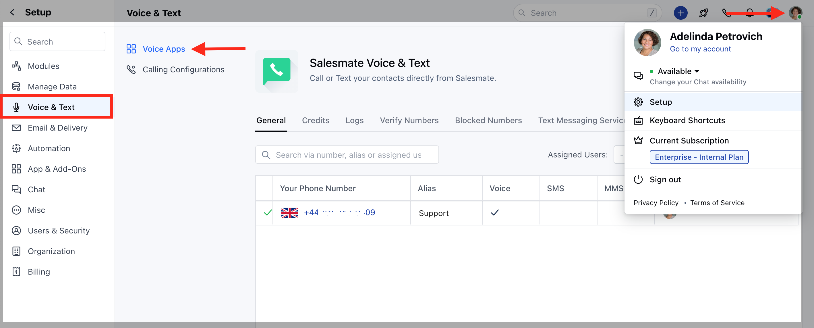
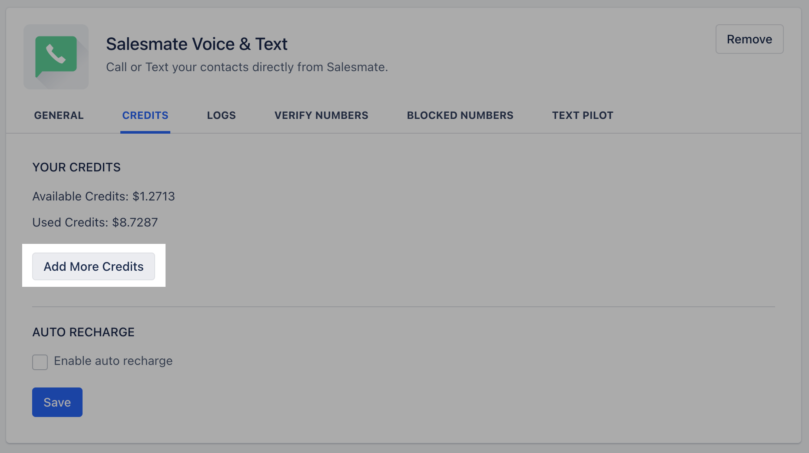
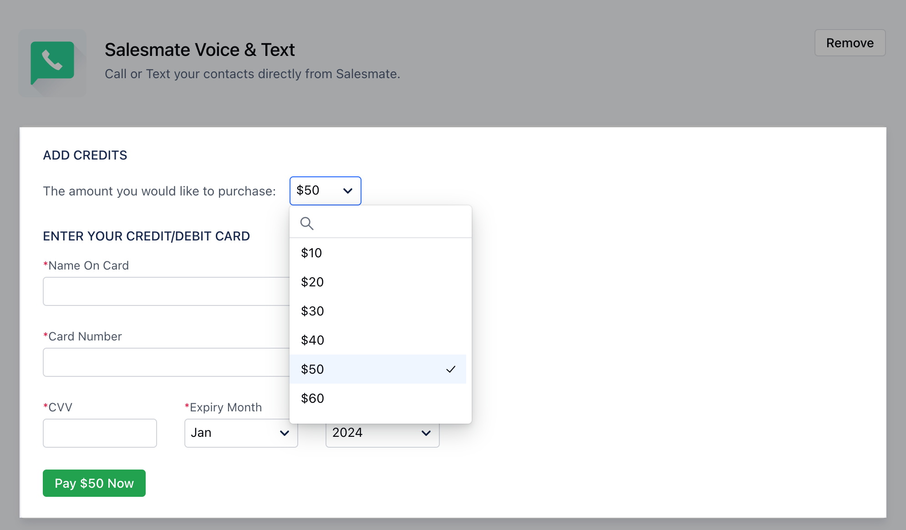
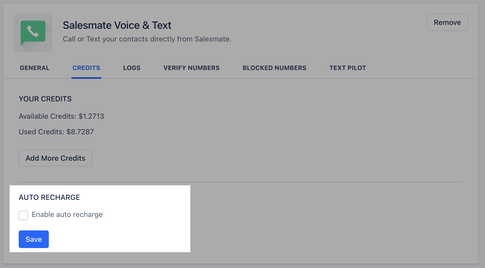
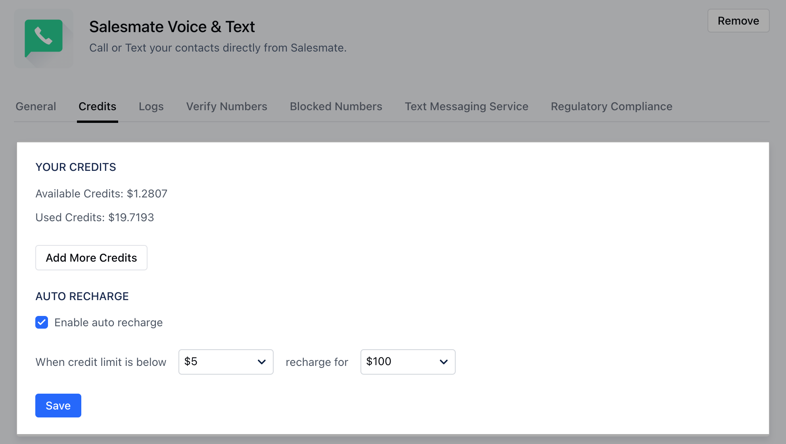

Once you have enabled your phone app you will need credits to purchase your phone number and credits to start calling from Salesmate. In case you exhaust your phone credits by purchasing numbers or making calls, an error message is shown.If so, you need to recharge(add credits) before trying to purchase more numbers or make calls.

###  **Topics covered:**

- [How to Add Phone Credits](#how-to-add-phone-credits)
- [How to Edit Payment Details](#how-to-edit-payment-details)

###  How to Add Phone Credits

To add credits to your phone **:** Navigate to the **Profile Icon** on the top right cornerClick on **Setup** Head over to **Voice & Text** categoryClick on **Voice Apps**

Click '**Credits**' tab and hit the '**Add More Credits**' link present below your credit balance.

On the overlay that appears, choose the amount you want to recharge within the drop-down. (Min: $10 - Max: $1000)

To be on the safer side and ensure that you don't run out of credits unexpectedly, enable the '**auto recharge**' checkbox.

Choose the threshold amount from '**When credit limit is below**' dropdown to trigger the auto recharge. (Min: $10 - Max: $1000)Set your auto recharge amount from the '**recharge for**' dropdown. (Min: $10 - Max:$1000).Click **Save.

An overlay asking you to fill in your payment details appears.**Note:**Only while recharging for the first time you need to fill in all your details on the payment overlay. These details are saved once filled.

###  How to Edit Payment Details

To edit your payment details :

Navigate to the **Profile Icon** on the top right cornerClick on **Setup** Head over to **Voice & Text** categoryClick on **Voice Apps**

Under the **Credits** Tab, click on the **Add More Credits** link

On the overlay which opens the current card is listed. Click **Change Card and Pay** link to change the card details and Pay.
