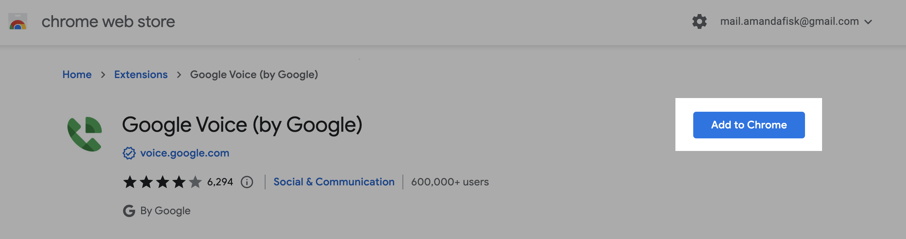
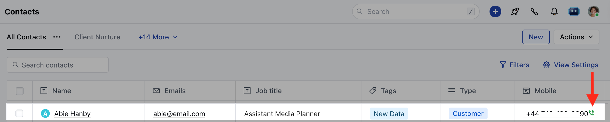

Install the chrome extension for google voice from the link provided - [Click Here](https://chrome.google.com/webstore/detail/google-voice-by-google/kcnhkahnjcbndmmehfkdnkjomaanaooo?hl=en)

Click on**Add to Chrome**button to add the extension to your chrome browser.

Further, click on**Add extension**to confirm the installation.

Once done you will receive a success message saying "**Google Voice has been added to Chrome**".Finally, after adding the extension, you will be able to click on the**G****reen phone icon**and make the calls using Google voice.

**Note:**Calls are not logged inside salesmate while using the extension.
