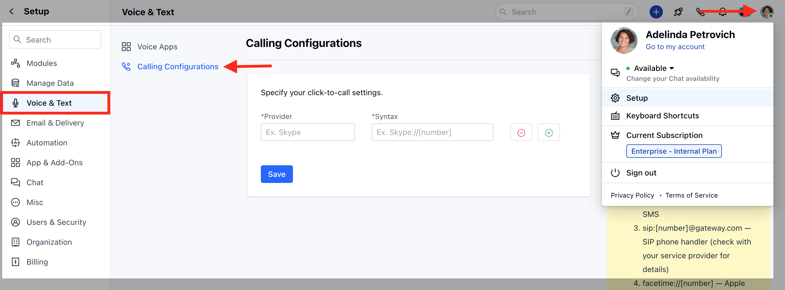
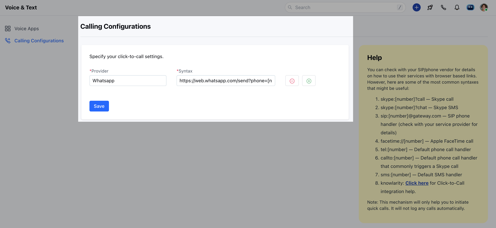
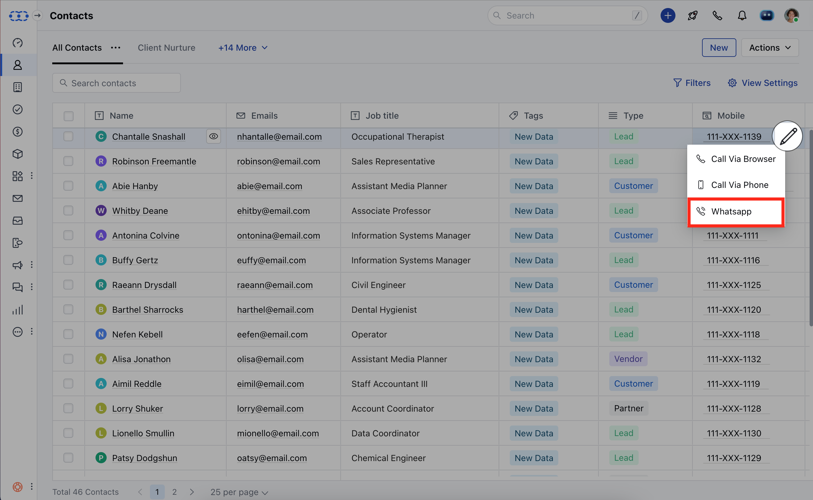

Navigate to the calling configuration page by following the steps down below

Navigate to the**Profile Icon**on the top right cornerClick on**Setup**Head over to**Voice & Text**categoryClick on**Calling Configuration**

Now, add the provider field as**Whatsapp**and add the Syntax as [https://web.whatsapp.com/send?phone=\[number\]](https://web.whatsapp.com/send?phone=%5Bnumber%5D)

Once you have set up the configuration, you will be able to send out the messages using Whatsapp.

