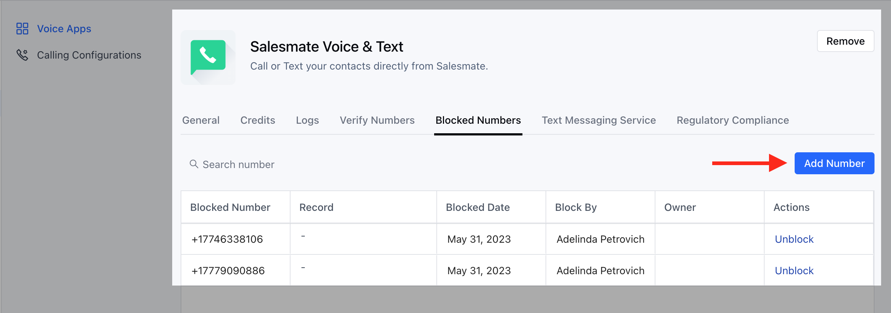
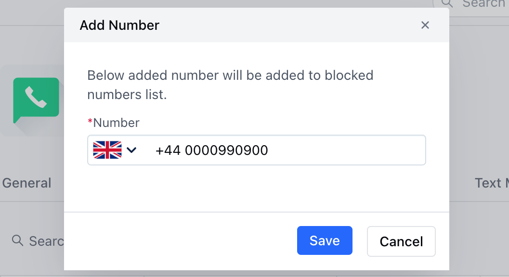
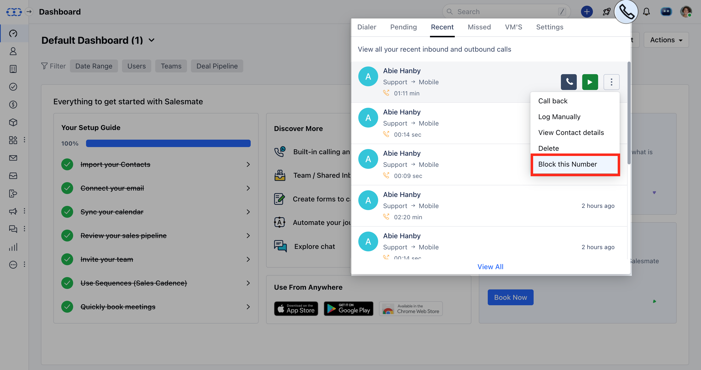
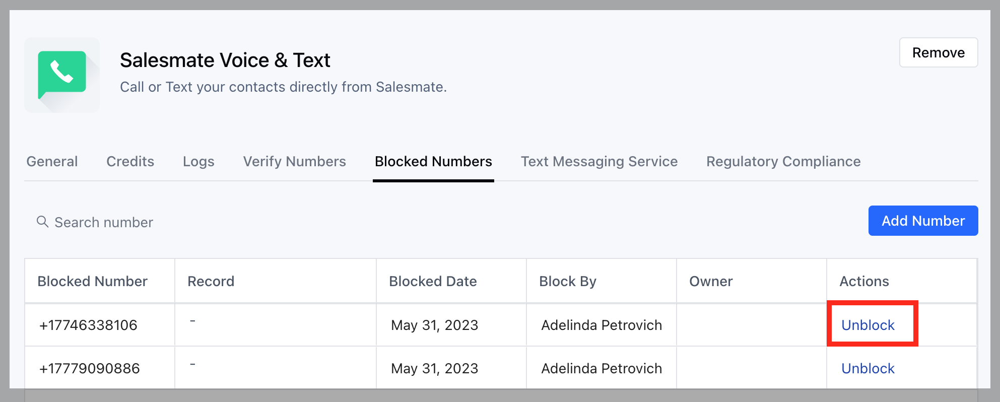

For Salesmate Privacy and user protection is of utmost importance and is being prioritized overall.Hence, Salesmate gives users an option for blocking Numbers that are unwanted or SPAM calls.While all Salesmate phone numbers go through a rapid testing process before they're made available for purchase to our esteemed customers, some SPAM or unwanted calls may continue to reach your purchased numbers.To overcome this challenge Salesmate offers an option to prevent these calls from becoming a problem.Topics Covered:

- [How to Block the Numbers](#how-to-block-the-numbers)
- [How to Unblock the Numbers](#how-to-unblock-the-numbers)

### How to Block the Numbers

Please follow the below steps to Block Numbers in Salesmate:

Navigate to the **Profile Icon** on the top right cornerClick on **Setup** Head over to **Voice & Text** categoryClick on **Voice Apps**

Under Voice, Click on the **Blocked Numbers** Tab.You will find all the previously Blocked Numbers on this screen.To Block, Numbers click on **Add Number.

Add the number that you would like to block.

Manually Type in the **Number** you would like to Block.Click on **Save.

- **Once saved, You can find the Number in the Block List.

You can also Block Numbers from the Call Icon above on the header section:

Click on **Call Icon** in the header section.Go to **Pending**,**Recent**,**Missed**, or **VM's** Tab.Click on the **Three Dots** Action Menu available against each Number.Select the **Block this Number** option.

### How to Unblock the Numbers

In case you have blocked a number mistakenly, don't worry you can always unblock the number.

To Unblock the Number you can hit the **Unblock** Button available under the **Actions** against each Number.

