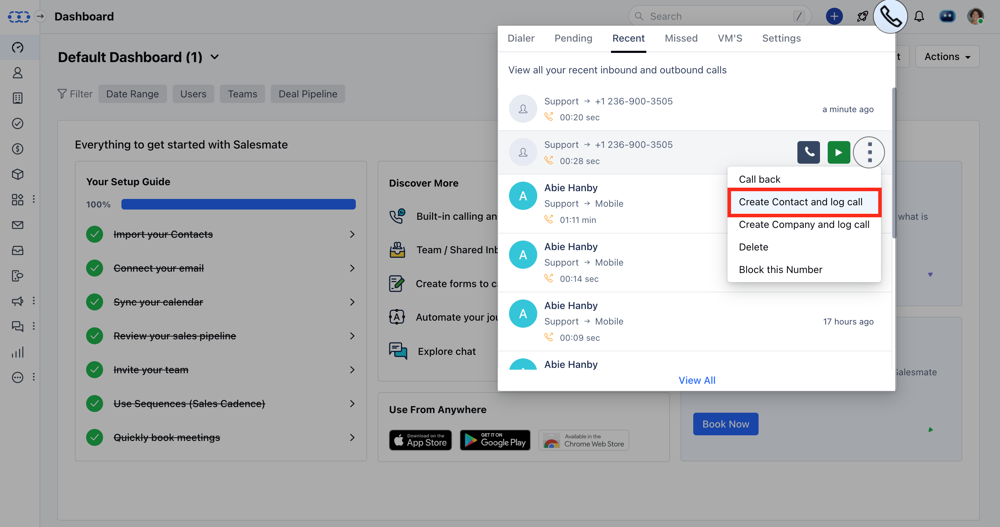
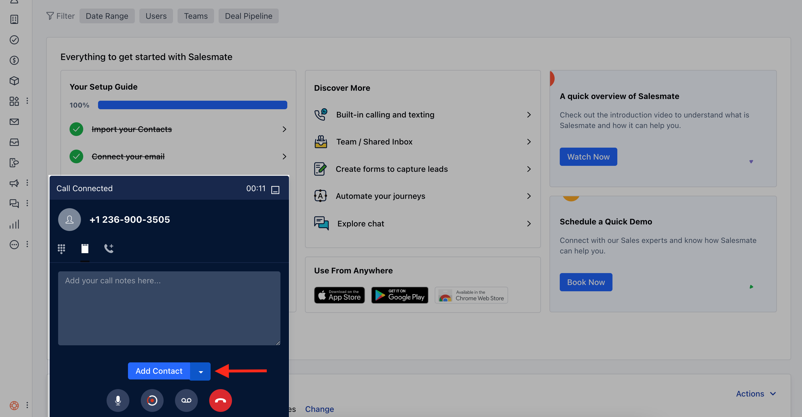
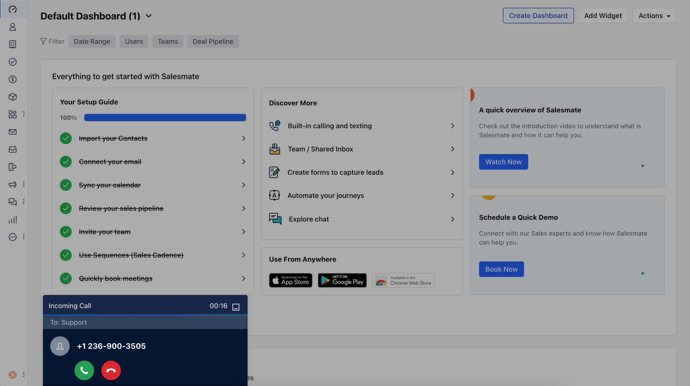
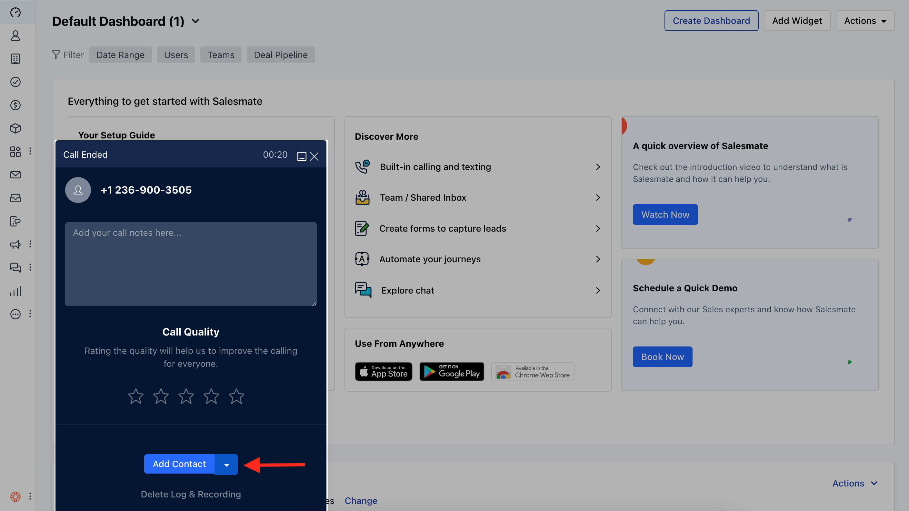

In Salesmate, with the inbuilt phone, all phone calls you make, receive, and miss is automatically logged. Call logs come in handy when you need to add new leads or contacts after having conversed with them over the phone. It doesn’t always have to be new leads or contacts, existing contacts and leads might call you from a number that isn’t registered in your account. In such cases, you can attach the call log to the relevant records and follow up with them.

- **How to Add/Update Contact**,

- [Adding a missed call](#adding-a-missed-call)
- [While on the call](#while-on-the-call)
- [After the call](#after-the-call)

###  Adding a missed call :

Navigate to the Phone Icon on the top rightClick on to **Missed** tab.Hover over the number and click on the **three-dotted button to Add it as a contact.

###  While on the call :

On the pop-up, hit the **Add Contact** button.

- **Update** the contact details.Hit **Save** to add the contact.

If the call is from an identified contact you can simply hit on the maximize icon to open up the details of the contact.

###  After the call :

On the pop-up, hit the **Add Contact** buttonUpdate the contact detailsHit **Save** to add the contact

