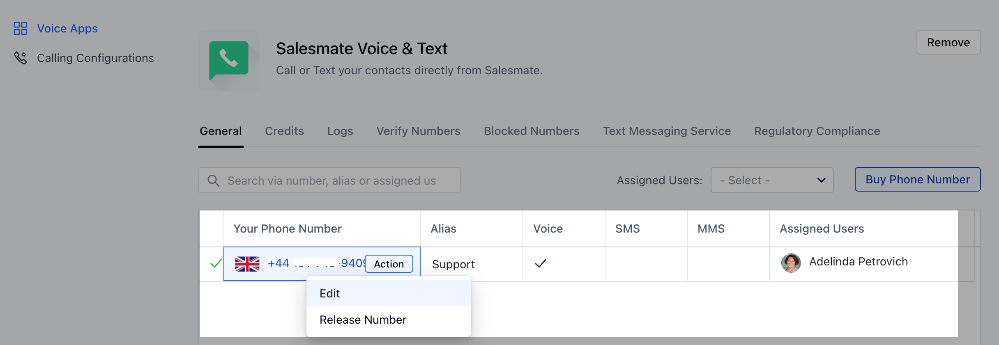
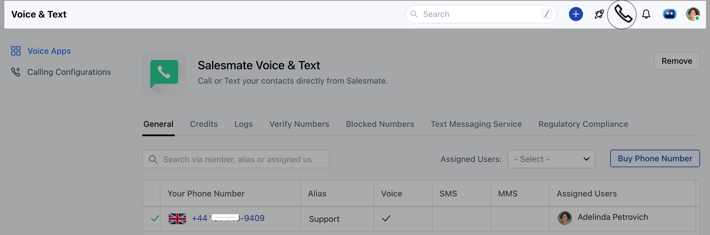

After purchasing phone numbers, you can assign the numbers to individual users. Using the numbers assigned to them, they can make calls. To assign phone numbers to a**user :**Navigate to the**Profile Icon**on the top right cornerClick on**Setup**Head over to**Voice & Text**categoryClick on**Voice Apps**

From the list of phone numbers purchased, select the number you’d like to customize.Click on**Actions >>****Edit**.

To assign a phone number to an individual, under the**SELECTED USER**section add the user/s you want to assign this number to.

On assigning the phone number to a user the**'Make a call button'**on the top bar will get activatedOn the**Make a call**button you will find the numbers listed under**From**assigned to the respective user**

**
