Customers might call you for a number of reasons. They might want a trial period extension, new features, or simply have their calls returned. To help you engage, prioritize, and manage calls better, Salesmate lets you take notes during the call and create activities soon after your call has ended.

###  **Topics covered:**

- [Logging an Incoming Call](#logging-an-incoming-call)
- [Logging an Outgoing Call](#logging-an-outgoing-call)
- [Logging a Missed Call](#logging-a-missed-call)

---
###  Logging an Incoming Call

To log an incoming call after the call is completed:

If the phone number of the contact is added in Salesmate, the contact name will be displayed when the incoming call comes in.

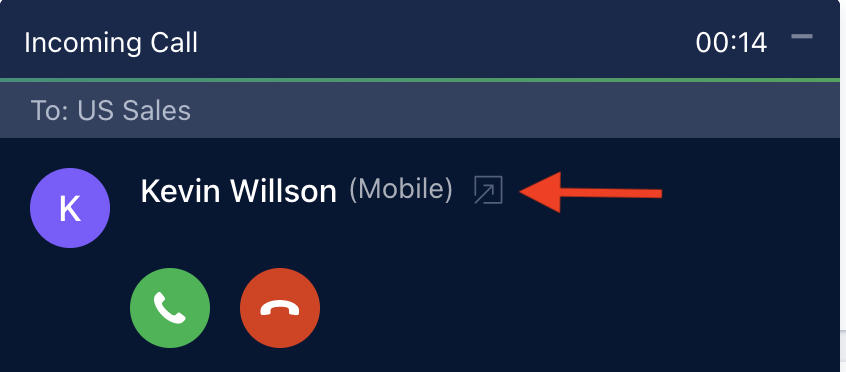

1. Select the **Outcome** of the call from the Outcome list.

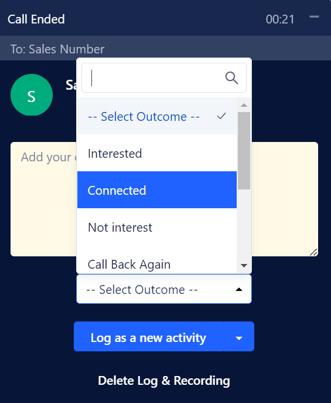

2. Click on **Log as a New Activity**. You can also select the option to log the **Activity Manually**.

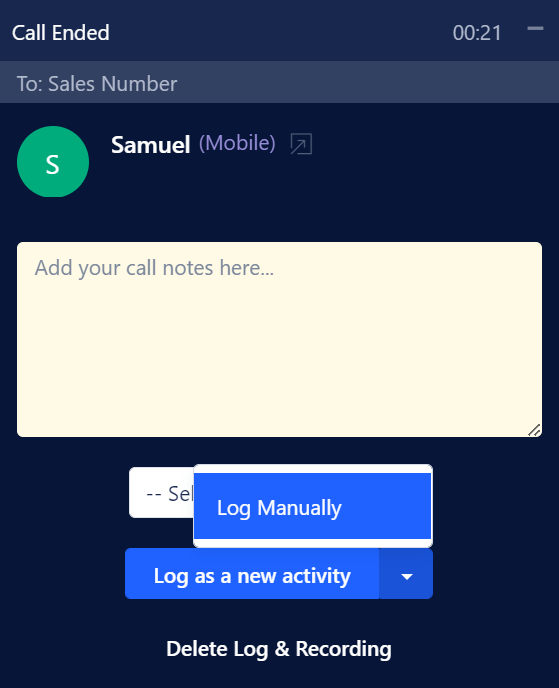

The incoming calls are logged as:
`Inbound call with {Contact Name}`

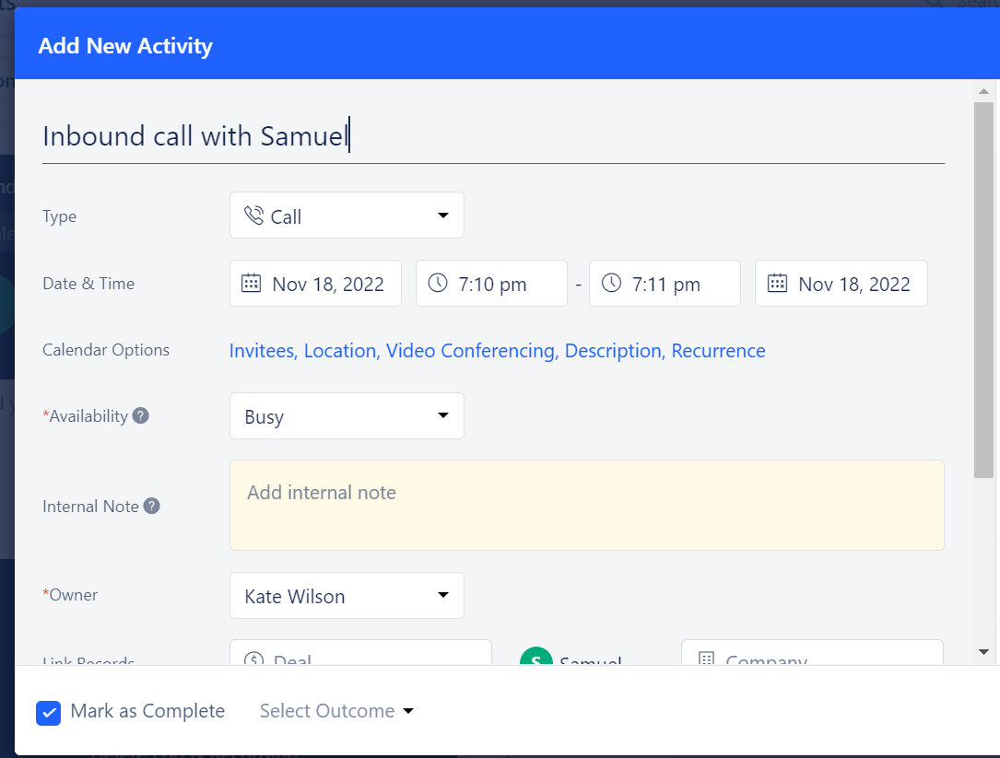

You can view the activity on the timeline of the contact.

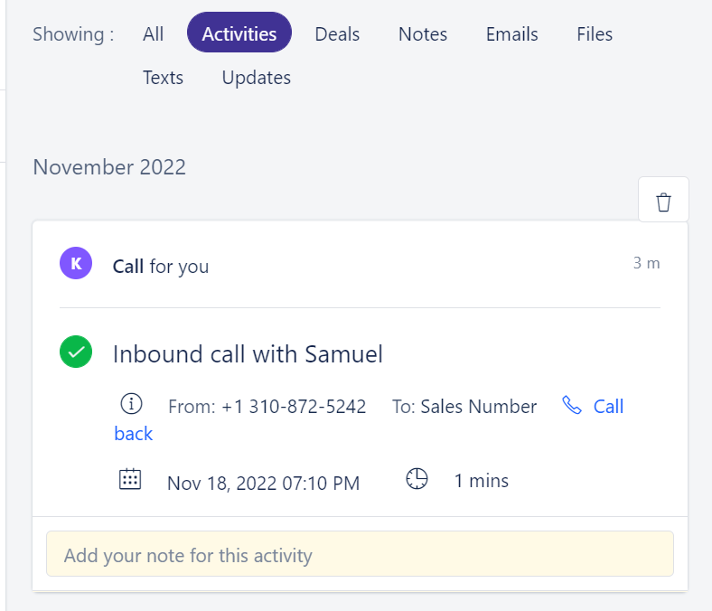

---
###  Logging an Outgoing Call

You can log your call with relevant notes and outcome once the call to your customer is completed. To log the outgoing call:

1. Select the **Outcome** of the call from the Outcome list.

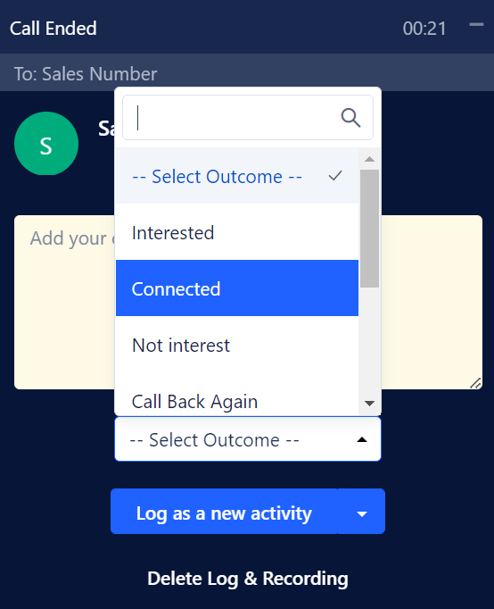

2. Click on **Log as a New Activity**. You can also select the option to log the **Activity Manually**.

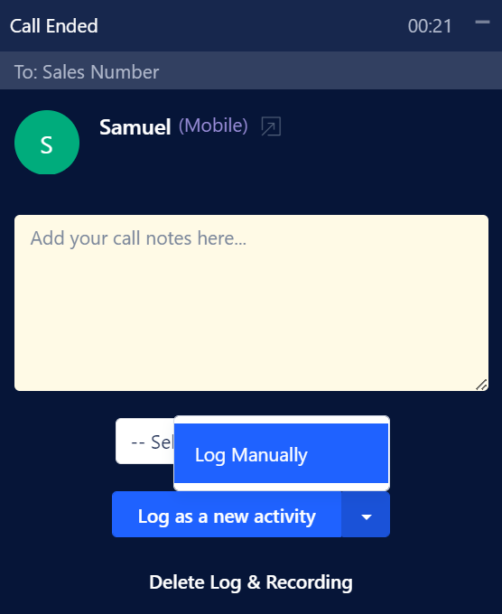

The outgoing calls are logged as:
`Outbound call with {Contact Name}`

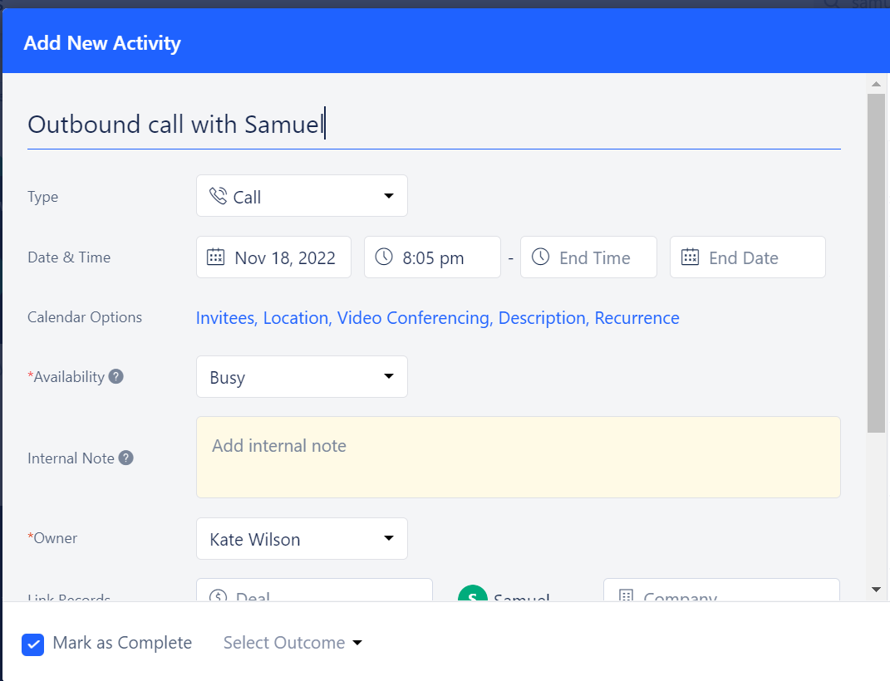

You can view the logged activity on the timeline of the contact.

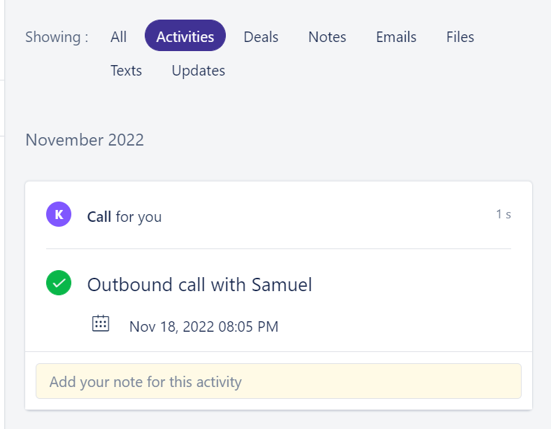

---
###  Logging a Missed Call

- **Timeline view:**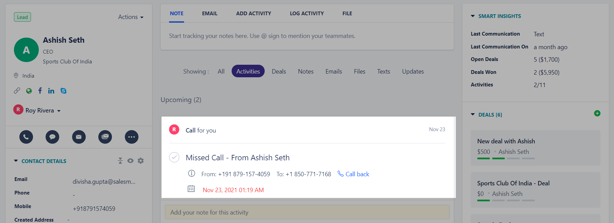

When you are unavailable, you will find an activity listed as:
`Missed Call - From {Contact Name}`
under **All Open Activities**.

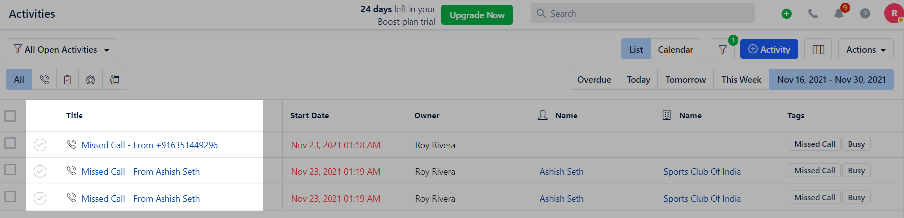

**Note:** If there is no contact name available, the activity will be logged as:
 `Missed Call - From {Contact.Number}`
