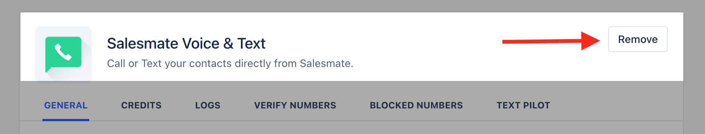
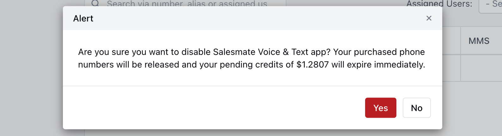

In Salesmate, to be able to stop calling out of the app using Salesmate Calling. You will need to deactivate the app. Here's how to do it :

Navigate to the**Profile Icon**on the top right cornerClick on**Setup**Head over to**Voice & Text**categoryClick on**Voice Apps**

Click on**Remove.**

You will be**prompted to Confirm**if  you want to disable the Salesmate Voice & Text app.

**Note:**Please note this action is irreversible. Contact Support to enable Calling in your account.
