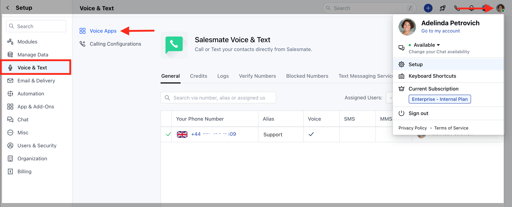
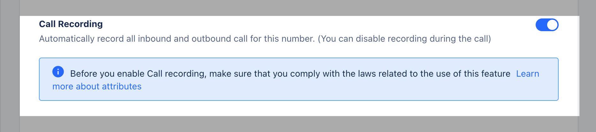

Call recordings are a great way to analyze conversations. Listening to call recordings offers a fresh perspective and reveals details that might have been overlooked when you or your sales reps were on the call. Use these calls for training purposes for future calls.In Salesmate you’d be able to associate call recordings to the concerned contacts and also add new contacts for the same.

###  To enable call recording,

Navigate to the **Profile Icon** on the top right cornerClick on **Setup** Head over to **Voice & Text** categoryClick on **Voice Apps**

Hover over the number under **Actions**, and click on **Edit.

If you haven’t purchased a number yet, click on [Buy phone number.](https://support.salesmate.io/hc/en-us/articles/360004733031) On the Edit Phone Number page, enable the option of ** Call **Recording** to record all incoming and outgoing calls to that phone number.Click on** Save.**

