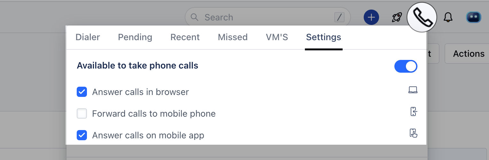
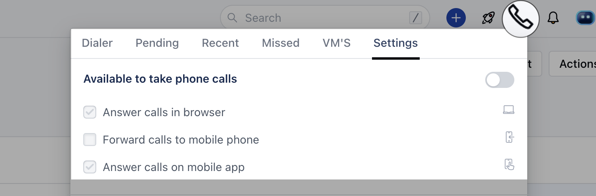
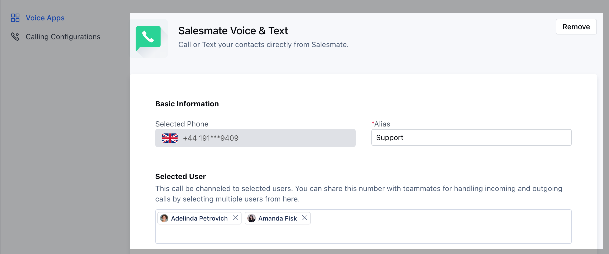
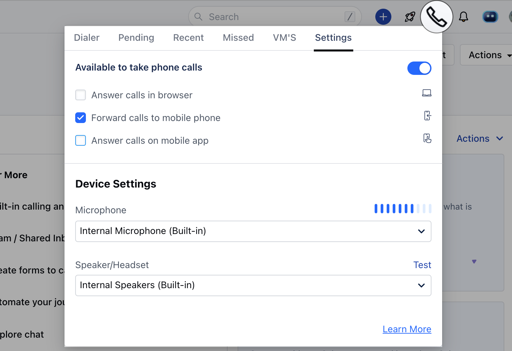

While an employee goes on a vacation or is away for the day it's best for them to mark themselves as away. This will play the [unavailable message](https://support.salesmate.io/hc/en-us/articles/360004733311-How-can-I-change-my-phone-number-settings-#h_01GEEWCY165Y1KVF1FNNC50DRG) when a contact calls on their number if they are the only user assigned to the particular number.They can do so by following the below-mentioned steps:

Navigate to the **Phone Icon** in the top right barHead over to the **Settings** tabDisable the **Available to take phone calls**

This will set the user to **Unavailable**

- *Note:**If there is more than one user assigned to a number then the call will ring on the next available user to whom the number is assigned.

- **Alternate,**Users can [add/assign another user](https://support.salesmate.io/hc/en-us/articles/360004733311-How-can-I-change-my-phone-number-settings-#h_01GEEWCFHYHQHVN0W57R78Z2E1) ( their supervisor/manager/colleague ) to the number who can answer calls in their absence

Users can set up forwarding by [updating their phone number availability](https://support.salesmate.io/hc/en-us/articles/360004733371-How-do-you-set-your-phone-s-availability-status-device-settings-) to **Forward calls to mobile phones**( Only check this option. Make sure you have a number mentioned in the mobile field of your My account )

